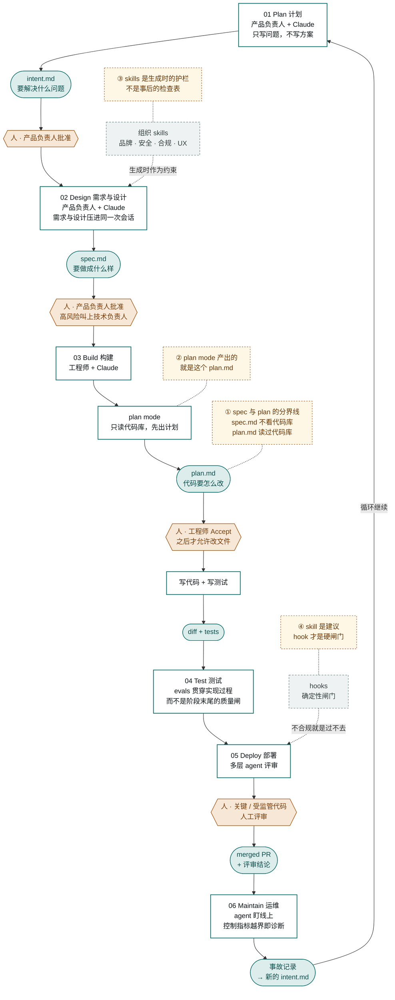

1. claude.md: softer conventions
2. hook: hard rule

https://academy.claude.com/courses/claude-code-in-action/verification-skills
skill可以被动触发，比如让claude重构代码后，会自动触发一个跑UT的skill，如何让skill触发，
需要在description中写清楚如何触发。

https://academy.claude.com/courses/ai-native-sdlc-playbook/introduction

intend 跟claude聊其实相当于头脑风暴了，完善想法。
spec 来审视这个产品具体要做成什么样子的，同时也能提出一些意见来说明有哪些需要变更的
intend和spec是可以都由产品负责人来完成的。

> Read the attached intent.md and produce a requirements and design spec for integrating it into our existing codebase. Apply the skills available to you so the plan conforms to our brand guidelines, security policies and UX standards. Document the spec fully as spec.md, ready to hand to the engineering team. Describe clearly any areas of concern, especially where you cannot satisfy contradicting policies.
请阅读附带的 intent.md 文件，并制定一份集成到我们现有代码库中的需求与设计规范。请运用你所拥有的技能来编写这份文档，使其符合我们的品牌指南、安全政策以及用户体验标准。请将这份规范详细整理成 spec.md 文件，以便提交给工程团队。同时，请明确指出任何可能存在的问题点，尤其是那些与现有政策相冲突的情况。
> 

提炼一些skill，并写好这些skill如何触发。

构建一个goal询来起来

> ## Verifying your work

- Build: make build (must finish with "Build succeeded")
- Test: make test (all green; never skip or delete a failing test)
- Lint: make lint (zero warnings)

Run all three before reporting any task complete, and paste the output.
If a test fails, fix the code, not the test.
