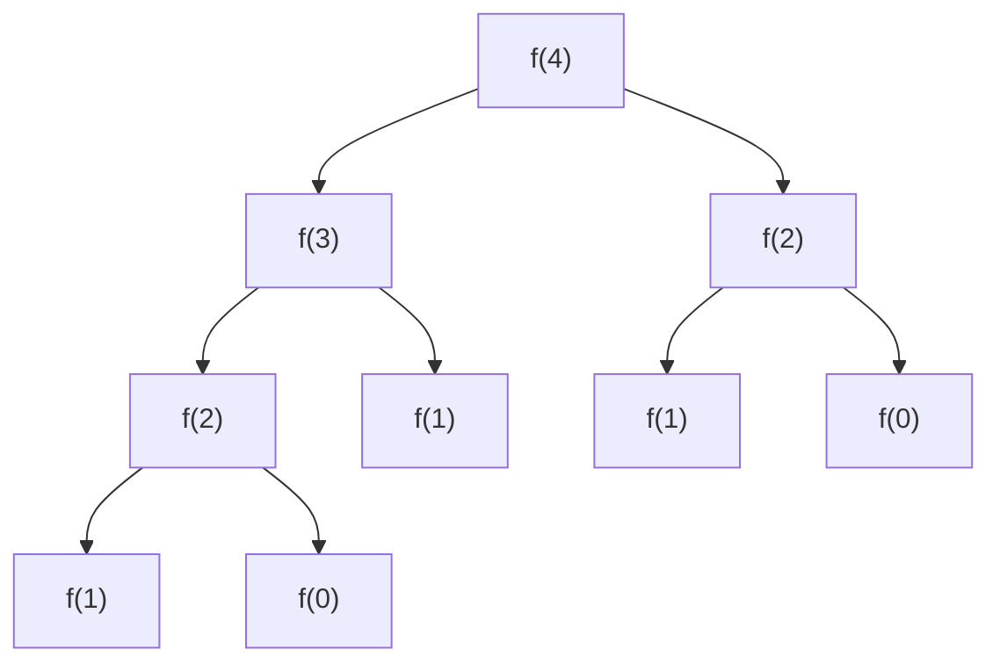

分治法是指将问题拆成一些独立的子问题，递归的求解各子问题，然后合并子问题的解得到原问题的解。

与分治法不同，动态规划（Dynamic programming, DP）适用于子问题不是独立的情况，各子问题包含公共的子子问题，分治法会做许多重复的动作，动态规划对每个子问题只求解一次，将其结果保存到一张表中，避免每次遇到相同的子问题都计算一遍。

动态规划常用于最优化问题。

DP的设计分为四个步骤：

1. 描述最优解的结构
2. 递归定义最优解的值
3. 按自底向上的方式计算最优解的值
4. 由计算出的结果构造一个最优解

下面我们以斐波拉契数列来具体的讨论动态规划。

## 斐波拉契算法
斐波拉契数列：0, 1, 2, 3, 5, 8, 13, ...

其规律是第0项和第1项分别为0和1，后续的项都为前两项之和。

所以求斐波拉契数的算法是：

$ f(n) = \left\{\begin{aligned} 0  \quad n=0 \\ 
1 \quad n=1\\
f(n-1)+f(n-2)  \quad n>1 \end{aligned}\right. $

[509. 斐波那契数](https://leetcode.cn/problems/fibonacci-number/)

### 朴素递归
最朴素的求解方式就是递归

```java
class Solution {
    public int fib(int n) {
      return fibBottomUpMethod(n);
    }

    private int fibCursive(int n) {
      if(n ==0) {
        return 0;
      }
      if(n == 1) {
        return 1;
      }
      return fib(n-1) + fib(n-2);
    }
}
```

### 带备忘录的自顶向下法
仔细分析递归的过程，可以发现过程中进行了大量的重复解计算，如下图



为了避免重复计算，一个思路是将计算出来的结果缓存起来使得下次能直接使用，这种方法就是带备忘录的自顶向下法。

```java
class Solution {
    public int fib(int n) {
      int[] memo = new int[n];
      return fibTopDownWithMemoization(n, memo);
    }

    private int fibTopDownWithMemoization(int n, int[] memo) {     
            
      if(n ==0) {
        return 0;
      }
      if(n == 1) {
        return 1;
      }
      if(memo[n-1] != 0) {
        return memo[n-1];
      }
      int result = fibTopDownWithMemoization(n-1, memo) + fibTopDownWithMemoization(n-2, memo);
      memo[n-1] = result;
      return result;
    }

}
```

### 自底向上法
带备忘录的自顶向下法是用了空间换时间的策略，会有空间上的额外开销，但如果进一步分析，其实f(n)只依赖于f(n-1) 和f(n-2)，也就是任何子问题的求解只依赖更小的子问题的求解，因此我们将子问题从小到大的求解，自底向上求解，这样就可以只保存依赖的子问题结果，进一步节省空间。

```java
class Solution {
    public int fib(int n) {
     
      return fibBottomUpMethod(n);
    }


    private int fibBottomUpMethod(int n) {
      if(n == 0) {
        return 0;
      }
      if(n == 1) {
        return 1;
      }
      int f1 = 0, f2 = 1;
      int f3 = 0;
      for(int i = 2; i < n + 1; i++) {
        f3 = f1 + f2;
        f1 = f2;
        f2 = f3;
      }
      return f3;
    }
}
```

## 动态规划原理
从工程角度上看，我们使用动态规划求解的优化问题应该具备两个要素：最优子结构和重叠子问题。

### 最优子结构
**如果一个问题的最优解包含其子问题的最优解，我们就称为此问题具有最优子结构性质。**

最优子结构规定的是子问题和原问题的关系，将子问题的解进行组合可以得到原问题的解是动态规划可行性的关键。在建模中一般用状态转移方程描述这种组合，斐波拉契数列中的算法其实就是状态转移方程：

$ f(n) = \left\{\begin{aligned} 0  \quad n=0 \\ 
1 \quad n=1\\
f(n-1)+f(n-2)  \quad n>1 \end{aligned}\right. $

原问题拆分成子问题，子问题的最优解组合得到原问题的最优解。

<!-- 这是一张图片，ocr 内容为：递归求解 子问题1的最优解 子问题1 组合 子问题2的最优解 子问题2 大问题 最优解 子问题N........?问题3的最优解 -->


### 重复子问题
子问题很大可能是重复的，大量的重复子问题提高了计算的成本，动态规划保证每个重复的子问题只被求解一次。

例如斐波拉契问题，f(4) = f(3) + f(2), f(3) = f(2) + f(1) ，f(2）会被多次求解。

如上，避免重复求解的思路有带备忘录的自顶向下法和自底向上法。

动态规划的难点在于状态转移方程的构造，如何拆分问题成为最关键的点。下面我们做题。

## 线性动态规划

单串，双串，矩阵，无串线性

### [322. 零钱兑换](https://leetcode.cn/problems/coin-change/)
虽然不知道怎么联系到动态规划，但coins的有限长度和固定的总额，不禁让我浮起了这张图：

coins = [1, 2,5], amount = 11.

<!-- 这是一个文本绘图，源码为：graph TD
	A("11") --> |"-1"| B("10");
	A("11") --> |"-2"| C("9");
	A("11") --> |"-5"| D("6");
	B --> |"-1"| E("9");
	B --> |"-2"| F("8");
	B --> |"-5"| G("5");
	C --> |"-1"| H("8");
	C --> |"-2"| I("7");
	C --> |"-5"| J("4");
	D --> |"-1"| K("5");
	D --> |"-2"| L("4");
	D --> |"-5"| M("1");
 -->


这不就是一个多叉树吗？每个子结点都面临相同的多个分叉，如果要让11块零钱刚好能兑换完，在某一条路一定会出现0这个值，此时的深度就是兑换可能性的其中一种解，如果直接减到负数就说明兑换失败。

#### 第一种DFS
为了遍历这个树结构，最基本的解法就是深度优先搜索DFS和广度优先搜索，我们用DFS尝试解题：

1. 搜索的终止条件为amout小于等于0
2. 递归dfs的出参为满足终止条件的最小深度

```java
class Solution {
    public int coinChange(int[] coins, int amount) {
      // 最短路径
      return dfs(coins, amount, 0);
    }
    private int dfs(int[] coins, int amount, int depth) {
    
      if (amount == 0) {
        return depth;
      }
      if (amount < 0) {
        return -1;
      }

      int res = Integer.MAX_VALUE;
      for(int coin : coins) {
        int subDepth = dfs(coins, amount - coin, depth+1);
        if (subDepth != -1) {
        	// 出参得是满足条件的最小的深度 
          res = Math.min(res, subDepth);
        }
      }
      
      return res == Integer.MAX_VALUE ? -1 : res;
    }
}
```

时间复杂度为$ O(W^{amount/min(coins)}) $，W为coins的长度，指数就是树的深度了。这个时间复杂度有点爆炸，但看上图，其实我们求解amount=9、8...的时候，会有很多重复的计算，想到动态规划中的重复子问题是可以用带备忘录的自顶向下法的，其实这里也是一样的可以用缓存的思想去做。

但实际做的过程中发现，上面的dfs模型无法利用缓存。

<!-- 这是一张图片，ocr 内容为：F(11) 2 F(9) F(10) F(6) F(9) F(5) F(8) F(7) F(4) F(8) -->


其中两个f(9)返回的值实际上分别是f(11)在两条路上的最小深度，所以返回的值代表的含义都不一样，自然无法缓存。为了能够缓存，两个f(9)的出参含义应该是一致的。

#### 第二种DFS
<!-- 这是一张图片，ocr 内容为：F(11) F(9) F(6) F(10) F(8) F(8) F(5) F(9) 9-5-2-2 F(8) F(4) F(7) 4 -->


如果dfs出参的含义是从为0的叶子结点开始算其高度，那f(9)无论在哪个位置都是一样的，那就可以用备忘录来减少重复计算了。

```java
class Solution {
  public int coinChange(int[] coins, int amount) {
    // 最短路径
    return dfs(coins, amount);
  }
  // 需要amount的最小硬币数
  private int dfs(int[] coins, int amount) {

    if (amount == 0) {
      return 0;
    }
    if (amount < 0) {
      return -1;
    }

    int minHeight = Integer.MAX_VALUE;
    for(int coin : coins) {
      int height = dfs(coins, amount - coin);
      // 为-1时代表无法兑换，没有意义；
      if (height != -1) {
        height = height + 1;
        // 始终返回最小的高度
        if(height < minHeight) {
          minHeight = height;
        }
      }
    }

    return minHeight == Integer.MAX_VALUE ? -1 : minHeight;
  }
}
```

#### 带备忘录的DFS
```java
class Solution {
  public int coinChange(int[] coins, int amount) {
    // 最短路径
    Map<Integer, Integer> map = new HashMap<>();
    return dfs(coins, amount, map, 0);
  }
  // 需要amount的最小硬币数
  private int dfs(int[] coins, int amount, Map<Integer, Integer> map, int depth) {
    if(map.containsKey(amount)) {
      return map.get(amount);
    }
    if (amount == 0) {
      return 0;
    }
    if (amount < 0) {
      return -1;
    }

    int res = Integer.MAX_VALUE;
    for(int coin : coins) {
      int highFromBottom = dfs(coins, amount - coin, map, depth+1);
      if (highFromBottom != -1) {
        highFromBottom = highFromBottom + 1;
        if(highFromBottom < res) {
          res = highFromBottom;
        }
      }
    }
    res = res == Integer.MAX_VALUE ? -1 : res;
    map.put(amount, res);
    return res;
  }
}
```

时间复杂度：O(W*Amount)。这道题有两个启示：

1. 深度优先搜索是可以结合动态规划的缓存思想来减少重复计算的。
2. 递归的返回最好是高度而不是深度。

#### 动态规划
那如果不考虑深度优先遍历，单纯的使用动态规划方程呢？那首先得找出状态转移方程。

由上面的dfs可以试探，f(n)为n元所需要的最少硬币个数，$ c_j $为coins中的面额，coins中共有i个面额。

$ f(n)=min_{j=0}^{j=i}{f(n-c_j)}+1  $

$ f(11) =min\{f(10), f(9), f(6)\}+1 \\
f(10) = min\{f(9), f(8), f(5)\}+1\\
f(9) = min\{f(8), f(7), f(4)\}+1\\
f(8) = min\{f(7), f(6), f(3)\}+1\\
f(7) = min\{f(6), f(5), f(2)\}+1\\
f(6) = min\{f(5), f(4), f(1)\}+1\\
f(5) = min\{f(4), f(3), f(0)\}+1\\
f(4) = min\{f(3), f(2)\}+1\\
f(3) = min\{f(2), f(1)\}+1\\
f(2) = min\{f(1)\}+1\\
f(1) = min\{f(0)\}+1\\
f(0)=0
 $

```java
public class Solution {
  public int coinChange(int[] coins, int amount) {
    int max = amount + 1;
    int[] dp = new int[amount + 1];
    Arrays.fill(dp, max);
    dp[0] = 0;
    // nums = [1,2,5], amount = 11
    for (int i = 1; i <= amount; i++) {
      for (int coin : coins) {
        if (coin <= i) {
          dp[i] = Math.min(dp[i], dp[i - coin] + 1);
        }
      }
    }
    return dp[amount] > amount ? -1 : dp[amount];
  }
}

```

时间复杂度O(W*Amount)，空间复杂度O(amount)

也就是说 动态规划 其实是由回溯来的，核心就是子问题拆解。

### [213. 打家劫舍 II](https://leetcode.cn/problems/house-robber-ii/)
这道题只是让数组变成了一个环，但思考却有难度。看到一个评论，说算法的核心思想就是把复杂的问题拆分成简单的问题，然后分而治之。既然选第一家后就不能选最后一家，那问题就可以拆分为：选第一家和不选第一家的情况，两个最优解中的最大值就是整个问题的最优解。

```java
class Solution {
    public int rob(int[] nums) {
      int n = nums.length;
      
      if(n == 1) {
        return nums[0];
      }
      if(n == 2) {
        return Math.max(nums[0], nums[1]);
      }
      return Math.max(robRange(nums, true), robRange(nums, false));
    
    }
    
    private int robRange(int[] nums, boolean containsZero) {
      int n = nums.length;
      int[] dp = new int[n];
      
        // 选0
      if(containsZero) {
        dp[0] = nums[0];
        dp[1] = nums[0];
      } else {
        // 不选0
        dp[0] = 0;
        dp[1] = nums[1];
      }
    
      int end = containsZero ? n - 2 : n - 1;
      for(int i = 2; i <= end; i++) {
        dp[i] = Math.max(dp[i-1], dp[i-2] + nums[i]);
      }
      return dp[end];
    }
}
```

### [121. 买卖股票的最佳时机](https://leetcode.cn/problems/best-time-to-buy-and-sell-stock/)
```java
class Solution {

    public int maxProfit(int[] prices) {
      int n = prices.length;
      int res = 0;
      for(int i = 0; i < n; i++) {
        for(int j = i+1; j < n; j++) {
          if(prices[j] > prices[i]) {
            res = Math.max(prices[j] - prices[i], res);
          }
        }
      }
      return res;
    }
}
```

时间复杂度O(n^2)，但是超时了，还需要更快的解法。

设f(i)为prices从0到i买卖股票的最大利润，那么状态转移方程

$$
f(i) = \max\Bigl(f(i-1),\; prices[i] - \min_{0 \le j \le i-1} prices[j]\Bigr)
$$

```java
class Solution {
    public int maxProfit(int[] prices) {
      int n = prices.length;
      int[] dp = new int[n];
      dp[0] = 0;
      int minPrice = prices[0];

      for(int i = 1; i < n; i++) {
        dp[i] = Math.max(dp[i-1], prices[i] - minPrice);
        if(minPrice > prices[i]) {
          minPrice = prices[i];
        } 
      }
      return dp[n-1];
    }
}
```

空间优化：

```java
class Solution {

    public int maxProfit(int[] prices) {
      int n = prices.length;
      int res = 0;
      int minPrice = Integer.MAX_VALUE;
      for(int i = 0; i < n; i++) {
        res = Math.max(prices[i] - minPrice, res);
        if(minPrice > prices[i]) {
          minPrice = prices[i];
        } 
      }
      return res;
    }
}
```

### [122. 买卖股票的最佳时机 II](https://leetcode.cn/problems/best-time-to-buy-and-sell-stock-ii/)
能够多次购买，并计算最大利润，其实就是把所有的上升区间相加。


```java
class Solution {
    public int maxProfit(int[] prices) {
      int n = prices.length;
      
      int res = 0;
      for(int i = 1; i < n; i++) {
        res = res + Math.max(0, prices[i] - prices[i-1]);
      }
      return res;

    }
}
```

#### 换个角度：从 O(n^2) 的 DP 推到 O(n)

贪心虽然一行就写完了，但如果一开始没看出「上升区间求和」，用 DP 也能做出来，而且
从 O(n^2) 的朴素式子化简到 O(n) 的过程本身是一个很通用的套路。

设 `dp[i]` 为前 i 天（0..i）能获得的最大利润，`p` 是 `prices`。枚举**最后一次买入日** j：
在 j 天买、i 天卖，之前 j 天的收益是 `dp[j]`（同一天可以先卖后买，所以 j 既能是上一次
的卖出日，也能是这一次的买入日）：

$$
dp[i] = \max_{j \lt i}
\begin{cases}
dp[j] + p[i] - p[j], & p[i] \gt p[j] \\
dp[j], & \text{否则}
\end{cases}
$$

直接照这个式子写就是两层循环，O(n^2)（代码里的 `maxProift` 就是式子里的 `dp`）：

```java
class Solution {
  public int maxProfit(int[] prices) {
    // maxProift[i] = max(maxProfit[0:i-1]) + nums[i] - nums[j] if nums[i] > nums[j] otherwise max(maxProfit[0:i-1])

    int n = prices.length;
    int[] maxProift = new int[n];
    int max = 0;
    for(int i = 0; i < n; i++) {
      for(int j = 0; j < i; j++) {
        if(prices[i] > prices[j]) {
          maxProift[i] = Math.max(maxProift[i], maxProift[j] + prices[i] - prices[j]);
        } else {
          maxProift[i] = Math.max(maxProift[i], maxProift[j]);
        }
        max = Math.max(maxProift[i], max);
      }

    }
    return max;

  }
}
```

**第一步：去掉分支。** 当 `p[i] <= p[j]` 时，`dp[j] + p[i] - p[j] <= dp[j]`，取 max
必然出局。所以可以无条件把两项都放进去，分支就消失了：

$$
dp[i] = \max\Bigl(\max_{j \lt i} dp[j],\;\; \max_{j \lt i}\bigl(dp[j] + p[i] - p[j]\bigr)\Bigr)
$$

**第二步：提常量。** `p[i]` 与 j 无关，提到 max 外面：

$$
\max_{j \lt i}\bigl(dp[j] + p[i] - p[j]\bigr) = p[i] + \max_{j \lt i}\bigl(dp[j] - p[j]\bigr)
$$

**第三步：最终式。** `dp` 单调不减（多一天至少可以什么都不做），故前一项就是 `dp[i-1]`：

$$
\boxed{\;dp[i] = \max\Bigl(dp[i-1],\;\; p[i] + \max_{j \lt i}\bigl(dp[j] - p[j]\bigr)\Bigr)\;}
$$

**内层循环为什么没了？** 把上式括号里那一项记作 `B_i`，它里面不含 i，是一个
**纯前缀最值**，满足

$$
B_i = \max_{j \lt i}\bigl(dp[j] - p[j]\bigr)
    = \max\bigl(B_{i-1},\;\, dp[i-1] - p[i-1]\bigr)
$$

即 i 前进一步只需要补进一个新元素，O(1) 更新。而原式 `max_j (dp[j] + p[i] - p[j])`
含 `p[i]`，i 一变整组候选值全变，上一轮算过的结果没法复用，只能重扫一遍——差别就在
这里。

```java
class Solution {
    public int maxProfit(int[] prices) {
        // maxProift[i] = max(maxProfit[0:i-1]) + nums[i] - nums[j] if nums[i] > nums[j] otherwise max(maxProfit[0:i-1])
        // dp[i] := 在i的地方能收获的最大的利润
        // dp[i] = max( max(dp[0:i-1]) + prices[i] - prices[j], max(dp[0:i-1]) )
        // 因为dp[i]一定是单调非递减的，所以max(dp[0:i-1]) = dp[i - 1], 同时dp[0:i-1] is dp[j]
        // dp[i] = max(dp[j] + prices[i] - prices[j], dp[i - 1])
        // dp[i] = max(prices[i] + max(dp[j] - prices[j]), dp[i - 1])
        // diff = max(dp[j] - prices[j])
        // dp[0] = 0, 
        
        int n = prices.length;
        int[] dp = new int[n];
        int diff = dp[0] - prices[0];
        int maxProfit = 0;
        for(int i = 1; i < n; i++) {
            dp[i] = Math.max(prices[i] + diff, dp[i - 1]);
            diff = Math.max(diff, dp[i] - prices[i]);
            maxProfit = Math.max(maxProfit, dp[i]);
        }
        return maxProfit; // or dp[n - 1]
    }
}
```

几点补充：

- 代码里的 `diff` 就是上面的 `B_i`，也就是「持有股票状态」的另一种写法：`dp[i]` 是第 i
  天手上没股票的最大收益，`diff` 是手上有一股时的最大收益（已经把买入价扣掉了）。所以
  化简出来的式子和常见的 `hold / sold` 两状态 DP 是同一个东西。
- `dp` 单调非递减，所以 `maxProfit` 这个滚动变量其实可以省掉，直接 `return dp[n-1]`
  —— 但留着也无妨，正好把「单调非递减」这个前提摆在明面上。
- 121 是同一个套路的特例：那里只能买卖一次，`dp[j]` 恒为 0，于是
  `max_{j<i}(dp[j] - p[j]) = -min_{j<i} p[j]`，前缀最值退化成了「前缀最小价格」，
  也就是上面 121 里的 `minPrice`。
- 套路本身可以脱离这道题记：**max 里带分支的先想想分支是否恒被淘汰 → 把与枚举变量
  j 无关的项提到 max 外 → 剩下的若是纯前缀最值就能 O(1) 递推**，O(n^2) 就降成 O(n)。
  反过来说，如果提完之后括号里还留着 i，那就说明候选值随 i 整体变化，这条路走不通，
  得换单调队列 / 斜率优化之类的工具。

> **In English**: the naive DP for LC 122 enumerates the last buy day j, giving an
> O(n^2) recurrence. Three rewrites collapse it to O(n): (1) the `p[i] <= p[j]` branch
> never wins the `max`, so drop it; (2) `p[i]` is independent of j, so pull it out of the
> `max`; (3) what remains, `max_{j<i}(dp[j] - p[j])`, contains no i — it is a pure prefix
> maximum and can be maintained in O(1) per step. The inner loop disappears precisely
> because the surviving expression no longer depends on i, so past work is reusable. That
> running maximum is exactly the "holding a stock" state of the usual two-state DP.

### [123. 买卖股票的最佳时机 III](https://leetcode.cn/problems/best-time-to-buy-and-sell-stock-iii/)

### [188. 买卖股票的最佳时机 IV](https://leetcode.cn/problems/best-time-to-buy-and-sell-stock-iv/)

### [309. 最佳买卖股票时机含冷冻期](https://leetcode.cn/problems/best-time-to-buy-and-sell-stock-with-cooldown/)
### [714. 买卖股票的最佳时机含手续费](https://leetcode.cn/problems/best-time-to-buy-and-sell-stock-with-transaction-fee/)

### [279. 完全平方数](https://leetcode.cn/problems/perfect-squares/)
