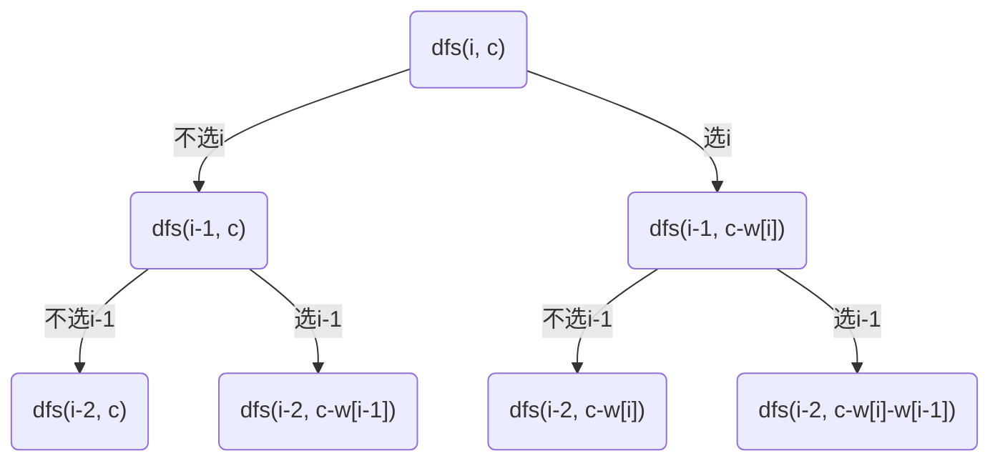
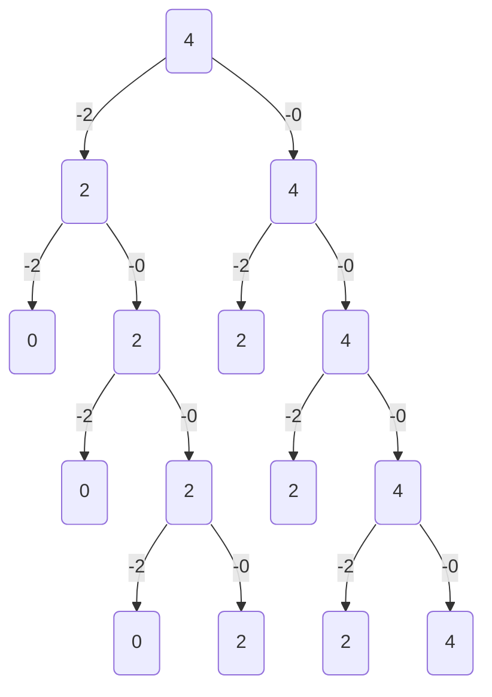

## 0-1背包问题
### 题意理解
有`n`个物品和一个容量为`w`的背包，每个物品有重量`w[i]`和价值`v[i]`两种属性，在背包容量为c的条件下，从中选出一些物品，限定每个物品最多只能选取0次或者1次，使得这些物品的价值和最大。

由于每个物体只有两种可能的状态（取与不取），对应二进制中的0和1，这类问题便被称为「0-1 背包问题」。

> 0-1背包： 如果限定每件物品最多只能选取 1 次（即 0 或 1 次），则问题称为 0-1背包问题。
>
> 完全背包： 如果每件物品最多可以选取无限次，则问题称为 完全背包问题。
>

这里其实有个隐含条件：重量是非负数的。负数 用回溯也是可以的，但是写dp时就很难受，所以问题先转化为非负数更方便。

![0-1 背包的回溯三问：当前操作是枚举第 i 个物品选或不选，不选则剩余容量不变、选则剩余容量减少 w[i]；子问题是剩余容量为 c 时从前 i 个物品中得到的最大价值和；由此得到 dfs(i, c) = max(dfs(i-1, c), dfs(i-1, c-w[i]) + v[i])](../../../assets/images/dp/knapsack-01-backtracking.png)
![0-1 背包的三种常见变形：至多装 capacity 求方案数/最大价值和，恰好装 capacity 求方案数/最大/最小价值和，至少装 capacity 求方案数/最小价值和；求方案数时 dfs(i, c) = dfs(i-1, c) + dfs(i-1, c-w[i])，对应填表 f[i][c] = f[i-1][c] + f[i-1][c-w[i]]，下标平移后写成 f[i+1][c] = f[i][c] + f[i][c-w[i]]](../../../assets/images/dp/knapsack-common-variants.png)

### 暴力回溯
先使用回溯的方法来做，回溯三问：

1. 当前操作：第i个物品选或者不选。选，剩余容量减少w[i]，价值增加v[i]；不选： 剩余容量不变
2. 子问题定义：dfs(i, c) := 表示w的下标[0:i]的区间的所有物品中，在剩余容量为c的条件下，从它们中选出一些物品，这些物品的最大的价值和。
3. 下一个子问题：
    1. 不选第i个物品，dfs(i, c) = dfs(i-1,c)
        1. 下标[0:i]的区间 就等价于下标[0:i-1]区间 的最大价值和。
    2. 选第i个物品：
        1. 剩余容量不够时，w[i] > c，dfs(i, c) = dfs(i - 1, c)
        2. 剩余容量够时，w[i] <= c，dfs(i, c) = dfs(i - 1, c - w[i]) + v[i]
            1. 最大价值和就等于 剩余容量为c-w[i]时，从下标[0 : i-1]区间 得到的最大价值和 加上物品i的价值。 

选第i个物品后的最大价值和必然是在选和不选之间 选取一个最大值，注意选择物品i不一定是最好的，因为：

> 在w[i] <= c的场景下：
>
> 1. dfs(i - 1, c) > dfs(i-1, c-w[i]) + v[i]: 选了i这个物品，可能是体积大但价值特别低，比如无穷小
> 2. dfs(i - 1, c) < dfs(i-1, c-w[i]) + v[i]：选了i这个物品，这个物品价值特别大，比如无穷大，那肯定选了价值更大
>

所以整合起来就是

1. `w[i] > c : dfs(i, c) = dfs(i - 1, c)`
2. `w[i] <= c : dfs(i, c) = max(dfs(i - 1, c), dfs(i - 1, c - w[i]) + v[i])`

```java
public class KnapsackProblem { 
  public int Knapsack(int[] w, int[] v, int capacity) {
    if(w.length != v.length) {
      return -1;
    }
    return dfs(w, v, w.length - 1, capacity);
  }
  // dfs(i, c) 表示w的下标[0:i]的区间的所有物品中，在剩余容量为c的条件下，从它们中选出一些物品，使得这些物品的价值和最大 
  private int dfs(int[] w, int[] v, int i, int c) {
    // 一个物品也没有了，没有价值了，返回0
    if(i < 0) {
      return 0;
    }
    // 当前i物品的重量超过剩余背包的容量
    if(w[i] > c) {
      return dfs(w, v, i - 1, c);
    }
    return Math.max(dfs(w, v, i-1, c), dfs(w, v, i - 1, c - w[i]) + v[i]);
  }
}
```

选或不选的过程其实就是一颗树，每个结点都是一个子问题，上面的结点依赖于下面的结点。所以时间复杂度为O(2^N)。



### 记忆化搜索
怎么优化时间复杂度呢？在上面的树中，会存在重复的子问题。

时刻记住：

dfs(i, c) 表示w的下标[0:i]的区间的所有物品中，在剩余容量为c的条件下，从它们中选出一些物品，使得这些物品的价值和最大 。

枚举i，选还是不选。其实可以发现dfs(i, c)会有很多重复的计算，同时dfs(i,c)的值是自底向上（深度）算出来的值，所以是可以在递归的过程中进行复用的。

```java
public class KnapsackProblem { 
  public int Knapsack(int[] w, int[] v, int capacity) {
    if(w.length != v.length) {
      return -1;
    }
    // dfs(i, c) 表示w的下标[0:i]的区间的所有物品中，在剩余容量为c的条件下，从它们中选出一些物品，使得这些物品的价值和最大 
    // dp[i][c] 也就是表示dfs(i, c)
    int[][] dp = new int[w.length][capacity + 1]
    return dfs(w, v, w.length - 1, capacity, dp);
  }
  
  private int dfs(int[] w, int[] v, int i, int c, int[][] dp) {
    if(i < 0) {
      return 0;
    }
    if(dp[i][c] != -1) {
      return dp[i][c];
    }
    // 当前i物品的重量超过剩余背包的容量，不选择
    if(w[i] > c) {
      return dfs(w, v, i - 1, c, dp);
    }
    dp[i][c] = Math.max(dfs(w, v, i-1, c, dp), dfs(w, v, i - 1, c - w[i], dp) + v[i]);
    return dp[i][c];
  }
}
```

时间复杂度为O(N*capacity)

### 填表dp
记忆化搜索已经算是dp了，但是是递归版本的。递归版本的不足是有额外的overhead，同时由于栈帧是在栈上分配的，栈的空间远比堆空间小，容易栈溢出。填表dp则通过迭代弥补了上述不足。

上面的记忆化搜索可以直接转化为表格递推式，这里需要注意的是，能够直接转换的原因是，dfs(i, c)的返回值其实是从底（叶子结点）向上（根结点）计算的值（深度），所以能够缓存子问题，因为表格也是从底开始算的，所以可以直接转换。

那么`dp[i][j]`的定义还是不变：`dp[i][j]`表示表示`w`的下标`[0: i]`的区间的所有物品中，在剩余容量为`j`的条件下，从它们中选出一些物品，使得这些物品的价值和最大 

1. 不选i：`dp[i][c] = dp[i - 1][c]`
    1. 不选i时，下标`[0: i]`的区间 就等价于下标`[0: i-1]`区间 的最大价值和 
2. 选i：
    1. `w[i] > c` ： `dp[i][c] = dp[i-1][c]`
        1. 超过背包剩余容量，无法选择，因为最大价值和为 dfs(i, c) = dfs(i-1, c)
    2. `w[i] <= c`： `dfs[i, c] = dp[i-1][c - w[i]] + v[i]`
        1. 尝试放入`w[i]`，那么价值和就等于 剩余容量为`c - w[i]`时，从下标`[0 : i-1]`区间 得到的最大价值和 加上物品i的价值
3. 边界条件:
    1. `dp[0][c] = v[0] if(w[0] <= c)`

```java
public class KnapsackProblem {
  public int Knapsack(int[] w, int[] v, int capacity) {
    int[][] dp = new int[w.length][capacity];
    // 边界条件
    for(int c = 0; c <= capacity; c++) {
      if(w[0] <= c) {
        dp[0][c] = v[0];
      }
    }

    for(int i = 1; i < w.length; i++) {
      for(int c = 0; c <= capacity; c++) {
        // 不选 or i的重量超过背包剩余容量
        dp[i][c] = dp[i-1][c];
        // 可选
        if(w[i] <= c) {
          dp[i][c] = Math.max(dp[i][c], dp[i-1][c-w[i]] + v[i]);
        }

      }
    }
    return dp[w.length-1][capacity];

  }
}
```

### 滚动数组优化空间
注意dp的状态转移方程，dp[i]只依赖于dp[i-1]，那可以只用一个滚动数组就行，又由于dp[i][j] 依赖于dp[i][j-w[i]]，如果从左滚动的话，滚动的i会覆盖掉i-1的，那后面的j依赖于前面的j，就有问题了。

所以需要从右向左滚动，保证不会覆盖。

```java
public class KnapsackProblem {
  public int Knapsack(int[] w, int[] v, int capacity) {
    int[] dp = new int[capacity];
    // 边界条件
    for(int c = 0; c <= capacity; c++) {
      if(w[0] <= c) {
        dp[c] = v[0];
      }
    }

    for(int i = 1; i < w.length; i++) {
      for(int c = capacity; c >= 0; c--) {
        // 不选 or i的重量超过背包剩余容量 dp[c] = dp[c]
        // 可选
        if(w[i] <= c) {
          dp[c] = Math.max(dp[c], dp[c-w[i]] + v[i]);
        }

      }
    }
    return dp[capacity];
  }
}
```

### 总结
01背包问题再次描述：

`dfs(i, c)` := 表示w的下标[0:i]的区间的所有物品中，在剩余容量为c的条件下，从它们中选出一些物品，这些物品的最大的价值和。

`dfs(i, c) = max(dfs(i - 1, c), dfs(i - 1, c - nums[i]) +v[i])`

但有时并不是求最大的总价值，而是求选择的方案数。那dfs(i, c) 表示w的下标[0:i]的区间的所有物品中，在剩余容量为c的条件下，从它们中选出一些物品，求最多能装的方案数。

那下一个子问题就是：

1. 下一个子问题：
    1. 不选第i个物品，dfs(i, c) = dfs(i-1,c)
        1. 下标[0:i]的区间 就等价于下标[0:i-1]区间 的方案数
    2. 选第i个物品：
        1. 剩余容量不够时，w[i] > c，dfs(i, c) = dfs(i-1, c)
        2. 剩余容量够时，w[i] <= c，dfs(i, c) = dfs(i-1, c-w[i]) 
            1. 方案数还是等于 剩余容量为c-w[i]时，从下标[0 : i-1]区间得到的方案数
2. 整体来看，就是选或者不选的方案数的叠加。 

`dfs(i, c) = dfs(i - 1, c) + dfs(i - 1, c - w[i])`

比较发现，方案数比最大价值和少了一个价值数组。

上面的01背包问题中，对于背包的剩余容量c，我们说的是最多装capacity，并没有要求装满

那如果要求的是恰好装capacity呢，求方案数/最大/最小价值和。

或者说至少装capacity，求方案数和最小价值和。

这种变化会影响边界条件和

![0-1 背包的三种常见变形：至多装 capacity 求方案数/最大价值和，恰好装 capacity 求方案数/最大/最小价值和，至少装 capacity 求方案数/最小价值和；求方案数时 dfs(i, c) = dfs(i-1, c) + dfs(i-1, c-w[i])，对应填表 f[i][c] = f[i-1][c] + f[i-1][c-w[i]]，下标平移后写成 f[i+1][c] = f[i][c] + f[i][c-w[i]]](../../../assets/images/dp/knapsack-common-variants.png)

## [494. Target Sum](https://leetcode.cn/problems/target-sum/)
与01背包无关的回溯：

```java
class Solution {
  private int count = 0;
    public int findTargetSumWays(int[] nums, int target) {
      // dp[i] 
      // dfs(i, target)

      dfs(nums, 0, target);
      return count;
    }
    private void dfs(int[] nums, int depth, int target) {
      if(depth == nums.length) {
        if(target == 0) {
          count++;
        }
        return ;
      }

      // +
      dfs(nums, depth + 1, target - nums[depth]);
      // - 
      dfs(nums, depth + 1, target + nums[depth]);
    }
}
```

### 暴力回溯
```java
class Solution {
  /* 
  p 非负数的和
  s 所有元素的和
  s - p 添加负数的和
  p - (s - p) = t
  2*p = s + t
  if s + t < 0 or (s + t) % 2 == 1, 上式便不成立，如果上式成立，那么
  p = (s + t) / 2
  so the question is : 
  choose some non-negative number of nums, make their sum equals to (s + t)/2;
  */
  public int findTargetSumWays(int[] nums, int target) {
    // 选择一些非负数，使得它们的和等于(s + t) / 2
    int n = nums.length;
    int sum = 0; 
    for(int i = 0; i < n; i++) {
      sum += nums[i];
    }
    int value = sum + target;
    if(value < 0 || value % 2 == 1) {
      return 0;
    }
    return dfs(nums, n - 1, value / 2);
  }
  private int dfs(int[] nums, int i, int target) {
    /* 
  dfs(i, target) := 从nums[0:i]中，选出一些非负数，使得这些数等于target的可能组合
  不选nums[i]:
  1. dfs(i, target) = dfs(i - 1, target);
  nums[i]为非负数时，选nums[i]：
  1. 容量不够时，dfs(i, target) = dfs(i - 1, target);
  2. 容量够时，dfs(i, target) = dfs(i - 1, target - nums[i]);
  
  
  所以 dfs(i, target) = dfs(nums, i - 1, target) + (nums[i] >= 0 ? dfs(nums, i - 1, target - nums[i]) : 0);
  edge : dfs(i < 0, 0) = 1, dfs(i < 0, != 0) = 0, dfs(i >= 0, t < 0) = 0;
	*/
    if(i < 0) {
      return target == 0 ? 1 : 0;
    }
    if(target < 0) {
      return 0;
    }
    return dfs(nums, i - 1, target) + 
    (nums[i] >= 0 ? dfs(nums, i - 1, target - nums[i]) : 0);
  }
}
```

总结：

属于背包问题的变形问题：从前i个物品中选取一些物品，背包恰好能装capacity时，最大的方案数。

恰好能装capacity体现在所有的物品都考虑过后，剩余容量为0的就代表着一种方案，非0的就代表不能恰好装下。

时间复杂度：O(2^n)

### 记忆化搜索
```java
class Solution {
  public int findTargetSumWays(int[] nums, int target) {
    // 选择一些非负数，使得它们的和等于(s + t) / 2
    int n = nums.length;
    int sum = 0; 
    for(int i = 0; i < n; i++) {
      sum += nums[i];
    }
    int value = sum + target;
    if(value < 0 || value % 2 == 1) {
      return 0;
    }
    int[][] dp = new int[n][value + 1];
    for(int[] item : dp) {
      Arrays.fill(item, -1);
    }
    return dfs(nums, n - 1, value / 2, dp);
  }
  private int dfs(int[] nums, int i, int target, int[][] dp) {
    // not choose nums[i], dfs(i, target) = dfs(i - 1, target);
    // choose nums[i], dfs(i, target) = max(dfs(i - 1, target), dfs(i - 1, target - nums[i]))
    // edge : dfs(i < 0, 0) = 1, dfs(i < 0, != 0) = 0, dfs(i >= 0, t < 0) = 0;
    if(i < 0) {
      return target == 0 ? 1 : 0;
    }

    if(target < 0) {
      return 0;
    }
    if(dp[i][target] != -1) {
      return dp[i][target];
    }
    return dp[i][target] = (dfs(nums, i - 1, target, dp) + (nums[i] >= 0 ? dfs(nums, i - 1, target - nums[i], dp) : 0));
  }
}
```

### 填表法
填表法在上面的记忆化搜索直接可以演化过来，但要注意边界条件。

如果初始化数组为int[][] dp = new int[nums.length][target + 1]，就要考虑dp[0] 在有一个数的的各种场景。

 边界条件：

  1. 不选nums[0]时，也算一种方案，dp[0][0] = 1

  2. 选nums[0]时，算一种方案，dp[0][nums[0]] += 1

如果初始化数组为int[][] dp = new int[nums.length + 1][target + 1]，那dp[0]代表就是空数组

边界条件：

  1. 空数组的条件下，dp[0][0] = 1

可以发现第二种的边界条件更简单。

```java
class Solution {
  /* 
    p 非负数的和
    s 所有元素的和
    s - p 添加负数的和
    p - (s - p) = t
    2 * p = s + t
    if s + t < 0 or (s + t) % 2 == 1, 上式便不成立，如果上式成立，那么
    p = (s + t) / 2
    so the question is : 
    choose some non-negative number of nums, make their sum equals to (s + t)/2;
    */
  public int findTargetSumWays(int[] nums, int target) {
    /* 
      target = (sum + target) / 2;
      dp[i + 1][target] := 从nums[0:i]中，选出一些非负数，使得这些数等于target的可能组合
      不选第i个数:
      1. dp[i + 1][target] = dp[i][target];
      nums[i]为非负数时，选第i个数：
      1. 容量不够时(nums[i] > target)，dp[i + 1][target] = dp[i][target]; target < nums[i]
      2. 容量够时(nums[i] <= target)，dp[i + 1][target] = dp[i][target - nums[i]]; target >= nums[i] && nums[i] >= 0
      
      return dp[n][target]；

      归纳总结一下：
      dp[i + 1][target] = dp[i][target]; when target < nums[i]
      dp[i + 1][target] = dp[i][target] + dp[i][target - nums[i]]; when target >= nums[i]
      
      我们用dp[0][target]表示空数组形成target的可能组合，所以边界条件：
      dp[0][0] = 1, 什么没有时，target为0也有一种方案。
    */
    int n = nums.length;
    int sum = 0; 
    for(int i = 0; i < n; i++) {
      sum += nums[i];
    }
    int value = sum + target;
    if(value < 0 || value % 2 == 1) {
      return 0;
    }
    value /= 2;
    int[][] dp = new int[n + 1][value + 1];
    dp[0][0] = 1;
    for(int i = 0; i < n; i++) {
      for(int j = 0; j <= value; j++) {
        if(nums[i] > j) {
          dp[i + 1][j] = dp[i][j];
        } else {
          dp[i + 1][j] = dp[i][j] +  dp[i][j - nums[i]];
        }
      }
    }
    return dp[n][value];
  }
}
```

## [416. Partition Equal Subset Sum](https://leetcode.cn/problems/partition-equal-subset-sum/)
The problem is very similar to 0/1 knapsack. It essentially  follows the same pattern. This solution tries all the combinations of partitioning the given numbers into two sets to see if any pair of sets have equal sum.

if `S`represents the total sum of all the given numbers, then the two equal subsets must have a sum equal to `S/2`, our problem is technically to find a subset of the given numbers that has a total sum of `S/2`. 

### bruce force solution：
```java
class Solution {
  public boolean canPartition(int[] nums) {
    int sum = Arrays.stream(nums).sum();
    if(sum % 2 == 1) {
      return false;
    }
    return dfs(nums, 0, sum / 2);
  }

  // find subset sum equals sum / 2
  private boolean dfs(int[] nums, int i, int sum) {
    if(sum < 0 || i >= nums.length) {
      return false;
    }
    if(sum == 0) {
      return true;
    }

    // choose  i or dont choose  i
    return dfs(nums, i + 1, sum - nums[i]) || dfs(nums, i + 1, sum);
  }
}
```

time complexity: O(2^n)

### solutiion 2: Memoization

我们以数组[2, 2, 2, 2]举例



每一层就相当于数组中的索引，可以发现，索引相同时，和也相同，那接下来的逻辑必然也是相同的，所以就有了重复子问题。

我们就可以建立一个dp[i][j] 表示集合前i个元素已经确认，剩下的元素能否选出一些数，使得这些数之和恰好为整数j。

```java
class Solution {
  public boolean canPartition(int[] nums) {
    int sum = Arrays.stream(nums).sum();
    if(sum % 2 != 0) {
      return false;
    }
    // dp[i][j] := 前i层sum等于j的
    // The first dimension of the array represents the subsets
    //  and the second dimension represents the “sums” that we can calculate from each subset.
    int[][] dp = new int[nums.length][sum / 2 + 1];
    for(int i = 0; i < nums.length; i++) {
      Arrays.fill(dp[i], -1);
    }
    return dfs(nums, 0, sum / 2, dp) == 1;
  }


  // find subset sum equals sum / 2
  private int dfs(int[] nums, int i, int sum, int[][] dp) {

    if(sum < 0 || i >= nums.length) {
      return 0;
    }
    if(sum == 0) {
      return 1;
    }
    if(dp[i][sum] != -1) {
      return dp[i][sum];
    }

    // choose  i or dont choose  i
    dp[i][sum] = dfs(nums, i + 1, sum - nums[i], dp) == 1 || dfs(nums, i + 1, sum, dp) == 1 ? 1 : 0;
    return  dp[i][sum];
  }
}
```

时间复杂度O(N*S)，S是数的和。

### Solution #3: Tabularization
0-1背包问题：在M个物品中取出若干件放在体积为W的背包里，每件物品只有一件，它们有各自的体积和价值，问如何选择使得背包能装下的物品的价值最多。

本问题可以抽象为：在若干个物品中选出一些物品，每个物品只能使用一次，这些物品恰好能够填满容量为sum/2的背包。

dp[i][j] 表示考虑下标[0, i] 这个区间里的所有整数，在它们当中能否选出一些数，使得这些数之和恰好为整数j

1. 不选nums[i]: dp[i][j] = dp[i-1][j]
2. 选nums[i]：
    1. nums[i] <= j：dp[i][j] = dp[i-1][j-nums[i]]
    2. nums[i] > j: 无法选取nums[i]，dp[i][j]= dp[i-1][j]
3. 边界条件
    1. dp[i][0] = true，一个都不选时，和自然为0。
    2. dp[0][nums[0]]= true，
4. 所以状态转移方程为：
    1. dp[i][j] = dp[i-1][j] when nums[i] > j
    2. dp[i][j] = dp[i-1][j] || dp[i-1][j-nums[i]] when nums[i] <= j

```java
class Solution {
  public boolean canPartition(int[] nums) {
    int sum = Arrays.stream(nums).sum();
    // must be even
    if(sum % 2 != 0) {
      return false;
    }
    // dp[i][j] := 考虑下标[0, i] 这个区间里的所有整数，在它们当中能否选出一些数，使得这些数之和恰好为整数j
    boolean[][] dp = new boolean[nums.length][sum / 2 + 1];
    // 一个数都不选时，和自然为0
    for(int i = 0; i < nums.length; i++) {
      dp[i][0] = true;
    }
    // 只考虑第一个数时，不选时，dp[0][0] = true；选时，dp[0][nums[0]] = true
    if(nums[0] <= sum / 2) {
      dp[0][nums[0]] = true;
    }

    for(int i = 1; i < nums.length; i++) {
      for(int j = 1; j <= sum / 2; j++) {
        if(nums[i] > j) {
          dp[i][j] = dp[i-1][j];
        } else {
          dp[i][j] = dp[i-1][j] || dp[i-1][j - nums[i]];
        }
      }
      if(dp[i][target]) {
        return true;
      }
    }

    return dp[nums.length - 1][sum / 2];
  }
}
```

如果我们用`dp[i+1]`表示`nums[i]`，那可以用更简单的边界的条件：

`dp[0][0] = true`，表示空集下，能够让其组成的和为0。

```java
class Solution {
  public boolean canPartition(int[] nums) {
    int n = nums.length;
    int sum = 0;
    for(int i = 0; i < n; i++) {
      sum += nums[i];
    }
    if(n == 1 || sum % 2 == 1) {
      return false;
    }
    int target = sum / 2;
    // 找出一些数，使得这些数等于target；
    // 类似01背包问题，从容量为target的背包中选出一些东西，这些东西的价值为nums[i]

    // dp[i + 1][target] := 从nums[0:i]选出一些数字，是否能使得它的价值为target
    // not choose nums[i], dp[i + 1][target] = dp[i][target]
    // choose nums[i] and nums[i] <= target , dp[i + 1][target] = dp[i][target] || dp[i][target - nums[i]]

    // return dp[n][target];
    // edge : dp[0][0] = 1 从空集中找出一些数等于0，方案也是一种; 
    // dp[0][t != 0] = 0; 
    // dp[i!= 0][0] = 1;
    boolean[][] dp = new boolean[n + 1][target + 1];
    dp[0][0] = true;
    for(int i = 0; i < n; i++) {
      for(int j = 0; j <= target; j++) {
        if(nums[i] > j) {
          dp[i + 1][j] = dp[i][j];
        } else {
          dp[i + 1][j] = dp[i][j] || dp[i][j - nums[i]];
        }
      }
    }
    return dp[n][target];
  }
}
```

#### 一维优化
由于dp[i][j] = dp[i-1][j] || dp[i-1][j - nums[j]]，dp[i] 只与dp[i-1]有关，下一行只依赖于上一行，那我们可以用一个滚动数组来完成。

即dp[j] = dp[j] || dp[j-nums[i]]，但值得注意的是，下一行后面的值依赖于上一行前面的值，如果每次从左开始计算，那么下一行就会覆盖掉上一行，下一行后面的值依赖的值就不正确了。

所以我们可以每次从右开始向左计算，就完全满足下一行后面的值依赖上一行前面的值。

```java
class Solution {
  public boolean canPartition(int[] nums) {
    int sum = Arrays.stream(nums).sum();
    // must be even
    if(sum % 2 != 0) {
      return false;
    }
    int target = sum / 2;
    // dp[i][j] := 考虑下标[0, i] 这个区间里的所有整数，在它们当中能否选出一些数，使得这些数之和恰好为整数j
    // dp[j] := 起始代表[0,0] 这个区间里的所有整数，在它们当中能否选出一些数，使得这些数之和恰好为整数j
    boolean[] dp = new boolean[target + 1];
    // 不选时，和为0的 dp[0] = true
    dp[0] = true;

    // 只考虑第一个数时，选nums[0]时，dp[nums[0]] = true
    if(nums[0] <= target) {
      dp[nums[0]] = true;
    }

    // 从考虑[0, 1]开始算
    for(int i = 1; i < nums.length; i++) {
      for(int j = target; j >= 0; j--) {
        if(nums[i] <= j) {
          dp[j] = dp[j] || dp[j - nums[i]];
        }
      }
      if(dp[target]) {
        return true;
      }
    }

    return dp[target];
  }
}
```

## [2431. 最大限度地提高购买水果的口味](https://leetcode.cn/problems/maximize-total-tastiness-of-purchased-fruits/)
### 记忆化搜索
```java
class Solution {

  public int maxTastiness(int[] price, int[] tastiness, int maxAmount, int maxCoupons) {

    int[][][] dp = new int[price.length][maxAmount + 1][maxCoupons + 1];
    return dfs(price, tastiness, price.length - 1, maxAmount, maxCoupons, dp);
  }
  /*
  dfs(i, j, k) := 下标[0:i]的水果中，在剩余价格为j、剩余优惠券数量为k的条件下，买一些水果的最大总口味
  1. 不买第i个水果，dfs(i, j, k) = dfs(i-1, j, k)
  2. 买第i个水果:
  2.1 不使用优惠券，
    2.1.1 剩余的钱够时，price[i] <= j,  dfs(i, j, k) = dfs(i-1, j - price[i], k) + tastiness[i]
    2.1.2 剩余的钱不够时，price[i] > j, dfs(i, j, k) = dfs(i-1, j, k)
  2.2 使用优惠券
    2.2.1 剩余的钱够时, price[i] / 2 <= j， dfs(i, j, k) = dfs(i-1, j - price[i] / 2, k - 1) + tastiness[i]
    2.2.2 剩余的钱不够时，price[i] / 2 > j, dfs(i, j, k) = dfs(i-1, j, k)
  */
  private int dfs(int[] price, int[] tastiness, int i, int j, int k, int[][][] dp) {
    if(i < 0) {
      return 0;
    }
    if(j < 0) {
      return 0;
    }
    if(dp[i][j][k] != 0) {
      return dp[i][j][k];
    }

    // 不选i
    int x1 = dfs(price, tastiness, i - 1, j, k, dp);
    // 选i但不使用优惠券：
    int x2 = 0;
    if(price[i] <= j) {
      x2 = dfs(price, tastiness, i - 1, j - price[i], k, dp) + tastiness[i];
    }

    // 选i且使用优惠券：
    int x3 = 0;
    if(price[i] / 2 <= j && k > 0) {
      x3 = dfs(price, tastiness, i - 1, j - (price[i] / 2), k - 1, dp) + tastiness[i];
    }
    int max = Math.max(x1, Math.max(x2, x3));
    // System.out.println(i + " " + j + " " + " " + k + " " + x1 + " "+ x2 + " "+ x3);
    dp[i][j][k] = max;
    return max;
  }        
}
```

### 填表dp
上面的回溯dp其实相当于是根据表格推的，如果要写成表格的形式，与记忆化搜索的区别是要注意初始条件。

```java
class Solution {
  public int maxTastiness(int[] price, int[] tastiness, int maxAmount, int maxCoupons) {
    /*
        dfs(i, j, k) := 下标[0:i]的水果中，在剩余价格为j、优惠券数量为k的条件下，买一些水果的最大总口味
        dfs(i, j, k) = max(dfs(i - 1, j, k), dfs(i - 1, j - prices[i], k), dfs(i - 1, j - prices[i] / 2, k - 1));

      dp[i][j][k] := 下标[0:i]的水果中，在剩余价格为j、优惠券数量为k的条件下，买一些水果的最大总口味
       1. 不买第i个水果：dp[i + 1][j][k] = dp[i][j][k]
       2. 买第i个水果:
          2.1 j < price[i] / 2, 使用优惠券也买不起的情况， dp[i + 1][j][k] = dp[i][j][k];
          2.2 使用优惠券买得起的情况，price[i] / 2 <= j < price[i], dp[i + 1][j][k] = dp[i][j - prices[i] / 2][k] + tastiness[i]
          2.3 不使用优惠券也能买得起，可以使用也可以不使用优惠券：j > price[i], dp[i + 1][j][k] = max(dp[i][j - prices[i] / 2][k - 1] + tastiness[i], dp[i][j - prices[i]][k] + tastiness[i])

      edge : dp[0][j][k] = 0 

      return dp[n][maxAmount][maxCoupons];
      */
    int n = price.length;
    int[][][] dp = new int[n + 1][maxAmount + 1][maxCoupons + 1];
    for(int i = 0; i < n; i++) {
      for(int j = 0; j <= maxAmount; j++) {
        for(int k = 0; k <= maxCoupons; k++) {
          if(j < price[i] / 2) {
            // 钱不够购买i
            dp[i + 1][j][k] = dp[i][j][k];
          } else if (price[i] / 2 <= j && j < price[i]){
            // 使用优惠券的情况下才能买得起i
            if (k > 0) {
              dp[i + 1][j][k] = Math.max(dp[i][j][k], dp[i][j - price[i] / 2][k - 1] + tastiness[i]);
            } else {
              dp[i + 1][j][k] = dp[i][j][k];
            }
          } else if(price[i] <= j && k == 0) {
            // 不使用优惠券也能买得起，但是没有优惠券
            dp[i + 1][j][k] = Math.max(dp[i][j][k], dp[i][j - price[i]][k] + tastiness[i]);
          } else if (price[i] <= j && k > 0){
            // 不使用优惠券也能买得起i, 可以使用也可以不使用
            dp[i + 1][j][k] = Math.max(dp[i][j][k], 
                                       Math.max(dp[i][j - price[i]][k] + tastiness[i], dp[i][j - price[i] / 2][k - 1] + tastiness[i]));
          }
        }
      }
    }
    return dp[n][maxAmount][maxCoupons];
  }


}
```

还可以从空间上去优化，滚动数组。
