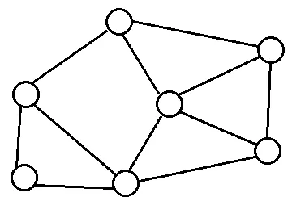
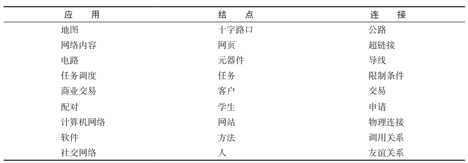
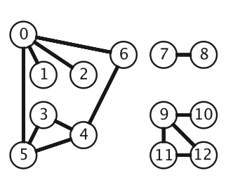
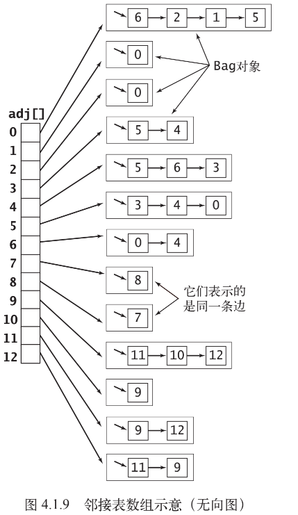
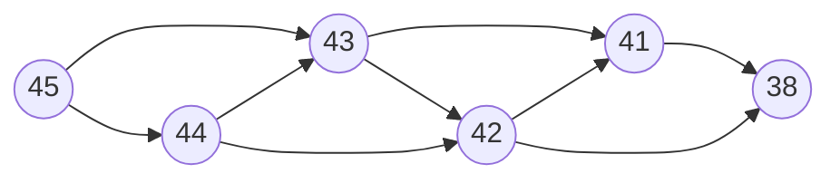

## 基本介绍
图是一种由顶点和边组成的一种数据结构，顶点是在图中的任意一个结点，边是两个结点之间的连接。



w这种复杂的数据结构可以用来抽象更复杂的现实，比如地图可以看作是以十字路口为结点、公路为边的图，社交网络是由人作为结点、人之间的关系（关系也是看可以枚举和量化）作为边的图。



图的典型应用

图的类型有很多，我们先介绍三种图。

## 无向图

无向图是指任意两个顶点之间的边是没有方向的，没有方向意味着每条边都可以在两个方向上穿过。

## 加权无向图
不同的边可能有不同的权值；

## 有向图
有向图：任意两个顶点之间的边是都是有方向的，有方向意味每条边只能在单个方向上穿过 。

树可以看中一种特殊的图：有向的无环图，

## 加权有向图
加权图：每条边都带有一个相关的权重；

## 特殊的图
最特殊、最常见的图应该就是树了，当一个图是无环图，但添加任意一条边都会产生一条环，满足这个条件的图就是树，大多数树都是有向的。

## 图的存储
不管是什么类型的图，最重要的无非是顶点（vertex）和边（edge），假设顶点有V条，边有E条，如果要实现图的表示，需要满足下列两个条件：

1. 它必须为可能在应用中碰到的各种类型的图预留出足够的空间；
2. 图的实例方法的实现一定要快；

### 邻接矩阵(adjacency matrix)
邻接矩阵 是一个V*V的二维矩阵，一般我们使用`boolean`数组`arr`。

1. 如果`arr[i][j]`的值为`true`，表示点 i与点 j之间连了一条从`i`指向`j`的边。
2. 如果`arr[i][j]`的值为`false`，表示点 i与点 j之间没有连边。

二维矩阵arr添加一条边的时间复杂度为O(1)，判断两个边是否相连的时间复杂度也为O(1)，但是它有一个很明显的缺陷，就是存下一个图需要O(n^2)的空间复杂度，当点的个数远远小于边时，很多空间都被浪费了。

### 邻接表数组(An array of adjacency lists)
邻接矩阵在存储稀疏图的时候比较浪费空间，优化的思路就是我们不考虑每一个点对的连边信息，只考虑有连边的点对。我们可以将每个顶点的所有相邻顶点都保存在该顶点对应的元素所指向的一张链表中。

以下面这张无向图为例，它有 13 个顶点（0~12）、3 个连通分量：



它对应的邻接表数组如下，`adj[]` 的每个下标是一个顶点，指向一张存放其所有相邻顶点的链表。注意无向图的每条边会在两个顶点的链表里各出现一次（比如 7 和 8 表示的是同一条边）：



图 4.1.9　邻接表数组示意（无向图）

添加一条边的时间复杂度为O(1)，

当顶点可以用整数表示时，尤其是从0开始的连续的整数，普遍用线性表来表示：

对于无权图：以List<List<Integer>> graph存图，grap.get(u).get(v）来获取边(u,v)的信息

> 也可以用：List<Integer>[] graph = new ArrayList[n];  
> Arrays.setAll(graph, k -> new ArrayList<>());
>

加权图：List<List<int[]>> graph，int[] v_weight =graph.get(u); v = v_weight[0]; weight = v_weight[1]

或者是List<List<Pair>> graph.

当顶点不能用非负整数来表示时，比如字符串和对象引用类型，可以用哈希表来存图，key为顶点，value仍然是列表，存储顶点key的领接顶点。

不过还有另一种方法，映射对象引用的顶点到非负整数，然后用int[][] weights = new int[][] 存储顶点i到顶点j之间到权重。思想是这个思想，可以根据具体情况进行微调。

```java
class solution {
  class Vertex {
    int x;
    int y;
    Vertex(int x, int y) {
      this.x = x;
      this.y = y;
    }
    
    @Override
    public boolean equals(Object o) {
      if(this == o) {
        return true;
      }
      if(o == null || getClass() != o.getClass()) {
        return false;
      }
      Vertex vertex = (Vertex) o;
      return x == vertex.x && y == vertex.y;
    }

    @Override
    public int hashCode() {
      return Objects.hash(x, y);
    }
  }
  
  public int[][] buildGrpah(int[][] u_v_weights, Map<Vertex, Integer> vertexToIndexMap) {
    // u_v_weights需要去重

    // map存顶点及其整数索引，每个vertex 从0开始映射 整数索引
    // Map<Vertex, Integer> vertexToIndexMap = new HashMap<>();
    
    for(int i = 0; i < u_v_weights.length; i++) {
      int[] u_v_weight = u_v_weights[i];
      Vertex u = new Vertex(u_v_weight[0], u_v_weight[1]);
      // 暂时映射0
      vertexToIndexMap.put(u, 0);

      Vertex v = new Vertex(u_v_weight[2], u_v_weight[3]);
      vertexToIndexMap.put(v, 0);
    }


    int vertexNum = vertexToIndexMap.size();
    // 所有顶点，不一定需要
    Vertex[] vertices = new Vertex[vertexNum];
    // 顶点映射的索引位置
    int index = 0;
    for(Vertex vertex : vertexToIndexMap.keySet()) {
      vertices[index] = vertex;
      vertexToIndexMap.put(vertex, index);
      index++;
    }


    int[][] weights = new int[vertexNum][vertexNum];
    for(int i = 0; i < u_v_weights.length; i++) {
      int[] u_v_weight = u_v_weights[i];
      Integer uIndex = vertexToIndexMap.get(new Vertex(u_v_weight[0], u_v_weight[1]));
      Integer vIndex = vertexToIndexMap.get(new Vertex(u_v_weight[2], u_v_weight[3]));
      weights[uIndex][vIndex] = u_v_weight[4];
    }

    // vertexToIndexMap 顶点映射的索引，索引之间的权重
    return vertexToIndexMap, weights;
  }

}


```

存储图的空间复杂度为O(E)，E为边的数量。

## 图的遍历
图的遍历如同树一样，使用DFS和BFS即可。

| 类型 | leetcode题 | 备注 |  |
| --- | --- | --- | --- |
| 无向图的连通性 | [323. 无向图中连通分量的数目](https://leetcode.cn/problems/number-of-connected-components-in-an-undirected-graph/) |  |  |
| 无向图判环 | [684. 冗余连接](https://leetcode.cn/problems/redundant-connection/) | dfs/bfs + 减边/加边法 |  |
| 有向图判环 | [207. 课程表](https://leetcode.cn/problems/course-schedule/) | dfs/bfs + 减边/加边法 |  |
| 有向无环图的路径 | [797. 所有可能的路径](https://leetcode.cn/problems/all-paths-from-source-to-target/) |  |  |
| 拓扑排序 | [210. 课程表 II](https://leetcode.cn/problems/course-schedule-ii/) | bfs - kahn算法;  dfs+tarjan算法 |  |

#### [323. 无向图中连通分量的数目](https://leetcode.cn/problems/number-of-connected-components-in-an-undirected-graph/)
该题的核心是将edges表示的图转化为邻接表数组，然后再通过dfs或者bfs遍历邻接表做标记，就跟之前的岛屿数量问题一样。

dfs的解法和bfs的解法的时间和空间复杂度都一样：

1. 时间复杂度：O(|V| + |E|) ，完成一遍图的遍历。
2. 空间复杂度：O(|V| + |E|) ，存图空间。

```java
class Solution {
  public int countComponents(int n, int[][] edges) {
    // 构造一个邻接表矩阵
    List<List<Integer>> graph = new ArrayList<>();
    for(int i = 0; i < n; i++) {
      graph.add(new ArrayList<>());
    }
    for(int[] edge : edges) {
      int u = edge[0];
      int v = edge[1];
      // 无向图
      graph.get(u).add(v);
      graph.get(v).add(u);            
    }
    // 图的显示
    for(int i = 0; i < n; i++) {
      List<Integer> nextNodes = graph.get(i);
      System.out.println(i + ": " + nextNodes);
    }

    boolean[] visited = new boolean[n];
    int count = 0;
    for(int i = 0; i < n; i++) {
      if(!visited[i]) {
        // 每一次dfs都会做标记，能从外部访问几次dfs就是连通分量的数量
        count++;
        visited[i] = true;
        // dfs(graph, i, visited);
        bfs(graph, i, visited);
      }
    }

    return count;
  }
  // dfs - 每成功访问一个结点后就做标记
  private void dfs(List<List<Integer>> graph, int i, boolean[] visited) {
    List<Integer> nextNodes = graph.get(i);
    for(Integer next : nextNodes) {
      if(!visited[next]) {
        visited[next] = true; 
        dfs(graph, next, visited);
      }
    }
  }

  // bfs - 每成功访问一个结点后就做标记
  private void bfs(List<List<Integer>> graph, int v, boolean[] visited) {
    Deque<Integer> queue = new LinkedList<>();
    queue.offer(v);
    visited[v] = true;
    while(!queue.isEmpty()) {
      int size = queue.size();
      for(int i = 0; i < size; i++) {
        Integer cur = queue.poll();
        List<Integer> nextNodes = graph.get(cur);
        for(Integer next : nextNodes) {
          if(!visited[next]) {
            queue.offer(next);
            visited[next] = true;
          }
        }
      }

    }
  }
}
```

#### [684. 冗余连接](https://leetcode.cn/problems/redundant-connection/)

这道题的本质是：判断无向图是否有环。

冗余链接有个点需要注意：需要返回的是`edges` 中最后出现的边。

思路有三种：

思路一：从某个顶点v出发，执行bfs/dfs遍历，如果能找到v，就说明v是在环中；确定环上所有的顶点，然后对照edges，找出最后出现的边；

思路二：加边法 - 建图过程中，每加入一条边（u, v）前，搜索当前图上，能否从u搜索到v，如果可以，说明当前u、v已经连通，再加入这条边必定成环。由于我们从前到后依此取edges的边加入，最后一条成环的边就是答案；

思路三：减边法 - 先建好图，然后依此从edges的最后开始减掉这个边(u, v)，减边后搜索图中u、v是否连通，如果能连通说明(u, v)就是造成环的最后一条边。

dfs的加边法：

```java
class Solution {
  // 加边法
  public int[] findRedundantConnection(int[][] edges) {
    int n = edges.length;
    List<List<Integer>> graph = new ArrayList<>();
    // boolean[] visited = new boolean[n];
    for(int i = 0; i <= n; i++) {
      graph.add(new ArrayList<>());
    }
    for(int i = 0; i < n; i++) {
      int[] edge = edges[i];
      int u = edge[0];
      int v = edge[1];

      if(dfs(graph, u, v, new boolean[n+1])) {
        return edge;
      }
      graph.get(u).add(v);
      graph.get(v).add(u);
    }
    // 图的显示
    // display(graph);
    return new int[]{0, 0};
  }
  // u与v是否连通
  private boolean dfs(List<List<Integer>> graph, int u, int v, boolean[] visited){
    if(u == v) {
      return true;
    }
    visited[u] = true;
    for(Integer next : graph.get(u)) {
      if(!visited[next] && dfs(graph, next, v, visited)) {
        return true;
      }
    }
    return false;
  }

  private void display(List<List<Integer>> graph) {
    int n = graph.size();
    for(int i = 0; i < n; i++) {
      List<Integer> nextNodes = graph.get(i);
      System.out.println(i + ": " + nextNodes);
    }
  }
}
```

时间复杂度: 最坏和平均时间复杂度都是 O(|V|^2)。分析与「无向图连通性」的泛洪解法一致，不再赘述。

空间复杂度: 存图空间 O(|V|+|E|) ， visited空间 O(|V|)，递归栈或队列空间 O(|V|) 。总体为线性空间复杂度 O(|V|+|E|)

如果用并查集，其时间复杂度可为O(VLogV)；

还可以考虑拓扑排序。

#### [207. 课程表](https://leetcode.cn/problems/course-schedule/)

这道题的本质是：判断一张有向图有没有环。

dfs的加边法，需要注意的是即使是有向图，也要注意使用visited来减少重复计算。

dfs(graph, v2, v1, new boolean[n])的含义为是否存在从v2到v1的边。



假设图如上面，我们需要找是否存在45能到36的路径。图中其实没有36，所以实际上遍历就需要遍历完所有的情况。把它从45展开成一棵搜索树，2^3条路径就是8个叶子：

```
45
├── 43
│   ├── 41 → 38          ①
│   └── 42
│       ├── 41 → 38      ②
│       └── 38           ③
└── 44
    ├── 43
    │   ├── 41 → 38      ④
    │   └── 42
    │       ├── 41 → 38  ⑤
    │       └── 38       ⑥
    └── 42
        ├── 41 → 38      ⑦
        └── 38           ⑧
```

43和42各被展开了两次，41和38被重复走了8次，这就是2^3的来历。

但实际上我们并不需要遍历这么多情况，每遍历完一个结点，就可以做个标记，如果标记的点的路径都不能到目标点，那么从其他路径来想通过这个标记的点也是不可能找到目标点，所以根本就不需要遍历。同一棵树，加上标记后就被剪成：

```
45
├── 43
│   ├── 41 → 38          只有这一条真正走到底
│   └── 42
│       ├── 41  ✗ 已标记，回头
│       └── 38  ✗ 已标记，回头
└── 44
    ├── 43   ✗ 已标记，回头
    └── 42   ✗ 已标记，回头
```

也就是只剩 `45 → 43 → 41 → 38`、`45 → 43 → 42`、`45 → 44` 三条，每个结点只进一次，大大减少时间复杂度。

整体最坏和平均时间复杂度都是 O(|V|^2)，如果用拓扑排序做的话，时间复杂度位O(E+V)

空间复杂度：存图空间 O(|V|+|E|)，visited 空间 O(|V|)，递归栈最深 O(|V|)，总体 O(|V|+|E|)。

补充一句：上面的 O(|V|^2) 是在「边数与顶点数同阶」（即 |E| = O(|V|)）时的结论。更一般地，每加一条边前都要跑一次 DFS，单次 DFS 最坏 O(|V|+|E|)，一共 |E| 条边，所以是 O(|E| · (|V|+|E|))。稠密图下 |E| 可以到 |V|^2 量级，这个做法会明显慢于拓扑排序的 O(|V|+|E|)——这也正是这题更推荐拓扑排序的原因。

```java
class Solution {
  public boolean canFinish(int numCourses, int[][] prerequisites) {
    List<List<Integer>> graph = new ArrayList<>();

    for(int i = 0; i < numCourses; i++) {
      graph.add(new ArrayList<>());
    }
    int n = graph.size();
    for(int[] prerequisite: prerequisites) {
      int u = prerequisite[1];
      int v = prerequisite[0];
      // 每加一条u->v的边之前，看看是不是已经存在v->u的路径，如果存在，则说明有环
      if(dfs(graph, v, u, new boolean[n])) {
        return false;
      }
      graph.get(u).add(v);
    }

    return true;
  }
  // 是否存在从u到v的边
  // 必须使用visited，否则会进行大量重复的搜索
  private boolean dfs(List<List<Integer>> graph, int u, int v, boolean[] visited) {
    if(u == v) {
      return true;
    }
    visited[u] = true;
    List<Integer> nextNodes = graph.get(u);
    for(Integer next : nextNodes) {
      if(!visited[next] && dfs(graph, next, v, visited)) {
          return true;
      }
    }
    return false;
  }
}
```

#### [797. 所有可能的路径](https://leetcode.cn/problems/all-paths-from-source-to-target/)
该题的图的存储的数据结构就是邻接表数组；

同时由于是一个有向无环图（DAG），并且题目显示只需找到从0开始到n-1结束的路径，所以非常简单的应用深度优先搜索即可。

```java
class Solution {
  public List<List<Integer>> allPathsSourceTarget(int[][] graph) {
    // 从0开始的有向无环图
    int n = graph.length;
    List<List<Integer>> result = new ArrayList<>();
    List<Integer> path = new ArrayList<>();
    path.add(0);
    dfs(graph, 0, path, result, n);
    return result;

  }

  private void dfs(int[][] graph, int node, List<Integer> path, List<List<Integer>> result, int n) {
    if(node == n - 1) {
      result.add(new ArrayList<>(path));
    }
    int[] nextNodes = graph[node];
    for(int nextNode : nextNodes) {
      path.add(nextNode);
      dfs(graph, nextNode, path, result, n);
      path.remove(path.size() - 1);
    }
  }
}
```

这题和前面三题不一样：前面三题只要一个「是/否」或者一个计数，遍历一遍图就够了，靠 `visited` 可以把每个点只走一次，做到 O(V+E)；这题要把**所有**路径都列出来，同一个点在不同路径里会被反复经过，`visited` 一加就会漏答案。所以复杂度由答案本身的规模决定，是指数级的。

**为什么路径数是 `2^(n-2)`**：最坏情况是「结点 i 指向所有 j > i」的完全 DAG，n=5 时邻接表长这样：

```
graph[0] = [1, 2, 3, 4]
graph[1] = [2, 3, 4]
graph[2] = [3, 4]
graph[3] = [4]
graph[4] = []          // 终点，没有出边
```

这种图里，一条从 0 到 n-1 的路径就是「起点 0 + 中间点的某个子集 + 终点 n-1」。中间点**挑哪些**是自由的（任意子集都合法，因为 i 能直接跳到任意 j > i），但**顺序不自由**（边只能由小到大走，子集一定，路径就唯一确定）。于是「路径」和「中间点集合 {1, …, n-2} 的子集」一一对应：

```
n = 5，中间点 {1,2,3}，共 2^3 = 8 条路径：

  {}        0 → 4
  {1}       0 → 1 → 4
  {2}       0 → 2 → 4
  {3}       0 → 3 → 4
  {1,2}     0 → 1 → 2 → 4
  {1,3}     0 → 1 → 3 → 4
  {2,3}     0 → 2 → 3 → 4
  {1,2,3}   0 → 1 → 2 → 3 → 4
```

中间点有 n-2 个，子集有 `2^(n-2)` 个，路径也就有 `2^(n-2)` 条。

1. 时间复杂度：O(n × 2^n)。最坏情况下路径共有 `2^(n-2)` 条；每条路径最长 n 个结点，`new ArrayList<>(path)` 拷贝一条路径要 O(n)。即使不算这次拷贝也一样：递归树上每个结点对应一个「路径前缀」，前缀总数同样是 O(2^n)，每层还要遍历 O(n) 条出边。
2. 空间复杂度：O(n)，`path` 最长 n、递归栈最深也是 n。这里不计返回值 `result` 本身；若把答案占用的空间算进去，则是 O(n × 2^n)——和时间同阶，也就是说光把答案写出来就要这么多时间，这个算法已经是渐进最优的了。
