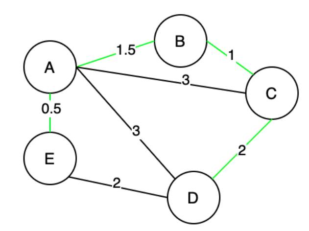
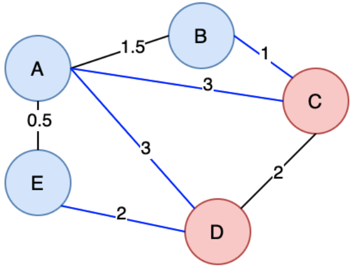
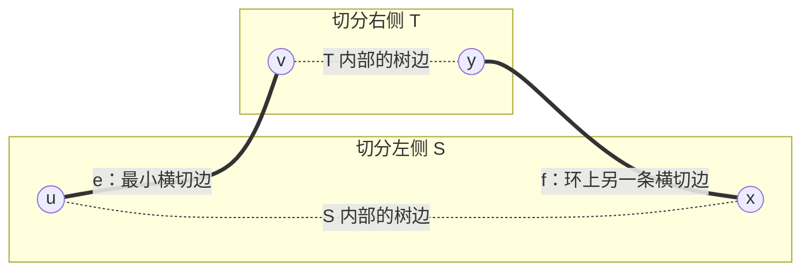
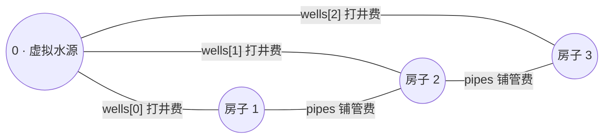
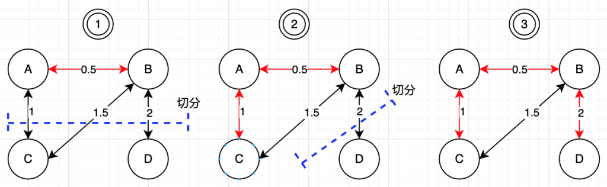

## 简介
> Minimum Spanning Tree, also MST
>

**生成树**是指的**「无向图」**中，具有该图的「**全部顶点」**且「**边数最小**」的连通子图；

**最小生成树**则是指在加权无向图中，**总权重**最小的生成树。

如下图的最小生成树是`[(A,B), (A, E), (B, C), (C, D)]`或者是`[(A, B), (A, E), (B, C), (E, D)]`。



可以自己验算一下：`0.5 + 1.5 + 1 + 2 = 5`；把 `C-D(2)` 换成同样是 2 的 `E-D(2)`，总权重还是 5。所以**最小生成树本身可能不唯一，但最小的总权重是唯一的**。

再看一眼边数：N 个顶点要连通，至少需要 N-1 条边；而一旦超过 N-1 条边就必然出现环，把环上任意一条边删掉，图仍然连通、总权重却更小。所以**生成树的边数恒等于 N-1**，后面两个算法的收工条件都是从这里来的。

最小生成树有什么用呢？在我们求解需要连接所有点的最小、最短等问题时就能用上，比如连接所有点的最小费用。

另外注意「最小生成树」是**无向图**上的概念。有向图上对应的问题叫「最小树形图」（朱刘算法），不在本文范围内。

如何生成最小生成树呢？

+ Kruskal 算法
+ Prim 算法

## 切分定理
切分定理是一个基础定理，将在后续的最小生成树算法中用到。



1. 切分：将图切成两个部分，称之为一个切分。上图就是一个切分图，其中(B, A, E)为一个部分，(C, D)为另外一个部分。
2. 横切边：如果一条边连接的两个顶点属于切分的两个部分，这个边称为横切边。在切分图中，(B, C), (A, C), (A, D), (E, D) 均为横切边。

对照上面这张切分图：四条横切边 (B,C)=1、(E,D)=2、(A,C)=3、(A,D)=3 里最小的是 **(B, C) = 1**。回头看文首那棵最小生成树，(B, C) 确实在里面。

> 在一幅连通加权无向图中，给定任意的切分，如果有一条横切边的权值严格小于所有其他横切边，则这条边必然属于图的最小生成树中的一条边。
>

最小的横切边，必定是最小生成树的一条边。

> 仔细品，如果是横切成了两部分，如果要形成最小生成树，横切边的最小边必然是最小生成树的一部分。
>

### 为什么切分定理成立
用**交换论证**（把一棵更优的树改造成含 e 的树）来看最直观：

设 e 是某个切分下**唯一**的最小横切边，反设有一棵最小生成树 T 不含 e。

1. 把 e 加进 T，必然形成一个环——树上任意加一条边都会成环。
2. 这个环从 e 的一端跨到切分的另一侧，最后还要绕回来，**一进一出**，所以环上除了 e 之外**至少还有另一条横切边 f**。
3. 因为 e 是严格最小的横切边，所以 `w(e) < w(f)`。
4. 把 f 删掉、换成 e：删掉环上一条边不会破坏连通性，结果仍然是一棵生成树，但总权重减少了 `w(f) - w(e) > 0`。

这与「T 是最小生成树」矛盾，所以 T 必须含 e。



图里 u-v-y-x-u 就是第 2 步说的那个环：**从左侧出去（e），必然要从某条横切边（f）回来**，这是整个证明的关键一步。

至于定理里为什么要写「严格小于」：如果最小的横切边有好几条并列，每一条**仍然属于某一棵最小生成树**，只是不保证它们同时属于同一棵（同时选可能成环），写成严格小于是为了让结论干净。实际写代码时不用管这点——并列的边按任意顺序处理，得到的都是合法的最小生成树，只是可能是不同的那一棵。文首 `C-D(2)` 和 `E-D(2)` 二选一，就是这种情况。

## Kruskal 算法
### 算法步骤
Kruskal算法是求解加权无向图的最小生成树的一种算法。

1. 所有的边按照权重从小到大的排序；
2. 依此加入到最小生成树中，形成环则跳过；
3. 直到选择`N - 1`条边为止
    1. 如果要连接所有的顶点，必然是至少需要`N - 1`条边的；

### 为什么贪心是对的
每一次都需要选择不形成环的最小的边，这其实是一种贪心的思想。为什么可以使用贪心算法？

Kruskal中心思想：不构成环的情况下选择最小边。

与其硬套反证法，不如**直接用切分定理**——Kruskal 的每一步其实都在偷偷做一个切分：

Kruskal 此刻拿出的是当前最小的、且两端还不连通的边 `e = (u, v)`。把「已经和 u 连通的所有点」划为 S、其余点划为 T，这就是一个切分，而 e 是它的一条横切边。

现在问：有没有比 e 更小的横切边？没有。因为所有比 e 小的边此前都已经被处理过了：

+ 要么被选进来了——那它两端现在同在 S 或同在 T，**不是**横切边；
+ 要么被跳过了——跳过意味着当时两端已连通，现在同样在同一侧，**也不是**横切边。

所以 **e 就是这个切分下最小的横切边**，由切分定理，e 必属于最小生成树。每一步都对，整个过程自然就对。

### 手动模拟
拿文首那张图跑一遍。先把七条边排序：`A-E 0.5`、`B-C 1`、`A-B 1.5`、`C-D 2`、`E-D 2`、`A-C 3`、`A-D 3`。

| 步骤 | 取出的边 | 权重 | 两端已连通？ | 决定 | 已选边数 | 当前连通块 |
| --- | --- | --- | --- | --- | --- | --- |
| 1 | A-E | 0.5 | 否 | 选 | 1 | {A,E} {B} {C} {D} |
| 2 | B-C | 1 | 否 | 选 | 2 | {A,E} {B,C} {D} |
| 3 | A-B | 1.5 | 否 | 选 | 3 | {A,B,C,E} {D} |
| 4 | C-D | 2 | 否 | 选 | 4 = N-1，收工 | {A,B,C,D,E} |

总权重 `0.5 + 1 + 1.5 + 2 = 5`。第 4 步如果堆里先弹出的是同为 2 的 `E-D`，选它之后 `C-D` 会因为两端已连通被跳过，答案仍是 5——这正是文首给出两组答案的原因。

注意中途的状态：Kruskal 手里始终是**一片森林**（好几个连通块），直到最后一步才拼成一棵树。这是它和 Prim 最大的区别。

### 复杂度

| 环节 | 复杂度 | 说明 |
| --- | --- | --- |
| 边排序 / 建堆 | O(ElogE) | 主导项，E 为边数 |
| 并查集判连通 | 约 O(E·α(V)) | α 是反阿克曼函数，可当常数看 |
| 空间 | O(V + E) | 并查集 O(V)，堆里放边 O(E) |

### [1584. 连接所有点的最小费用](https://leetcode.cn/problems/min-cost-to-connect-all-points/)
连接所有点，又是最小费用，相当于是做加权无向图的最小生成树。

1. 利用二维数组的索引来映射顶点；
2. 查看连通性利用并查集；
3. 利用优先队列（最小堆）来使所有的边按照权重从小到大出队；

Edge(start, end, cost)：Edge类代表从start点开始，连接到end点，两点到权重为cost

```java
class Solution {
  // kruskal算法
  // 所有的边按照权重从小到大的排列
  // 直到选取n-1条边 
  public int minCostConnectPoints(int[][] points) {
    int n = points.length;
    // [point1, point2, distance], 按照distance从小到大排序
    PriorityQueue<int[]> pq = new PriorityQueue<>((u, v) -> u[2] - v[2]);
    for(int i = 0; i < n; i++) {
      for(int j = 0; j < n; j++) {
        int[] p1 = points[i];
        int[] p2 = points[j];
        int cost = Math.abs(p1[0] - p2[0]) + Math.abs(p1[1] - p2[1]);
        pq.add(new int[]{i, j, cost});
      }
    }

    int count = 0;
    int ans = 0;
    UnionFind uf = new UnionFind(n);
    while(!pq.isEmpty() && count < n - 1) {
      int[] edge = pq.poll();
      int p1 = edge[0];
      int p2 = edge[1];
      int cost = edge[2];
      if(!uf.isConnect(p1, p2)) {
        uf.union(p1, p2);
        ans += cost;
        count++;
      }
    }
    return ans;
  }

  class UnionFind {
    int[] root;
    int[] rank;

    public UnionFind(int len) {
      root = new int[len];
      rank = new int[len];
      for(int i = 0; i < len; i++) {
        root[i] = i;
        rank[i] = 1;
      }
    }

    public int find(int x) {
      if(x == root[x]) {
        return x;
      }
      return root[x] = find(root[x]);
    }

    private void union(int x, int y) {
      int rootX = find(x);
      int rootY = find(y);
      if(rootX == rootY) {
        return ;
      }
      if(rank[rootX] > rank[rootY]) {
        root[rootY] = rootX;
      } else if(rank[rootX] < rank[rootY]) {
        root[rootX] = rootY;
      } else {
        root[rootY] = rootX;
        rank[rootX]++;
      }
    }

    private boolean isConnect(int x, int y) {
      return find(x) == find(y);
    }
  }
}
```

并查集这部分是「路径压缩 + 按秩合并」的标准写法，细节见《图论 · 并查集》那篇的刷题模版，这里不重复了。

**一个小优化**：建边的内层循环 `for(int j = 0; j < n; j++)` 是从 0 开始的，于是

+ `i == j` 时会造出 n 条权重为 0 的自环（靠 `isConnect` 挡掉了，不影响答案）；
+ `(i, j)` 和 `(j, i)` 会各入堆一次，无向图里这是同一条边。

写成 `for(int j = i + 1; j < n; j++)` 就够了，边数从 `n²` 降到 `n²/2`，堆的规模和排序的常数直接减半。逻辑不受影响，因为无向图里一条边从哪头看都一样。

### [1135.最低成本联通所有城](https://leetcode.cn/problems/connecting-cities-with-minimum-cost/)

### [1489.找到最小生成树里的关键边](https://leetcode.cn/problems/find-critical-and-pseudo-critical-edges-in-minimum-spanning-tree/)

### [1724.检查边长度限制的](https://leetcode.cn/problems/checking-existence-of-edge-length-limited-paths-ii/)

### [1168. 水资源分配优化](https://leetcode.cn/problems/optimize-water-distribution-in-a-village/)
这题是最小生成树最常考的变形，精华就一个词：**虚拟源点**。

每栋房子有两个选择：自己打井（`wells[i]`），或者从别家接一根管子过来（`pipes`）。这看起来是两类完全不同的决策，没法直接塞进「选边」的框架里。

技巧是**凭空造一个 0 号节点当作「地下水源」**，从它到房子 i 连一条权重为 `wells[i-1]` 的边——于是「打井」就变成了「连一条到 0 号点的边」，两类决策统一成了同一件事：**选边**。



这样图里一共 n+1 个点（1 个虚拟点 + n 栋房子），问题就变成了在这张图上求最小生成树，选够 n 条边即可。

「每栋房子都有水」等价于「每栋房子都和 0 号点连通」——要么直连（自己打井），要么顺着管子间接连到某口井上。

```java
class Solution {
  public int minCostToSupplyWater(int n, int[] wells, int[][] pipes) {

    PriorityQueue<int[]> queue = new PriorityQueue<>((u, v) -> u[0] - v[0]);
    UnionFind uf = new UnionFind(n + 1);

    for(int i = 0; i < pipes.length; i++) {
      int u = pipes[i][0];
      int v = pipes[i][1];
      int weight = pipes[i][2];
      queue.offer(new int[]{weight, u, v});
    }
    // 虚拟水井，到每栋房子的边的权重为建造水井的成本
    for(int i = 1; i <= wells.length; i++) {
      queue.offer(new int[]{wells[i-1], 0, i});
    }

    // kruskal
    // 1. 所有的边按照权重从小到大排序；
    // 2. 以此加入到最小生成树中，形成环则跳过；
    // 3. 直到选到N-1条边，其实就是要连接所有的顶点
    int res = 0;
    while(!queue.isEmpty()) {
      int[] top = queue.poll();
      int weight = top[0];
      int u = top[1];
      int v = top[2];
      if(!uf.connect(u, v)) {
        res += weight;
        uf.union(u, v);
      }
    }
    return res;
  }

  class UnionFind {
    int[] root;
    int[] rank;

    UnionFind(int n) {
      root = new int[n];
      rank = new int[n];
      for(int i = 0; i < n; i++) {
        root[i] = i;
        rank[i] = 1;
      }
    }

    // 路径压缩高度
    public int find(int x) {
      if(x == root[x]) {
        return x;
      }
      return root[x] = find(root[x]);
    }

    // 按秩合并高度
    public void union(int x, int y) {
      int rootX = find(x);
      int rootY = find(y);
      if(rootX != rootY) {
        if(rank[rootX] < rank[rootY]) {
          root[rootX] = rootY;
        } else if(rank[rootX] > rank[rootY]) {
          root[rootY] = rootX;
        } else {
          root[rootX] = rootY;
          rank[rootY]++;
        }
      }
    }

    public boolean connect(int x, int y) {
      return find(x) == find(y);
    }
  }
}
```

这里的循环条件是「一直跑到队列空」，而不是像 1584 那样数够 `N-1` 条就停。两者等价：多余的边都会被并查集挡在 `connect` 那一关，只是白白多 poll 了几次。要提前收工的话，同样加个 `count == n` 的判断即可（这里是 n+1 个点，所以是 n 条边）。

## Prim 算法
「Prim 算法」是求解「加权无向图」的「最小生成树」的另一种算法。相比于「Kruskal算法」从选择边的角度出发，「prim算法」是从顶点的角度开始选择 。

「Prim」算法基于贪心思想：

1. 所有的顶点都是待选顶点，随机选择一个顶点作为初始的访问起点，计算初始起点连接的边，选择权重最小的边，该边连接的顶点从待选顶点中移除，加入访问结点。
2. 把新加入的访问结点向所有「未访问顶点」伸出去的边也纳入候选，再从全部候选边里挑权重最小的一条，它连到的顶点就是下一个访问结点；
3. 直到访问结点满足N个。



### 为什么 Prim 是对的
还是切分定理，只是这次的切分换了个描述方式：**每一步「已经在树里的顶点」和「树外的顶点」就构成一个切分**，Prim 挑的那条最小候选边，正好就是这个切分下的最小横切边。所以每一步选中的边都必属于最小生成树。

上面那张图的 ①②③ 就是连续三个切分（蓝色虚线），红色边是各自的最小横切边。**Kruskal 和 Prim 是同一个定理的两种用法**：区别只在于那个切分是谁给出的——Kruskal 用并查集的连通块，Prim 用 `visited`。

### 手动模拟
用上面那张图的数据（`A-B 0.5`、`A-C 1`、`B-C 1.5`、`B-D 2`），从 A 出发：

| 步骤 | 树内顶点 | 候选横切边 | 选中 | 累计权重 |
| --- | --- | --- | --- | --- |
| 1 | {A} | A-B 0.5、A-C 1 | A-B 0.5 | 0.5 |
| 2 | {A,B} | A-C 1、B-C 1.5、B-D 2 | A-C 1 | 1.5 |
| 3 | {A,B,C} | B-C 1.5（作废）、B-D 2 | B-D 2 | 3.5 |
| 4 | {A,B,C,D} | — | 满 N 个点，收工 | 3.5 |

第 3 步里 `B-C` 两端都已经在树内了，它已经不是横切边——这就是代码里 `if(!visited[end])` 那一行在干的事。

### 懒惰 Prim 与即时 Prim
上面表格第 3 步暴露了一个问题：**作废的候选边还躺在堆里**。围绕这一点，Prim 有两种实现：

|  | 懒惰 Prim（下面 1584 的写法） | 即时 Prim |
| --- | --- | --- |
| 容器里存什么 | 所有横切边，含已作废的 | 每个未访问点到「当前这棵树」的最短距离 `dist[]` |
| 容器规模 | O(E) | O(V) |
| 怎么处理作废 | 出堆时看 `visited[end]`，作废就丢掉 | 更新 `dist[]` 时取 min，天然不会作废 |
| 时间复杂度 | O(ElogE) | 数组选点 O(V²)；配堆 O(ElogV) |
| 适合 | 稀疏图（E 远小于 V²） | 稠密图 / 完全图 |

一句话记：**懒惰版把「哪条边最短」交给堆，即时版把「哪个点离树最近」记在数组里**。

### 复杂度

| 实现 | 时间复杂度 | 空间复杂度 |
| --- | --- | --- |
| 懒惰 Prim（二叉堆存边） | O(ElogE) | O(E) |
| 即时 Prim（二叉堆存点） | O(ElogV) | O(V) |
| 即时 Prim（数组选点） | O(V²) | O(V) |
| 即时 Prim（斐波那契堆） | O(E + VlogV) | O(V) |

V 表示顶点数，E 表示边数。

### [1584. 连接所有点的最小费用](https://leetcode.cn/problems/min-cost-to-connect-all-points/)
#### 懒惰版（优先队列）
```java
class Solution {
  public int minCostConnectPoints(int[][] points) {
    return prim(points);
  }
  // prim算法
  public int prim(int[][] points) {
    // Prim算法
    int len = points.length;
    PriorityQueue<Edge> pq = new PriorityQueue<Edge>((x, y) -> x.cost - y.cost);
    boolean[] visited = new boolean[len];
    int[] startZero = points[0];
    for(int i = 1; i < len; i++) {
      int[] coordinate = points[i];
      int distance = Math.abs(startZero[0] - coordinate[0]) + Math.abs(startZero[1] - coordinate[1]);
      pq.add(new Edge(0, i, distance));
    }
    visited[0] = true;
    int res = 0; 
    int count = 0; 
    while(!pq.isEmpty() && count < len) {
      // 权重最小的边
      Edge edge = pq.poll();
      int start = edge.start;
      int end = edge.end;
      int cost = edge.cost;
      if(!visited[end]) {
        res = res + cost;
        visited[end] = true;
        count++;
        // 计算下一个顶点与剩余顶点的权重，加入优先队列
        int[] endCoordinate = points[end];
        
        for(int i = 0; i < len; i++) {
          if(!visited[i]) {
            int[] coordinate = points[i]; 
            int cost1 = Math.abs(endCoordinate[0] - coordinate[0]) + Math.abs(endCoordinate[1] - coordinate[1]);
            pq.add(new Edge(end, i, cost1));
          }
        }
      }

    }
    return res;
  }

  class Edge {
    // 两点之间的起点
    int start;
    // 两点之间的终点
    int end;
    // 两点之间的权重
    int cost;
    Edge(int start, int end, int cost) {
      this.start = start;
      this.end = end;
      this.cost = cost;
    }
  }

}
```

循环条件 `count < len` 里，`count` 数的是 0 号点之外新拉进来的点，实际到 `len - 1` 就该结束了。写成 `len` 不会出错——多跑的那几次 poll 出来的边两端都已访问，全被 `visited` 挡掉了——但收紧成 `count < len - 1` 更贴合「选 N-1 条边」的语义。

#### 即时版（dist 数组，O(V²)）
这道题给的是**完全图**：任意两点之间都有边，`E = O(V²)`，而 V 最大 1000。懒惰版堆里最多要塞 `O(V²)` 条边，每次进出堆还带 log；即时版换成两重循环 `O(V²)`、空间只要 `O(V)`，在这道题上反而更快。

核心是维护一张 `dist[]` 表——**`dist[i]` 表示顶点 i 到「当前这棵树」的最短距离**（和 Dijkstra 的 `distTo` 表很像，区别是 Dijkstra 记的是「到源点」的距离，Prim 记的是「到整棵树」的距离）：

```java
class Solution {
  // 即时 Prim：dist[i] = 顶点 i 到「当前这棵树」的最短距离
  public int minCostConnectPoints(int[][] points) {
    int n = points.length;
    boolean[] visited = new boolean[n];
    int[] dist = new int[n];
    Arrays.fill(dist, Integer.MAX_VALUE);
    // 从 0 号点开始，它到树的距离算 0
    dist[0] = 0;

    int res = 0;
    for(int k = 0; k < n; k++) {
      // 1. 未访问的点里挑离树最近的那个，等价于挑当前切分的最小横切边
      int cur = -1;
      for(int i = 0; i < n; i++) {
        if(!visited[i] && (cur == -1 || dist[i] < dist[cur])) {
          cur = i;
        }
      }
      visited[cur] = true;
      res += dist[cur];

      // 2. cur 进树后切分变了，更新其余点到树的距离
      for(int i = 0; i < n; i++) {
        if(!visited[i]) {
          int cost = Math.abs(points[cur][0] - points[i][0])
                   + Math.abs(points[cur][1] - points[i][1]);
          dist[i] = Math.min(dist[i], cost);
        }
      }
    }
    return res;
  }
}
```

因为 `dist[0] = 0`，第一轮加进 `res` 的是 0，后面 n-1 轮加进去的正好是 n-1 条树边，累计结果就是最小生成树的总权重。

## 总结
### Kruskal 与 Prim 的对比

|  | Kruskal | Prim |
| --- | --- | --- |
| 视角 | 选**边** | 选**点** |
| 核心数据结构 | 排序/堆 + 并查集 | 优先队列 或 `dist[]` 数组 |
| 怎么防成环 | 并查集查两端是否已连通 | `visited[]`，天然不会回头 |
| 切分是谁给的 | 并查集的连通块 | `visited` 划出的树内/树外 |
| 时间复杂度 | O(ElogE) | O(ElogV) / O(V²) |
| 适合 | 稀疏图，边本来就给成列表 | 稠密图、完全图 |
| 中途状态 | 一片森林，最后才连成一棵树 | 始终是一棵树，滚雪球长大 |

### 如何记忆
如何记忆这两个算法？先记住它们都只是切分定理的直接推论，区别只在于**那个切分是怎么描述出来的**。

+ **Kruskal**：把所有边摊在桌上从小到大拿，拿之前问一句并查集「这两个点已经连上了吗」，连上了就丢掉，拿够 `N-1` 条收工。切分 = 已经和当前边一端连通的那堆点。
+ **Prim**：树像滚雪球，每次在「树内 vs 树外」这条边界上挑最便宜的一条边，把一个新点拉进来，拉够 `N` 个点收工。切分 = `visited` 划的那条线。

一个从边下手，一个从点下手，收工条件一个数边（N-1 条）、一个数点（N 个），本质是同一件事。

### 什么时候该想到最小生成树

| 题目特征 | 套路 | 例题 |
| --- | --- | --- |
| 连接所有点/城市，总代价最小 | 裸的最小生成树 | 1584、1135 |
| 除了「连线」还能「自建」（打井、建电站） | 加虚拟源点，自建成本变成到虚拟点的边 | 1168 |
| 求最大生成树 | 排序反向 / 权重取负，其余不变 | — |
| 判定关键边、伪关键边 | 对每条边分别做「禁用它」「强制先选它」再跑一遍 MST，比总权重 | 1489 |
| 路径上最大边最小（瓶颈路） | 最小生成树上两点间的路径就是瓶颈路 | 1724 |

> **In short**: both Kruskal and Prim are just the cut property applied greedily — Kruskal's cut comes from the union-find components, Prim's from the visited set.
>
