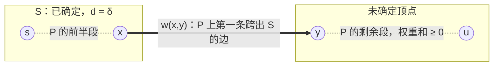
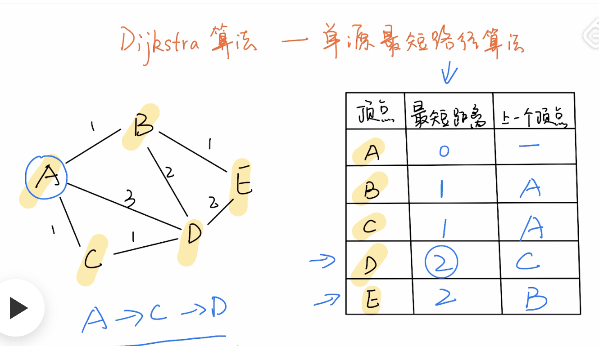
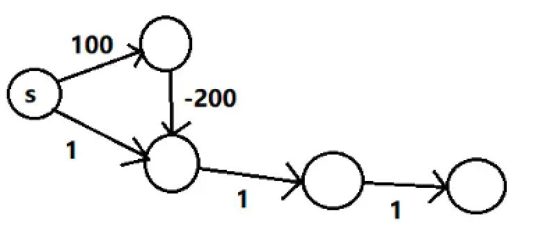
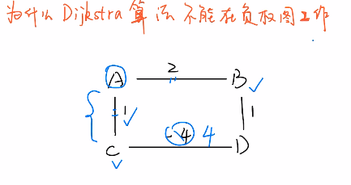
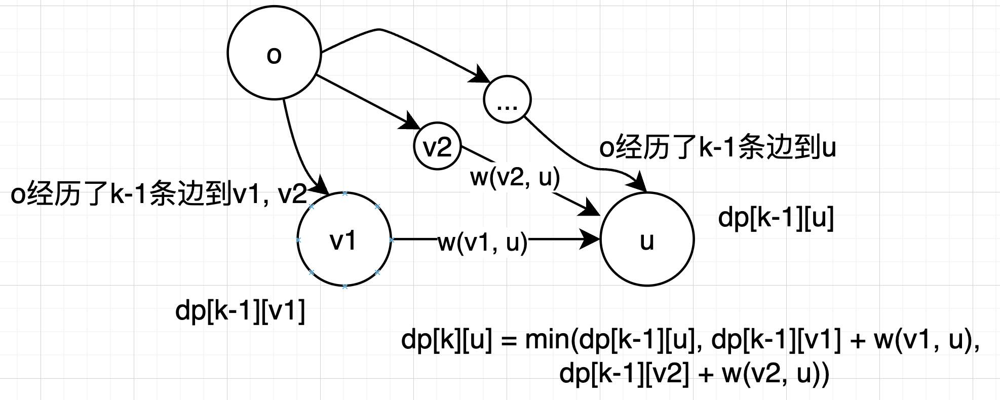
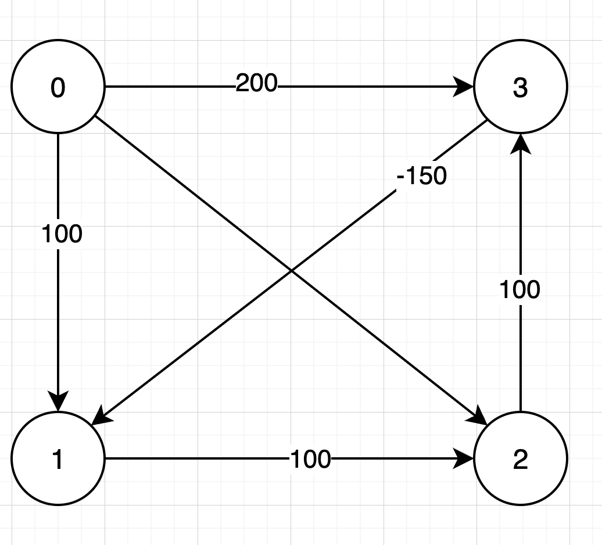
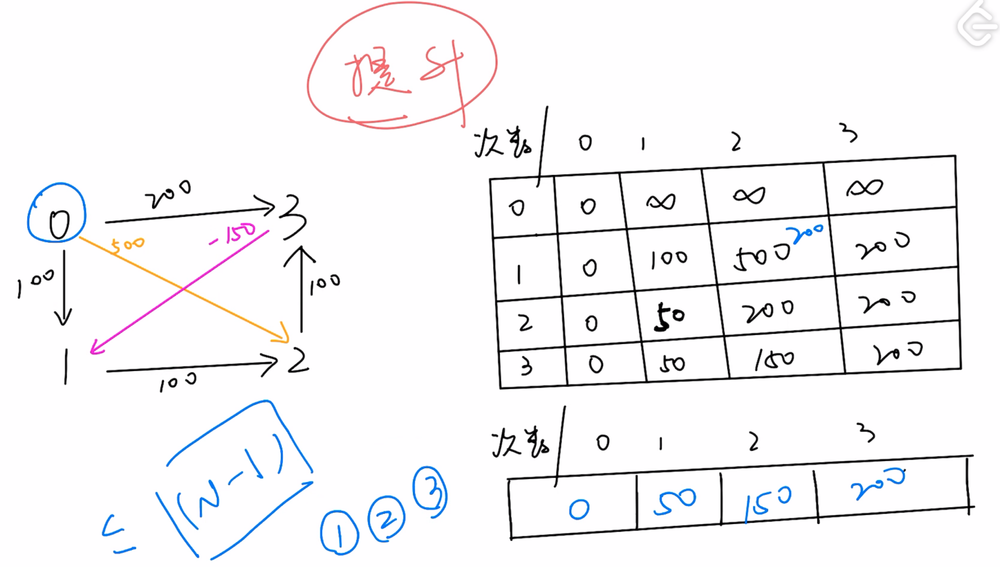

## Dijkstra算法
「Dijkstra 算法」解决的是加权有向图「单源最短路径」问题，其中该图的所有权重必须为非负数。

一种贪心算法。

参考资料：

1. [https://leetcode.cn/circle/discuss/FyPTTM/#dijkstra](https://leetcode.cn/circle/discuss/FyPTTM/#dijkstra)

### 用公式理解
先约定记号：

- `w(u,v)`：边的权重，Dijkstra 要求所有权重非负；
- `δ(v)`：源点 s 到 v 的**真实**最短距离，也就是要求的答案；
- `d[v]`：算法当前记录的**估计值**，就是代码里的 `distTo[v]`；
- `S`：已确定最短距离的顶点集合，就是 `visited[v] == true` 的那些点。

**一、最短路本身满足的方程**

最短路的前缀也一定是最短路，所以 δ 满足：

```
δ(s) = 0
δ(v) = min{ δ(u) + w(u,v) }     对所有指向 v 的边 (u,v) ∈ E
```

Dijkstra 和后面的 bellman-ford 求的其实是同一个方程，区别只在解法：bellman-ford 按边数一层层迭代逼近它（`dp[k][u] = min(dp[k-1][u], dp[k-1][v] + w(v,u))`），Dijkstra 则按 δ 从小到大的顺序，一个一个直接定死。

**二、松弛就是往这个方程上靠**

```
松弛：  d[v] ← min( d[v], d[u] + w(u,v) )

不变量：(I1) d[v] ≥ δ(v)            d 只会偏大，不会比最短路还短
       (I2) u ∈ S ⟹ d[u] = δ(u)    进了 S 就是最终答案
```

(I1) 是说 `d[v]` 始终是某条真实路径的长度，只会偏大不会偏小；(I2) 是说进了 S 的点就是最终答案——它正是下面要证的那一步。

**三、为什么「取当前最小的点」就能定死**

> 设 S 里的点都已满足 `d = δ`，取未确定顶点中 d 最小的 u，则 `d[u] = δ(u)`。

任取一条 s → u 的最短路 P。s 在 S 里而 u 不在，所以 P 上必有第一条跨出 S 的边 (x, y)：



x 出队时松弛过 (x, y)，所以 `d[y] ≤ d[x] + w(x,y) = δ(x) + w(x,y) = δ(y)`；再配合 (I1) 的 `d[y] ≥ δ(y)`，得到 `d[y] = δ(y)`。而 u 是未确定顶点里 d 最小的，所以 `d[u] ≤ d[y]`。把这些串起来：

```
d[u] ≤ d[y]                  u 是未确定顶点里 d 最小的
     = δ(y)                  x 出队时松弛过 (x,y)，再配合 (I1)
     ≤ δ(y) + w(P: y→u)      ← 只有这一步用到「权重非负」
     = δ(u)                  P 是 s→u 的最短路
     ≤ d[u]                  (I1)
```

首尾一样，中间就只能全取等号，于是 `d[u] = δ(u)`。

顺带还能看出出队顺序满足 `δ(u₁) ≤ δ(u₂) ≤ …`，所以每个顶点只需要出队松弛一次。

**四、非负权重用在了哪一步**

整个证明只有 `δ(y) ≤ δ(y) + w(P: y→u)` 这一步用到了权重非负：y 到 u 剩下那段不会是负的。一旦出现负权边，这个不等号反向，δ(u) 可能比 δ(y) 还小，「当前最小」就不再等于最终答案——后面那张含负权边的图正是这么塌的。

**五、复杂度**

- 朴素版每轮线性扫描找最小值：`O(|V|² + |E|)`；
- 堆优化每条边最多一次入堆出堆：`O((|V| + |E|) log|V|)`。

> In short: δ satisfies the Bellman equation `δ(v) = min{δ(u) + w(u,v)}`. Relaxation keeps `d[v] ≥ δ(v)`, and the cut argument shows the unvisited vertex with the smallest `d` already equals its δ — so Dijkstra can finalize vertices in nondecreasing order of δ. Non-negative weights are exactly what makes that last step hold.


### [743. 网络延迟时间](https://leetcode.cn/problems/network-delay-time/)
算法过程：

1. 建图及初始化。 
    1. 构建带权图。
    2. 设置一个顶点到源点的最短距离是否「已确定」的 boolean数组`visited[]` ，下标表示顶点，`visited[v]`表示从源点`k`到`v`得最短距离已确定。
    3. 设置一个顶点到源点的最短距离数组 `distTo[] `，下标表示顶点，对于目前从源点不可达的顶点，距离都设置为无穷大。最开始源点到自身的最短距离为0，源点到其余所有的顶点都处于不可达状态，因此都设置为无穷大。
2. 从源点出发 
    1. 寻找距离源点未确定最短距离的顶点u，找到后标记u已确定最短距离：visited[u] = true
    2. **松弛**u的邻接顶点：遍历u的所有邻接顶点v，并尝试松弛u -> v的边，更新源点到v的最短距离dv。
3. 循环2.1 - 2.2，直到所有的顶点都已经找到最短距离。

以一个循环寻找 当前距离未确定顶点中距离最小者 u ，立即置 u 的距离为「已确定」。

看Dijkstra算法，就是一种贪心的算法，不断寻找最短路径的顶点，数学上的证明：[https://leetcode.cn/circle/discuss/jJQn7V/](https://leetcode.cn/circle/discuss/jJQn7V/)，但从直觉上去理解：

确定源点后，每次找到的都是距离源点**最近**的一个点作为下一个点开始标记访问和松弛，



比如上图，A是源点，第一轮确定C是最近的一个点，C就被立刻标记为「已访问」了，也就是说，C到A的「最小距离」已经是确定的了，**不会再有从其他路径来更短的距离了**，因为在路径权重都是非负数的情况下，如果还有更短的距离，就与最开始确定C是最近的一个点相互矛盾了，所以C可以大胆的被标记为「已访问」和确定最短距离。同时，与C相邻的D也会更新最短距离，就保证了接下来确定距源点最近的点的过程中，能够保证每一次选择最近点 都是正确的。

同理，在这个过程中，每次选取最短距离的时候，上一次的结果都是客观的，就导致下一次也一定是正确的。

不过Dijkstra算法 如上所述，只能适用于权重为非负数的图。一旦有负权重，就不能保证 **不会从其他路径来的更短距离了**。



#### 朴素版
```java
import java.util.List;
import java.util.PriorityQueue;

class Solution {

  private static int INF = Integer.MAX_VALUE;

  public int networkDelayTime(int[][] times, int n, int k) {
    // 构建带权图
    return dijkstra(times, n, k);

  }
  private int dijkstra(int[][] times, int n, int k) {
    // 1. 构建加权有向图
    List<List<int[]>> graph = buildGraph(times, n);
    // max为距离源点最远顶点的距离
    int max = 0;

    // 2. 到达源点的距离，distTo[v]为从源点k到v的已知最短路径。对于从k不可达的顶点，距离都设置为无穷大。
    int[] distTo = new int[n];
    // 最开始k到其余所有的顶点都处于不可达状态，因此都设置为无穷大
    Arrays.fill(distTo, INF);
    // 源点k到k距离置为0
    distTo[k - 1] = 0;
    // 3. visited[v]表示从源点k到v到最短距离已确定
    boolean[] visited = new boolean[n];
    // u定义为当前可达顶点中距离源点k最短的顶点，最初就是源点k本身
    // 约定遍历完之后返回-1
    int u = k - 1;
    // 遍历顶点，寻找当前距离未确定顶点中的距离最小者，起始找到的就是源点k
    while (u != -1) {
      // 当某个顶点的最短距离已经确定后，则做标记，用来查找下一个最短距离的顶点 和 避免其他顶点再做不必要的松弛
      visited[u] = true;
      // 遍历u的邻接边，松弛源点k到邻接顶点的距离
      relaxVertex(graph, u, distTo, visited);
      // 寻找距离未确定顶点的最小
      u = getMinDistanceToSource(distTo, visited);
    }
    // display(distTo);
    return findMax(distTo);
  }
  /**
   * @param times [u, v, weight] 加权有向边的参数
   * @param n 顶点个数
   * @return 邻接矩阵构建的图
   * */
  private List<List<int[]>> buildGraph(int[][] times, int n) {
    List<List<int[]>> graph = new ArrayList<>();
    for (int i = 0; i < n; i++) {
      graph.add(new ArrayList<>());
    }
    for (int[] edge : times) {
      int u = edge[0] - 1;
      int v = edge[1] - 1;
      int weight = edge[2];
      graph.get(u).add(new int[]{v, weight});
    }
    return graph;
  }

  /**
   * 在最短距离未确定的顶点中寻找到源点最短距离的顶点
   * 找不到时返回-1
   *
   * @param distTo  源点k到各个顶点到最短距离
   * @param visited 标记确定最短距离的顶点，visited[v]表示从源点k到v到最短距离已确定
   */
  private int getMinDistanceToSource(int[] distTo, boolean[] visited) {
    int minDistance = Integer.MAX_VALUE;
    int vertexOfMinDist = -1;
    for (int u = 0; u < distTo.length; u++) {
      if (!visited[u] && distTo[u] < minDistance) {
        minDistance = distTo[u];
        vertexOfMinDist = u;
      }
    }
    return vertexOfMinDist;
  }

  /**
   * 顶点的松弛: 松弛从给定顶点u出度的所有边[[u, v1],[u, v2],...]
   * @param graph 图
   * @param u 给定的顶点
   * @param distTo 源点k到各个顶点到最短距离
   * @param visited 标记确定最短距离的顶点，visited[v]表示从源点k到v到最短距离已确定
   * */
  private void relaxVertex(List<List<int[]>> graph, int u, int[] distTo, boolean[] visited) {
    for (int[] v_weight : graph.get(u)) {
      int v = v_weight[0];
      int weight = v_weight[1];
      if (!visited[v]) {
        relaxEdge(u, v, weight, distTo);
      }
    }
  }
  /**
   * 松弛u -> v的边
   *
   * @param u      当前的起点
   * @param v      当前的终点
   * @param weight u到v的权重
   * @param distTo 源点k到各个顶点到最短距离
   */
  private void relaxEdge(int u, int v, int weight, int[] distTo) {
    int dv = distTo[u] + weight;
    // 松弛条件：当u -> v到距离能够松弛源点到v到最短距离
    if (dv < distTo[v]) {
      // 更新dv
      distTo[v] = dv;
    }
  }
  /**
   * @param distTo  源点k到各个顶点到最短距离
   * @return 返回距离源点最远顶点的距离
   * */
  private int findMax(int[] distTo) {
    // max为距离源点最远顶点的距离
    int max = 0;
    // 找最短路长度最大者
    for (int dist : distTo) {
      // 存在距离未更新的顶点直接返回 -1
      if (dist == INF) {
        return -1;
      }
      if (dist > max) {
        max = dist;
      }
    }
    return max;
  }

  private void display(int[] distTo) {
    for (int i = 0; i < distTo.length; i++) {
      System.out.println(i + " " + distTo[i]);
    }
  }

}
```

1. 朴素版在寻找到源点最短距离的顶点方法getMinDistanceToSource的复杂度为O(V)，寻找V个顶点，时间复杂度为O(V^2)。
2. 松弛顶点时，每次松弛的次数是u的邻接顶点个数 ，即出度。所有的松弛次数加起来就是边的数量，所以松弛的时间复杂度为O(E)
3. 总的时间复杂度为O(V^2 + E);

时间复杂度的优化 可以从 寻找源点最短距离的顶点 方法优化，可以用最小堆来优化。

#### 优先队列版
优先队列版与朴素的数组版区别并不大，只是获取最短距离的顶点的差异。

```java
import java.util.List;
import java.util.PriorityQueue;

class Solution {

  private static int INF = Integer.MAX_VALUE;

  public int networkDelayTime(int[][] times, int n, int k) {
    // 构建带权图
    return dijkstraPriorityQueue(times, n, k);
  }

  private int dijkstraPriorityQueue(int[][] times, int n, int k) {
    // 构建加权有向图
    List<List<int[]>> graph = buildGraph(times, n);
    // 到达源点的距离，distTo[v]为从源点k到v的已知最短路径。对于从k不可达的顶点，距离都设置为无穷大。
    int[] distTo = new int[n];
    // 最开始k到其余所有的顶点都处于不可达状态，因此都设置为无穷大
    Arrays.fill(distTo, INF);
    // 源点k到k距离置为0
    distTo[k - 1] = 0;
    // visited[v]表示从源点k到v到最短距离已确定
    boolean[] visited = new boolean[n];
    PriorityQueue<int[]> pq = new PriorityQueue<>((u, v) -> u[1] - v[1]);
    // 将顶点和最短距离放入最小堆
    pq.add(new int[]{k - 1, 0});
    while (!pq.isEmpty()) {
      // 从最小堆中出队的就是最短距离的
      int[] item = pq.poll();
      // u定义为当前可达顶点中距离源点k最短的顶点，最初就是源点k本身
      int u = item[0];
      // 当某个顶点的最短距离已经确定后，则做标记，用来查找下一个最短距离的顶点 和 避免其他顶点再做不必要的松弛
      // 出队的时候才标记，而不是入队，入队只意味着"某个点松弛到了它"，此时它既不是队列最小值
      visited[u] = true;
      // 遍历u的邻接边，松弛源点k到邻接顶点的距离
      relaxVertex(graph, u, distTo, visited, pq);
    }
    // display(distTo);
    return findMax(distTo);
  }

  /**
   * @param times [u, v, weight] 加权有向边的参数
   * @param n     顶点个数
   * @return 邻接矩阵构建的图
   */
  private List<List<int[]>> buildGraph(int[][] times, int n) {
    List<List<int[]>> graph = new ArrayList<>();
    for (int i = 0; i < n; i++) {
      graph.add(new ArrayList<>());
    }
    for (int[] edge : times) {
      int u = edge[0] - 1;
      int v = edge[1] - 1;
      int weight = edge[2];
      graph.get(u).add(new int[]{v, weight});
    }
    return graph;
  }

  /**
   * @param distTo 源点k到各个顶点到最短距离
   * @return 返回距离源点最远顶点的距离
   */
  private int findMax(int[] distTo) {
    // max为距离源点最远顶点的距离
    int max = 0;
    // 找最短路长度最大者
    for (int dist : distTo) {
      // 存在距离未更新的顶点直接返回 -1
      if (dist == INF) {
        return -1;
      }
      if (dist > max) {
        max = dist;
      }
    }
    return max;
  }

  /**
   * 顶点的松弛: 松弛从给定顶点u出度的所有边[[u, v1],[u, v2],...]
   *
   * @param graph   图
   * @param u       给定的顶点
   * @param distTo  源点k到各个顶点到最短距离
   * @param visited 标记确定最短距离的顶点，visited[v]表示从源点k到v到最短距离已确定
   * @param pq      松弛后的顶点组成的最小堆
   */
  private void relaxVertex(List<List<int[]>> graph, int u, int[] distTo, boolean[] visited,
      PriorityQueue<int[]> pq) {
    for (int[] v_weight : graph.get(u)) {
      int v = v_weight[0];
      int weight = v_weight[1];
      if (!visited[v]) {
        relaxEdge(u, v, weight, distTo, pq);
      }
    }
  }

  /**
   * 松弛u -> v的边
   *
   * @param u      当前的起点
   * @param v      当前的终点
   * @param weight u到v的权重
   * @param distTo 源点k到各个顶点到最短距离
   */
  private void relaxEdge(int u, int v, int weight, int[] distTo, PriorityQueue<int[]> pq) {
    int dv = distTo[u] + weight;
    // 松弛条件：当u -> v的距离能够松弛源点到v到最短距离
    if (dv < distTo[v]) {
      // 更新dv
      distTo[v] = dv;
      pq.add(new int[]{v, dv});
    }
  }

  private void display(int[] distTo) {
    for (int i = 0; i < distTo.length; i++) {
      System.out.println(i + " " + distTo[i]);
    }
  }

}
```

如果用最小堆，时间复杂度就能变为O(ElogE)

### [499. 迷宫 III](https://leetcode.cn/problems/the-maze-iii/)
构建图：把起点、靠边的空地、洞当成顶点，一个顶点到另一个顶点需要走的步数就是边。

实际上就是求两个顶点之间的最短距离。

使用优先队列版本

```java
class Solution {

  public String findShortestWay(int[][] maze, int[] ball, int[] hole) {
    return dijkstra(maze, ball, hole);
  }

  private String dijkstra(int[][] maze, int[] start, int[] destination) {
    int m = maze.length;
    int n = maze[0].length;

    int[][] distTo = new int[m][n];
    for (int[] dist : distTo) {
      Arrays.fill(dist, Integer.MAX_VALUE);
    }
    distTo[start[0]][start[1]] = 0;

    boolean[][] visited = new boolean[m][n];

    PriorityQueue<int[]> pq = new PriorityQueue<>((u, v) -> u[2] - v[2]);
    Map<Integer, String> vertexToMinPathMap = new HashMap<>();
    pq.offer(new int[] { start[0], start[1], 0 });

    int[][] directions = { { 0, -1 }, { -1, 0 }, { 0, 1 }, { 1, 0 } };
    char[] way = { 'l', 'u', 'r', 'd' };

    while (!pq.isEmpty()) {
      int[] u = pq.poll();
      int ux = u[0], uy = u[1];
      // 当某个顶点的最短距离已经确定后，则做标记，用来查找下一个最短距离的顶点 和 避免其他顶点再做不必要的松弛
      visited[ux][uy] = true;
      // 松弛顶点
      relaxVertex(maze, u, destination, distTo, vertexToMinPathMap, pq, visited, directions, way);

    }
    String res = vertexToMinPathMap.getOrDefault(destination[0] * n + destination[1], "impossible");
    return res.isEmpty() ? "impossible" : res;
  }

  /**
   * 顶点的松弛: 松弛从给定顶点u出度的所有边[[u, v1],[u, v2],...]
   */
  private void relaxVertex(int[][] maze, int[] u, int[] destination, int[][] distTo,
                           Map<Integer, String> vertexToMinPathMap, PriorityQueue<int[]> pq, boolean[][] visited, int[][] directions, char[] way) {
    // 松弛顶点: 松弛从给定顶点u出度的所有边[[u, v1],[u, v2],...]
    int ux = u[0];
    int uy = u[1];
    int m = maze.length;
    int n = maze[0].length;
    for (int j = 0; j < directions.length; j++) {
      int[] direction = directions[j];
      // 下一个邻接的顶点
      int vx = ux + direction[0];
      int vy = uy + direction[1];
      // 顶点之间的权重
      int step = 0;
      // 走到下一个顶点[vx, vy]
      while (!isEdge(m, n, vx, vy) && !isWall(vx, vy, maze) && !isHole(vx, vy, destination)) {
        vx += direction[0];
        vy += direction[1];
        step++;
      }
      if (!isHole(vx, vy, destination)) {
        vx -= direction[0];
        vy -= direction[1];
      }

      // 如果有更优的最短路线就进行更新 
      String updatedMinPath = vertexToMinPathMap.getOrDefault(ux * n + uy, "") + way[j];
      // 下一个顶点已有的最短路线 dv
      String existMinPath = vertexToMinPathMap.getOrDefault(vx * n + vy, "");

      // 松弛u -> v的边
      // 1. du + w(u, v) < dv 
      // 2. du + w(u, v) == dv && path(
      if (!visited[vx][vy]) {
        if (distTo[ux][uy] + step < distTo[vx][vy]) {
          distTo[vx][vy] = distTo[ux][uy] + step;
          pq.offer(new int[] { vx, vy, distTo[vx][vy] });
          vertexToMinPathMap.put(vx * n + vy, updatedMinPath);
        } else if (distTo[ux][uy] + step == distTo[vx][vy]
                   && updatedMinPath.compareTo(existMinPath) < 0) {
          pq.offer(new int[] { vx, vy, distTo[vx][vy] });
          vertexToMinPathMap.put(vx * n + vy, updatedMinPath);
        }
      }
    }
  }

  private boolean isEdge(int m, int n, int x, int y) {
    return x < 0 || x >= m || y < 0 || y >= n;
  }

  private boolean isWall(int x, int y, int[][] maze) {
    return maze[x][y] == 1;
  }

  private boolean isHole(int x, int y, int[] hole) {
    return (x == hole[0] && y == hole[1]);
  }
}
```

### [6343. Minimum Cost of a Path With Special Roads](https://leetcode.cn/problems/minimum-cost-of-a-path-with-special-roads/)
这道题是周赛343的第三题，这道题是非常值得做的。

题目给了起点坐标、终点坐标，坐标x到坐标y的cost是曼哈顿距离$ |x2-x1|+|y2-y1| $，同时还有坐标x到坐标y的特殊cost，可能比曼哈顿距离还小，从而降低cost，问题就是找到一个从起点到终点的最短距离。

如果没有特殊坐标的cost，因为是曼哈顿距离，所以从起点到终点到Minimum cost必然就是直接从起点到终点的cost，如果中间经过其他任意坐标后，再到终点的cost一定不会小于直接从起点到终点的cost。

但正因为有了特殊坐标的cost，所以可能存在跳跃到特殊坐标群，再到终点的最短cost。

那么这个问题就可以抽象为 包含起点、终点、特殊坐标顶点构成的一张有向加权图，权重就是cost，找到起点到终点的最短路径。cost始终是大于0的，那我们就可以直接使用Dijkstra算法。

建模：	

1. 创建顶点的数据结构Vertex(x, y)，存储其能唯一表示顶点的元素，在本题中也就是坐标， 注意需要重写equals和hashcode
2. 建图及初始化
    1. 建图：buildGraph()创建Map<Vertex, Integer> vertexToIndexMap和int[][] weights
        1. vertexToIndexMap存储了顶点映射的数组下标索引，相当于是把每个顶点都用0 - |V| 的整数来映射表示
        2. weights[u][v]表示顶点u到v的边，值即边的权重。
    2. 初始化顶点到源点的最短距离int[] distTo，数组下标即顶点索引，数组值为顶点到源点到最短距离；
        1. distTo[源点] = 0
        2. 一开始其他顶点还没有进行遍历，所以最开始值初始化为无穷大
    3. 初始化顶点到源点到最短距离是否「已确定」的boolean数组visited[]，下标表示顶点，visited[v]表示从顶点v到源点k到最短距离已确定。
3. 松弛
    1. 寻找距离源点未确定最短距离的顶点u
        1. getMinDistanceVertexToSource
    2. 找到后标记u已确定最短距离：visited[u] = true
    3. **松弛**u的邻接顶点relaxVertex：遍历u的所有邻接顶点v，并尝试松弛u -> v的边，更新源点到v的最短距离dv。

这道题有意思的地方在于顶点的表示、建图，因为顶点不是从0开始基本整数类型，因此需要自己构建顶点和整数的映射，以及边的权重。

同时因为所有被选中的顶点都是指向其他所有的顶点，这意味着，可以用distTo隐式的来表示邻接顶点，所以在relaxVertex中，每次是直接对distTo进行循环，就能找到邻接点。

```java
import java.util.HashMap;
import java.util.List;
import java.util.Map;
import java.util.Objects;

class Solution {
    class Vertex {

    int x;
    int y;

    Vertex(int x, int y) {
      this.x = x;
      this.y = y;
    }

    @Override
    public boolean equals(Object o) {
      if (this == o) {
        return true;
      }
      if (o == null || getClass() != o.getClass()) {
        return false;
      }
      Vertex vertex = (Vertex) o;
      return x == vertex.x && y == vertex.y;
    }

    @Override
    public int hashCode() {
      return Objects.hash(x, y);
    }
  }

  public int minimumCost(int[] start, int[] target, int[][] specialRoads) {
    // 建图
    Map<Vertex, Integer> vertexToIndexMap = new HashMap<>();
    int[][] weights = buildGraph(vertexToIndexMap, start, target, specialRoads);

    // Dijkstra算法，distTo为顶点到达源点的距离
    int[] distTo = new int[vertexToIndexMap.size()];
    // 最开始源点到其他顶点都处于不可达状态，因此都设置为无穷大
    Arrays.fill(distTo, Integer.MAX_VALUE);

    // 源点
    int source = vertexToIndexMap.get(new Vertex(start[0], start[1]));
    // 源点为start
    distTo[source] = 0;

    // visited[v] 表示源点到v的距离已确定
    boolean[] visited = new boolean[vertexToIndexMap.size()];

    int u = source;
    while(u != -1) {
      // 当源点到某个顶点的最短距离已经确定后，则做标记，用来查找下一个最短距离的顶点 和 避免其他顶点再做不必要的松弛
      visited[u] = true;
      // 遍历u的邻接边，松弛源点到邻接顶点的距离
      relaxVertex(distTo, u, weights, visited);
      // 寻找最小距离未确定的顶点
      u = getMinDistanceVertexToSource(distTo, visited);
    }
    return distTo[vertexToIndexMap.get(new Vertex(target[0], target[1]))];
  }

  /**
   * @param vertexToIndexMap 图中所有顶点及其映射的索引
   * @return 有向图中顶点之间的加权，weights[i][j]代表i到j之间的权重
   * */
  private int[][] buildGraph(Map<Vertex, Integer> vertexToIndexMap, int[] start, int[] target, int[][] specialRoads) {

    vertexToIndexMap.put(new Vertex(start[0], start[1]), 0);
    vertexToIndexMap.put(new Vertex(target[0], target[1]), 0);

    for (int i = 0; i < specialRoads.length; i++) {
      int[] road = specialRoads[i];
      vertexToIndexMap.put(new Vertex(road[0], road[1]), 0);
      vertexToIndexMap.put(new Vertex(road[2], road[3]), 0);
    }
    // 图中的每个点
    Vertex[] vertices = new Vertex[vertexToIndexMap.size()];
    int size = 0;
    for (Vertex vertex : vertexToIndexMap.keySet()) {
      vertices[size] = vertex;
      vertexToIndexMap.put(vertex, size);
      size++;
    }
    // 记录图中所有顶点之间的权重，权重即曼哈顿距离
    int source = vertexToIndexMap.get(new Vertex(start[0], start[1]));
    int[][] weights = new int[vertexToIndexMap.size()][vertexToIndexMap.size()];
    for (int i = 0; i < weights.length; i++) {
      for (int j = 0; j < weights.length; j++) {
        // 其他顶点不需要到达源点，设置为不可达，在松弛的时候可以进行过滤
        if (source == j) {
          weights[i][j] = Integer.MAX_VALUE;
          continue;
        }
        // 第i个点到第j个点的曼哈顿距离
        weights[i][j] = dist(vertices[i], vertices[j]);
      }
    }
    // 考虑特殊距离，更新顶点之间的权重
    for (int[] road : specialRoads) {
      int i = vertexToIndexMap.get(new Vertex(road[0], road[1]));
      int j = vertexToIndexMap.get(new Vertex(road[2], road[3]));
      if (source == j) {
        continue;
      }
      weights[i][j] = Math.min(weights[i][j], road[4]);
    }
    

    return weights;
  }

  private int dist(Vertex p1, Vertex p2) {
    return Math.abs(p1.x - p2.x) + Math.abs(p1.y - p2.y);
  }

  // 找到距离最近的点，这里其实可以用优先队列来优化
  private int getMinDistanceVertexToSource(int[] distTo, boolean[] visited) {
    int minDistance = Integer.MAX_VALUE;
    // 没有时返回-1
    int vertexIndexOfMinDistance = -1;
    for (int j = 0; j < distTo.length; j++) {
      if (!visited[j] && distTo[j] < minDistance) {
        minDistance = distTo[j];
        vertexIndexOfMinDistance = j;
      }
    }
    return vertexIndexOfMinDistance;
  }

  /**
   * 因为所有被选中的顶点都是指向其他所有的顶点，这意味着，可以用distTo隐式的来表示邻接顶点，所以在relaxVertex中，每次是直接对distTo进行循环，就能找到邻接点。
   * */
  private void relaxVertex(int[] distTo, int minIndex, int[][] weights, boolean[] visited) {
    // minIndex 的邻接点是其他所有的点
    for (int j = 0; j < distTo.length; j++) {
      // 遍历i的领接边，松弛源点k到领接顶点的距离
      // roads[minIndex][j] != Integer.MAX_VALUE 可以过滤掉不可达的顶点
      if (!visited[j] && weights[minIndex][j] != Integer.MAX_VALUE) {
        // 更新i到所有相邻点的最短距离
        distTo[j] = Math.min(distTo[j], distTo[minIndex] + weights[minIndex][j]);
      }
    }
  }
}
```

我们也可以再构造一个便于理解的List<List<int[]>> grpah图，下标即顶点索引，graph.get(u) 即u的所有邻接点， int[] v_weight = graph.get(u).get(0) 即其中某一个邻接点，v_weight[0]代表v， v_weight[1]代表边的权重。

```java
import java.util.HashMap;
import java.util.List;
import java.util.Map;
import java.util.Objects;

class Solution {

  class Vertex {

    int x;
    int y;

    Vertex(int x, int y) {
      this.x = x;
      this.y = y;
    }

    @Override
    public boolean equals(Object o) {
      if (this == o) {
        return true;
      }
      if (o == null || getClass() != o.getClass()) {
        return false;
      }
      Vertex vertex = (Vertex) o;
      return x == vertex.x && y == vertex.y;
    }

    @Override
    public int hashCode() {
      return Objects.hash(x, y);
    }
  }

  public int minimumCost(int[] start, int[] target, int[][] specialRoads) {
    // 建图
    Map<Vertex, Integer> vertexToIndexMap = new HashMap<>();
    List<List<int[]>> graph = buildGraph(vertexToIndexMap, start, target, specialRoads);
    int vertexNum = graph.size();
    // 源点
    int source = vertexToIndexMap.get(new Vertex(start[0], start[1]));
    // 终点
    int end = vertexToIndexMap.get(new Vertex(target[0], target[1]));

    // Dijkstra算法，distTo为顶点到达源点的距离
    int[] distTo = new int[vertexNum];
    // 最开始源点到其他顶点都处于不可达状态，因此都设置为无穷大
    Arrays.fill(distTo, Integer.MAX_VALUE);
    // 源点为start
    distTo[source] = 0;

    // visited[v] 表示源点到v的距离已确定
    boolean[] visited = new boolean[vertexNum];

    int u = source;
    while(u != -1) {
      // 当某个顶点的最短距离已经确定后，则做标记，用来查找下一个最短距离的顶点 和 避免其他顶点再做不必要的松弛
      visited[u] = true;
      // 遍历u的邻接边，松弛源点到邻接顶点的距离
      relaxVertex(graph, u, distTo, visited);
      // 寻找最小距离未确定的顶点
      u = getMinDistanceVertexToSource(distTo, visited);
    }
    return distTo[end];
  }

  /**
* @param vertexToIndexMap 图中所有顶点及其映射的索引
* @return 有向图中顶点之间的加权，weights[i][j]代表i到j之间的权重
* */
  private List<List<int[]>> buildGraph(Map<Vertex, Integer> vertexToIndexMap, int[] start, int[] target, int[][] specialRoads) {

    vertexToIndexMap.put(new Vertex(start[0], start[1]), 0);
    vertexToIndexMap.put(new Vertex(target[0], target[1]), 0);

    for (int i = 0; i < specialRoads.length; i++) {
      int[] road = specialRoads[i];
      vertexToIndexMap.put(new Vertex(road[0], road[1]), 0);
      vertexToIndexMap.put(new Vertex(road[2], road[3]), 0);
    }
    // 图中的每个点
    Vertex[] vertices = new Vertex[vertexToIndexMap.size()];
    int size = 0;
    for (Vertex vertex : vertexToIndexMap.keySet()) {
      vertices[size] = vertex;
      vertexToIndexMap.put(vertex, size);
      size++;
    }

    List<List<int[]>> graph = new ArrayList<>();
    for(int i = 0; i < vertexToIndexMap.size(); i++) {
      graph.add(new ArrayList<>());
    }
    // 记录图中所有顶点之间的权重，权重即曼哈顿距离
    int source = vertexToIndexMap.get(new Vertex(start[0], start[1]));
    for(int u = 0; u < vertexToIndexMap.size(); u++) {
      for (int v = 0; v < vertexToIndexMap.size(); v++) {
        // 不需要再指向源点
        if (v == source) {
          continue;
        }
        graph.get(u).add(new int[]{v, dist(vertices[u], vertices[v])});
      }
    }
    // 考虑特殊距离，更新顶点之间的权重
    for(int[] road : specialRoads) {
      int u = vertexToIndexMap.get(new Vertex(road[0], road[1]));
      int v = vertexToIndexMap.get(new Vertex(road[2], road[3]));
      graph.get(u).add(new int[]{v, Math.min(dist(vertices[u], vertices[v]), road[4])});
    }

    return graph;
  }

  private int dist(Vertex p1, Vertex p2) {
    return Math.abs(p1.x - p2.x) + Math.abs(p1.y - p2.y);
  }

  // 找到距离源点最近的未确定距离的顶点，这里其实可以用优先队列来优化
  private int getMinDistanceVertexToSource(int[] distTo, boolean[] visited) {
    int minDistance = Integer.MAX_VALUE;
    // 没有时返回-1
    int vertexIndexOfMinDistance = -1;
    for (int j = 0; j < distTo.length; j++) {
      if (!visited[j] && distTo[j] < minDistance) {
        minDistance = distTo[j];
        vertexIndexOfMinDistance = j;
      }
    }
    return vertexIndexOfMinDistance;
  }

  private void relaxVertex(List<List<int[]>> graph, int u, int[] distTo, boolean[] visited) {
    // minIndex 的邻接点是其他所有的点

    for (int[] v_weight : graph.get(u)) {
      int v = v_weight[0];
      int weight = v_weight[1];
      if(!visited[v]) {
        relaxEdge(u, v, weight, distTo);
      }
    }
  }
  private void relaxEdge(int u, int v, int weight, int[] distTo) {
    int dv = distTo[u] + weight;
    if(dv < distTo[v]) {
      distTo[v] = dv;
    }
  }
}
```

#### 优先队列版1
进一步优化，使用优先队列版优化找到距离源点最近的未确定距离的顶点。

```java
import java.util.HashMap;
import java.util.List;
import java.util.Map;
import java.util.Objects;

class Solution {

  class Vertex {

    int x;
    int y;

    Vertex(int x, int y) {
      this.x = x;
      this.y = y;
    }

    @Override
    public boolean equals(Object o) {
      if (this == o) {
        return true;
      }
      if (o == null || getClass() != o.getClass()) {
        return false;
      }
      Vertex vertex = (Vertex) o;
      return x == vertex.x && y == vertex.y;
    }

    @Override
    public int hashCode() {
      return Objects.hash(x, y);
    }
  }

  public int minimumCost(int[] start, int[] target, int[][] specialRoads) {
    // 建图
    Map<Vertex, Integer> vertexToIndexMap = new HashMap<>();
    List<List<int[]>> graph = buildGraph(vertexToIndexMap, start, target, specialRoads);
    int vertexNum = graph.size();
    // 源点
    int source = vertexToIndexMap.get(new Vertex(start[0], start[1]));
    // 终点
    int end = vertexToIndexMap.get(new Vertex(target[0], target[1]));

    // Dijkstra算法，distTo为顶点到达源点的距离
    int[] distTo = new int[vertexNum];
    // 最开始源点到其他顶点都处于不可达状态，因此都设置为无穷大
    Arrays.fill(distTo, Integer.MAX_VALUE);
    // 源点为start
    distTo[source] = 0;

    // visited[v] 表示源点到v的距离已确定
    boolean[] visited = new boolean[vertexNum];
    
    PriorityQueue<int[]> pq = new PriorityQueue<>((u, v) -> u[1] - v[1]);
    pq.add(new int[]{source, 0});

    while(!pq.isEmpty()) {
      // 最小距离未确定的顶点及权重
      int[] vertexAndWeightOfMinDist = pq.poll();
      int u = vertexAndWeightOfMinDist[0];
      // 当源点到某个顶点的最短距离已经确定后，则做标记，用来查找下一个最短距离的顶点 和 避免其他顶点再做不必要的松弛
      visited[u] = true;
      // 遍历u的邻接边，松弛源点到邻接顶点的距离
      relaxVertex(graph, u, distTo, visited, pq);
    
    }

    return distTo[end];
  }

  /**
    * @param vertexToIndexMap 图中所有顶点及其映射的索引
    * @return 有向图中顶点之间的加权，weights[i][j]代表i到j之间的权重
    * */
  private List<List<int[]>> buildGraph(Map<Vertex, Integer> vertexToIndexMap, int[] start, int[] target, int[][] specialRoads) {

    vertexToIndexMap.put(new Vertex(start[0], start[1]), 0);
    vertexToIndexMap.put(new Vertex(target[0], target[1]), 0);

    for (int i = 0; i < specialRoads.length; i++) {
      int[] road = specialRoads[i];
      vertexToIndexMap.put(new Vertex(road[0], road[1]), 0);
      vertexToIndexMap.put(new Vertex(road[2], road[3]), 0);
    }
    // 图中的每个点
    Vertex[] vertices = new Vertex[vertexToIndexMap.size()];
    int size = 0;
    for (Vertex vertex : vertexToIndexMap.keySet()) {
      vertices[size] = vertex;
      vertexToIndexMap.put(vertex, size);
      size++;
    }

    List<List<int[]>> graph = new ArrayList<>();
    for(int i = 0; i < vertexToIndexMap.size(); i++) {
      graph.add(new ArrayList<>());
    }
    // 记录图中所有顶点之间的权重，权重即曼哈顿距离
    int source = vertexToIndexMap.get(new Vertex(start[0], start[1]));
    for(int u = 0; u < vertexToIndexMap.size(); u++) {
      for (int v = 0; v < vertexToIndexMap.size(); v++) {
        // 不需要再指向源点
        if (v == source) {
          continue;
        }
        int distance = Math.abs(p1.x - p2.x) + Math.abs(p1.y - p2.y)
        graph.get(u).add(new int[]{v, dist(vertices[u], vertices[v])});
      }
    }
    // 考虑特殊距离，更新顶点之间的权重
    for(int[] road : specialRoads) {
      int u = vertexToIndexMap.get(new Vertex(road[0], road[1]));
      int v = vertexToIndexMap.get(new Vertex(road[2], road[3]));
      graph.get(u).add(new int[]{v, Math.min(dist(vertices[u], vertices[v]), road[4])});
    }
    return graph;
  }

  private int dist(Vertex p1, Vertex p2) {
    return Math.abs(p1.x - p2.x) + Math.abs(p1.y - p2.y);
  }

  private void relaxVertex(List<List<int[]>> graph, int u, int[] distTo, boolean[] visited, PriorityQueue<int[]> pq) {
    // minIndex 的邻接点是其他所有的点
    for (int[] v_weight : graph.get(u)) {
      int v = v_weight[0];
      int weight = v_weight[1];
      if(!visited[v]) {
        relaxEdge(u, v, weight, distTo, pq);
      }
    }
  }
  private void relaxEdge(int u, int v, int weight, int[] distTo, PriorityQueue<int[]> pq) {
    int dv = distTo[u] + weight;
    if(dv < distTo[v]) {
      distTo[v] = dv;
      pq.add(new int[]{v, dv});
    }
  }
}
```

#### 不建图
上面显示建图还是非常麻烦，实际上可以不显示建图，直接优先队列存储distTo，然后一边遇到新的顶点的时候，一边隐式建图。

我们的目标是找到start到target的最短路径成本。

> 这个是看到大佬arignote的代码，不过在脑中感觉很难建模，以后再想吧
>

```java
class Solution {

  public int minimumCost(int[] start, int[] target, int[][] specialRoads) {
    
    int sx = start[0], sy = start[1];
    int tx = target[0], ty = target[1];
    // [ux, uy, distance(start, u)]
    PriorityQueue<int[]> pq = new PriorityQueue<>((o, p) -> o[2] - p[2]);
    pq.offer(new int[]{sx, sy, 0});
    // [ux, uy, distance(start, u)]
    Map<List<Integer>, Integer> map = new HashMap<>();
    while (!pq.isEmpty()) {
      int[] u = pq.poll();
      int ux = u[0];
      int uy = u[1];
      // 源点start到该顶点的距离
      int distanceOfSToU = u[2];
      if (!map.containsKey(List.of(ux, uy))) {
        map.put(List.of(ux, uy), distanceOfSToU);
        // 遍历特殊路径更新start到v的路径
        for (int[] r : specialRoads) {
          int vx = r[0], vy = r[1];
          int kx = r[2], ky = r[3];
          int distanceOfVToK = r[4];
          // (start, v)
          int distanceOfUToV = Math.abs(ux - vx) + Math.abs(uy - vy);
          int distanceOfSToV = distanceOfSToU + distanceOfUToV;
          pq.offer(new int[]{vx, vy, distanceOfSToV});
          if (vx == ux && vy == uy) {
            pq.offer(new int[]{kx, ky, distanceOfSToU + distanceOfVToK});
          }
        }
        int distanceOfUToT =  Math.abs(ux - tx) + Math.abs(uy - ty);
        int distanceOfSToT = distanceOfSToU + distanceOfUToT;
        pq.offer(new int[]{tx, ty, distanceOfSToT);
      }
    }
    return map.get(List.of(tx, ty));
  }
}
```

### 算法限制
Dijkstra算法不能在负权图上工作。



## bellman-ford算法
bellman-ford算法求加权有向图的最短路径，比dijkstra算法的优势在于：

1. 能够求带负权重的图；
2. 能够检测出图中是否存在负权环图；

有权有向图 - 权重为负数。

环的分类：

1. **正权环图**：环的总权和大于等于0
2. **负权环图**：环的总权重小于0

**定理一：在一个有 N 个顶点的「正权环图」中，两点之间的最短路径最多经过**`N-1`条边。

证明：显而易见

**定理二：「负权环」没有最短路径。**

证明：环的总权重是负数，说明再走一圈回到原点后路径会变得更短，一直走圈圈证明了没有最短路径。

但bellman-ford能求该图是否包含「负权环」。

### 动态规划基础版
Bellman-ford算法可以从动态规划的角度去理解：

比如求0 -> [0, 1, 2, 3]的最短路径的朴素的思路就是：

1. 求出0到达[0, 1, 2, 3]依次经过最多1、2、3... N条边的最短路径
2. 最后一次最多经过N条边的路径就是最短路径。



动态转移方程式：源点o到u的最短距离其实可以归纳为下面的公式：

`dp[k][u] = min(dp[k-1][u], dp[k-1][v] + w(v, u))`

1. `dp[k][u]`代表源点经历**最多**k条边到u的最短距离；
2. `dp[k - 1][u]` 代表源点最多经历k-1条边到v的最短距离，
3. `w(v, u)`指v到u的权重。

我们用动态规划表模拟一下：

源点设为0，横轴表示 源点0的目标顶点，纵轴表示源点最多经过N条边后到达目标顶点的最短距离。



| 经历最多k条边\ 目标点u | u=0 | u=1 | u=2 | u=3 |
| --- | --- | --- | --- | --- |
| k=0 | `dp[0][0] = 0` | `dp[0][1] = ∞` | `dp[0][2] = ∞` | `dp[0][3] = ∞` |
| k=1 | `dp[1][0]=0` | `dp[1][1]=100` | `dp[1][2]=500` | `dp[1][3]=200` |
| k=2 | `dp[2][0]=0` | `dp[2][1]=50` | `dp[2][2]=200` | `dp[2][3]=200` |
| k=3 | `dp[3][0]=0` | `dp[3][1]=50` | `dp[3][2]=150` | `dp[3][3]=200` |

每一格是怎么算出来的：

```
k=1（由 k=0 那一行推出）：
dp[1][0] = min{ dp[0][0], dp[0][0]+w(0,10) } = 0
dp[1][1] = min{ dp[0][1], dp[0][0]+w(0,1) } = dp[0][0] + 100 = 100
dp[1][2] = min{ dp[0][2], dp[0][0]+w(0,2) } = dp[0][0] + 500 = 500
dp[1][3] = min{ dp[0][3], dp[0][0]+w(0,3) } = dp[0][0] + 200 = 200

k=2（由 k=1 那一行推出）：
dp[2][0] = min{ dp[1][0] } = 0
dp[2][1] = min{ dp[1][1], dp[1][3] + w(3,1) } = dp[1][3] - 150 = 50
dp[2][2] = min{ dp[1][2], dp[1][0] + w(0,2), dp[1][1] + w(1,2) } = dp[1][1] + 100 = 200
dp[2][3] = min{ dp[1][3], dp[1][0] + w(0,3), dp[1][2] + w(2,3) } = dp[1][3] = 200

k=3：
dp[3][2] = min{ dp[2][2], dp[2][0] + w(0,2), dp[2][1] + w(1,2) } = min{ 200, 0+500, 50+100 } = 150
```

实际上，dp矩阵的下一行只由上一行决定，因此实际上只需要两个数组就够了。

令`previous[u]`表示源点到u最多经历k-1条边到时候的最短距离，`current[u]`表示源点到u最多经历k条边到时候的最短距离。

`current[u] = min(previous[u], previous[v_i] + w(v_i, u))`

所以在空间上可以只使用两个一维数组就可以进行滚动计算。

#### 代码模版
##### [743. Network Delay Time](https://leetcode.cn/problems/network-delay-time/)
```java
class Solution {
  /**
    * 朴素的bellman - ford，带提前终止
    * @param k 源点
    */
  public int networkDelayTime(int[][] times, int n, int k) {
    /** 
        bellman-ford
        dp[k][u] := 经过k次到达u顶点的最短路径
        dp[k][u] = min(dp[k-1][u], dp[k-1][v] + w(v, u))
        
        current[u] = min(previous[u], previous[v] + w(v, u))
      */
    int INF = Integer.MAX_VALUE;
    int[] previous = new int[n];
    int[] current = new int[n];
    Arrays.fill(previous, INF);
    Arrays.fill(current, INF);
    previous[k - 1] = 0;
    boolean finished = true;
    for(int i = 0; i < n - 1; i++) {
      current[k - 1] = 0;
      finished = true;
      // 每一次遍历实际上是在求从源点k到v 做多经历i+1条边的最短距离
      for(int[] time : times) {
        int u = time[0] - 1;
        int v = time[1] - 1;
        int w = time[2];
        // previous[u] < INF意味着可以从源点k到u，说明在经历i条边的时候已经经过了u，那么就可以求v了
        if(previous[u] < INF) {
          int dv = previous[u] + w;
          // current[u] = min(previous[u], previous[v] + w(v, u)) 这里u和v有点混乱，但这里表示的是经历i+1条边和经历i条边的最短路径比较
          if(dv < current[v]) {
            current[v] = dv;
            finished = false;
          }
        } 
      }
      if(finished) {
        break;
      }
      previous = current.clone();
    }
    int max = 0;
    for(int i = 0; i < current.length; i++) {
      if(current[i] == INF) {
        return -1;
      }
      max = Math.max(max, current[i]);
    }
    return max;
  }
}
```

### 动态规划的优化版
> 这个优化只在leetcode小册中看到，其他地方没看到过，一般优化直接就说下面的SPFA了。
>

这里有一个小小的优化，动态规划表格中，计算最多经历k条边时的最短路径需要始终保证到达目标点是最多经历k条边的，也就是经历k条边的计算只依赖于经历k-1条边的结果，但实际上在经历k次边的时候，非常有可能的是，就已经可以从其他点（顶点1）推导出目标点（如顶点2）更小，如在经历最多1条边时，其实这个时候已经知道从0->1-> 2点最短路径可以更小，相当于是提前知道了经历最多k+1条边时的结果，如果真的是提前计算了，那后面的整体结果都会向更小的边数提升。

bellman-ford算法优化的思路就是不用管动态规划表格中最多几条边的想法，只要我们对所有的边进行一个遍历，因此只需要一个int[] current数组就可以，直到k次遍历和k+1次遍历没有任何区别时，我们就可以认为我们已经找到了最短路径。



动态规划提升方法适用于不需要知道经过多少条边到达目标点，每一次循环后是不知道经历过多少条边的，如果是要知道经历过k条边到目标点，那还是需要上面的动态规划表格版。

算法过程：

1. 建图及初始化。
    1. 构建加权图；
    2. 设置一个大小为`|V|`的距离数组`dists[]`，下标表示顶点。初始化所有顶点到源点s到距离为`Infinity`，表示该顶点到源点s到距离尚未确定；
    3. 初始化`dists[s]=0`
2. 外层循环执行|V|-1次，每一次都「松弛所有边」:
    1. 设置一个finished布尔变量用于实现「提前结束优化」.
    2. 按顶点顺序对所有顶点u判断所有邻接顶点v是否是 `du+|(u, v)| < dv`，若是则进行松弛，令finished=false，表明经历过了松弛
    3. 在一次「松弛所有边」的操作中，若没有任何边被松弛，finished=true，表明所有可能的松弛已完成，此时可提前退出。
3. 外层循环结束后，每个顶点到源点的最短路径距离被求出。
4. 检测图是否有负权环。再次对所有边进行松弛，若有边可被继续松弛，说明没有最短路径，即有负权环。反之，求出了所有顶点到源点的最短路径。

#### 
时间复杂度：每次全量松弛要操作｜E｜条边，共｜V｜-1次，复杂度为O((|V| - 1)*|E|)

空间复杂度为：O(|V| + |E|)

代码模版如下：

```java
class Solution {
  private static int INF = Integer.MAX_VALUE;

  public int networkDelayTime(int[][] times, int n, int k) {

    return bellmanFordV2(times, n, k);

  }
  private int bellmanFordV2(int[][] times, int n, int k) {
    List<List<int[]>> graph = new ArrayList<>();
    for(int i = 0; i < n; i++) {
      graph.add(new ArrayList<>());
    }
    for(int[] edge : times) {
      int u = edge[0] - 1;
      int v = edge[1] - 1;
      int weight = edge[2];
      graph.get(u).add(new int[]{v, weight});
    }
    int[] current = new int[n];
    Arrays.fill(current, INF);
    current[k - 1] = 0;
    boolean finished = true;
    for(int i = 0; i < n - 1; i++) {
      finished = true;
      for(int u = 0; u < n; u++) {
        int previous_node = u;
        for(int[] v_weight : graph.get(u)) {
          // u就是previous_node, v 就是 current_node
          int current_node = v_weight[0];
          int weight = v_weight[1];

          if (current[previous_node] < INF) {
            int dv = current[previous_node] +  weight;
            if(dv < current[current_node]) {
              current[current_node] =  dv;
              finished = false;
            }
          }
        }
      }
      if(finished) break;
    }
    return findMax(current);
  }
  /**
* 朴素的bellman - ford，带提前终止
* @param k 源点
*/
  private int bellmanFord_test(int[][] times, int n, int k) {
    // int[] previous = new int[n];
    int[] current = new int[n];

    for(int i = 0; i < n; i++) {
      // previous[i] = INF;
      current[i] = INF;
    }

    current[k-1] = 0;
    boolean finished = true;
    // |V - 1|次
    for(int i = 0; i < n - 1; i++) {
      current[k-1] = 0;
      finished = true;
      // 全量松弛
      for(int[] time : times) {
        int previous_node = time[0] - 1;
        int current_node = time[1] - 1;
        int weight = time[2];
        if(current[previous_node] < INF ) {
          int dv = current[previous_node] + weight;
          if(dv < current[current_node]) {
            current[current_node] = dv;
            finished = false;
          }
        }
      }
      // 某一次全量松弛未松弛任何边时，提前结束
      if(finished) break;
    }

    return findMax(current);
  }
  private int findMax(int[] current) {
    int max = -1; 
    for(int curr : current) {
      if(INF == curr) {
        return -1;
      }
      max = Math.max(curr, max);
    }
    return max;
  }
}
```

### SPFA
`bellman-ford`算法的优化版的缺陷：对边进行全量松弛时，是随机选择的边，具有很大的随机性，不同的边的选择会使得计算收敛的速度不一样。如果想尽早的收敛，我们希望所有的松弛都是有效松弛，也就是顶点所有入边的松弛是无遗漏且不重复的。

SPFA(Shortest Path Faster Algorithm) 是对BF算法的一种改进，「SPFA」算法是通过队列来维护我们接下来要遍历的起点，而不是「BF」算法中的任意还没有遍历过的边。每次只有当某个顶点的最短距离更新之后，并且该顶点不在「队列」中，我们就将该顶点加入到「队列」中。一直循环以上步骤，直到队列为空，就可以终止算法。

SPFA的核心在于 只有前驱结点有更新，邻接的结点才会去更新。

算法过程：

1. 建图及初始化
    1. 构建加权图
    2. 设置一个大小为｜V｜的`dists[]`，下标表示顶点。初始化所有顶点到源点s到距离为`infinity`，表示该顶点到源点的距离尚未确定
    3. 设置一个大小为`inCount[]`记录顶点的入队次数
    4. 设置一个队列queue
    5. `dists[s]=0`
    6. 源点入队
2. 遍历队列queu，队列不为空时
    1. 队头顶点u出队，松弛u得所有邻接边
    2. 判断是否有`du + |(u,v)| < dv`，若有进行松弛 `dv = du + |(u,v)|`
        1. 判断邻接顶点是否已经在队列中，没有则入队，如果入队次数超过了|V|-1次，那么就说明有环，可以提前终止算法，没有则`inCount[v]++`。
3. 寻找dists中最短路径

```java
class Solution {
  public int networkDelayTime(int[][] times, int n, int k) {
    List<List<int[]>> graph = new ArrayList<>();
    for (int i = 0; i < n; i++) {
      graph.add(new ArrayList<>());
    }
    for (int[] time : times) {
      int u = time[0] - 1;
      int v = time[1] - 1;
      int w = time[2];
      graph.get(u).add(new int[] { v, w });
    }

    int[] distTo = new int[n];
    int INF = Integer.MAX_VALUE;
    Arrays.fill(distTo, INF);
    distTo[k - 1] = 0;
    Deque<Integer> queue = new ArrayDeque<>();
    queue.offer(k - 1);

    // 记录节点是否在队列里面
    boolean[] visited = new boolean[n];
    // 节点入队的次数，超过n - 1就说明有负环
    int[] inCnt = new int[n];
    inCnt[k - 1]++;
    while (!queue.isEmpty()) {
      int u = queue.poll();
      // 可以重复入队
      visited[u] = false;
      for (int[] v_w : graph.get(u)) {
        int v = v_w[0];
        int w = v_w[1];
        if (distTo[u] + w < distTo[v]) {
          distTo[v] = distTo[u] + w;
          if (!visited[v]) {
            queue.offer(v);
            if (inCnt[v] > n - 1) {
              return -1;
            }
            inCnt[v]++;
          }
        }
      }
    }
    int max = 0;
    for (int dist : distTo) {
      if (dist == INF) {
        return -1;
      }
      max = Math.max(max, dist);
    }
    return max;
  }
}
```

### [787. K 站中转内最便宜的航班](https://leetcode.cn/problems/cheapest-flights-within-k-stops/)
因为要求最多经过k站，所以只能使用BF的动态规划基础版。

```java
class Solution {
  public int findCheapestPrice(int n, int[][] flights, int src, int dst, int k) {

    // SPFA
    // dp[k][v] = min(dp[k - 1][v], dp[k - 1][u] + w(u, v))
    // dp[v] = min(dp[v], dp[u] + w(u, v))
    if(src == dst) {
      return 0;
    }
    int[] previous = new int[n];
    int[] current = new int[n];
    int INF = Integer.MAX_VALUE;
    Arrays.fill(previous, INF);
    Arrays.fill(current, INF);
    previous[src] = 0;

    for(int i = 0; i <= k; i++) {
      current[src] = 0;
      for(int[] flight : flights) {
        int u = flight[0];
        int v = flight[1];
        int w = flight[2];
        if(previous[u] < INF) {
          int dv = previous[u] + w;
          if(dv < current[v]) {
            current[v] = dv;
          }
        }
      }
      previous = current.clone();
    }
    return current[dst] == INF ? -1 : current[dst];
  }
}
```

### [743. 网络延迟时间](https://leetcode.cn/problems/network-delay-time/)
```java
import java.util.List;
import java.util.PriorityQueue;

class Solution {
  private static int INF = Integer.MAX_VALUE;

  public int networkDelayTime(int[][] times, int n, int k) {

    // return bellmanFord(times, n, k);
    // return bellmanFord_FinishEarly(times, n, k);
    // return bellmanFordV2(times, n, k);
    return bellmanFord_test(times, n, k);

  }
  /**
* 朴素的bellman - ford，不带提前终止
* @param k 源点
*/
  private int bellmanFord(int[][] times, int n, int k) {
    int[] previous = new int[n];
    int[] current = new int[n];

    for(int i = 0; i < n; i++) {
      previous[i] = INF;
      current[i] = INF;
    }

    previous[k-1] = 0;
    for(int i = 0; i < n - 1; i++) {
      current[k-1] = 0;
      for(int[] time : times) {
        int previous_node = time[0] - 1;
        int current_node = time[1] - 1;
        int weight = time[2];
        if(previous[previous_node] < INF ) {
          // 实际上也可以这样写，但实际上一开始current的值就是previous[current_node]的值
          // current[current_node] = Math.min(previous[current_node], current[current_node]);
          // current[current_node] = Math.min(current[current_node], previous[previous_node] + weight);
          current[current_node] = Math.min(current[current_node], previous[previous_node] + weight);
        }
      }
      previous = current.clone();
    }

    return findMax(current);
  }
  /**
* 朴素的bellman - ford，带提前终止
* @param k 源点
*/
  private int bellmanFord_FinishEarly(int[][] times, int n, int k) {
    int[] previous = new int[n];
    int[] current = new int[n];

    for(int i = 0; i < n; i++) {
      previous[i] = INF;
      current[i] = INF;
    }

    previous[k-1] = 0;
    boolean finished = true;
    // |V - 1|次
    for(int i = 0; i < n - 1; i++) {
      current[k-1] = 0;
      finished = true;
      // 全量松弛
      for(int[] time : times) {
        int previous_node = time[0] - 1;
        int current_node = time[1] - 1;
        int weight = time[2];
        if(previous[previous_node] < INF ) {
          int dv = previous[previous_node] + weight;
          if(dv < current[current_node]) {
            current[current_node] = dv;
            finished = false;
          }
        }
      }
      // 某一次全量松弛未松弛任何边时，提前结束
      if(finished) break;
      previous = current.clone();
    }

    return findMax(current);
  }
  private int bellmanFordV2(int[][] times, int n, int k) {
    List<List<int[]>> graph = new ArrayList<>();
    for(int i = 0; i < n; i++) {
      graph.add(new ArrayList<>());
    }
    for(int[] edge : times) {
      int u = edge[0] - 1;
      int v = edge[1] - 1;
      int weight = edge[2];
      graph.get(u).add(new int[]{v, weight});
    }
    int[] current = new int[n];
    Arrays.fill(current, INF);
    current[k - 1] = 0;
    boolean finished = true;
    for(int i = 0; i < n - 1; i++) {
      finished = true;
      for(int u = 0; u < n; u++) {
        for(int[] v_weight : graph.get(u)) {
          // u就是previous_node, v 就是 current_node
          int current_node = v_weight[0];
          int weight = v_weight[1];
          int previous_node = u;
          if (current[previous_node] < INF) {
            int dv = current[previous_node] +  weight;
            if(dv < current[current_node]) {
              current[current_node] =  dv;
              finished = false;
            }
          }
        }
      }
      if(finished) break;
    }
    return findMax(current);
  }
  /**
* 朴素的bellman - ford，带提前终止
* @param k 源点
*/
  private int bellmanFord_test(int[][] times, int n, int k) {
    // int[] previous = new int[n];
    int[] current = new int[n];

    for(int i = 0; i < n; i++) {
      // previous[i] = INF;
      current[i] = INF;
    }

    current[k-1] = 0;
    boolean finished = true;
    // |V - 1|次
    for(int i = 0; i < n - 1; i++) {
      current[k-1] = 0;
      finished = true;
      // 全量松弛
      for(int[] time : times) {
        int previous_node = time[0] - 1;
        int current_node = time[1] - 1;
        int weight = time[2];
        if(current[previous_node] < INF ) {
          int dv = current[previous_node] + weight;
          if(dv < current[current_node]) {
            current[current_node] = dv;
            finished = false;
          }
        }
      }
      // 某一次全量松弛未松弛任何边时，提前结束
      if(finished) break;
    }

    return findMax(current);
  }
  private int findMax(int[] current) {
    int max = -1; 
    for(int curr : current) {
      if(INF == curr) {
        return -1;
      }
      max = Math.max(curr, max);
    }
    return max;
  }
}
```

### [1631. Path With Minimum Effort](https://leetcode.cn/problems/path-with-minimum-effort/)
最短路径是权重的加法，

重新定义加法：

$ a \oplus b=max(a, b) $

只要$ \oplus $表现的有加法的性质，那也是能用于最短路径。

满足交换律；

$ a \oplus b=max(a, b)= b \oplus a $

结合律

$ a \oplus b\oplus c=max(max(a,b),c)=max(a, max(b,c))=a \oplus(b\oplus c) $

所以：

$ a \oplus b\oplus c $就是a到c到距离。

这道题不用显式的建图，heights本身就是一个图，每个结点的邻接结点就是周围的结点。

#### Dijkstra 朴素版
```java
class Solution {
    int[][] directions = new int[][]{{0, -1},{1, 0},{-1, 0}, {0, 1}};

    public int minimumEffortPath(int[][] heights) {
      return dijkstraBasic(heights);
    }

    private int dijkstraBasic(int[][] heights) {
      // 1. build graph and initialization
      int rows = heights.length;
      int cols = heights[0].length;

      // 2. minimum distance from source to all vertices
      int[][] distTo = new int[rows][cols];
      for(int[] dist : distTo) {
        Arrays.fill(dist, Integer.MAX_VALUE);
      }
      
      distTo[0][0] = 0;

      // 3. confirmed minimum distance from source to specific vertex
      boolean[][] visited = new boolean[rows][cols];

    
      // 4. releax edge and vertex
      int[] xy = new int[]{0, 0};
      while(xy[0] != -1 && xy[1] != -1) {
        // 4.1 flag u
        visited[xy[0]][xy[1]] = true;
        // 4.2 relex adjacent edge
        relaxVertex(heights, xy, distTo, visited);
        // 4.3 find vertex of unconfirmed minimum distance
        xy = findVertexOfMinDistanceOf(distTo, visited);
      }

      return distTo[rows-1][cols-1];

    }
    private void relaxVertex(int[][] heights, int[] xy, int[][] distTo, boolean[][] visited) {
      int ux = xy[0];
      int uy = xy[1];
      for(int[] direction : directions) {
        int vx = ux + direction[0];
        int vy = uy + direction[1];

        if(isInGrid(heights, vx, vy) && !visited[vx][vy]) {
          int weight = Math.abs(heights[vx][vy] - heights[ux][uy]);
          int dv = Math.max(distTo[ux][uy], weight);
          if(dv < distTo[vx][vy]) {
            distTo[vx][vy] = dv;
          }
        }
      }
    }

    private int[] findVertexOfMinDistanceOf(int[][] distTo, boolean[][] visited) {
      int[] res = new int[2];
      int min = Integer.MAX_VALUE; 
      int minRow = -1; 
      int minCol = -1;
      for(int i = 0; i < distTo.length; i++) {
        for(int j = 0; j < distTo[0].length; j++) {
          if(!visited[i][j] && distTo[i][j] < min) {
            min = distTo[i][j];
            minRow = i;
            minCol = j;
          }
        }
      }

      return new int[]{minRow, minCol};
    }

    private boolean isInGrid(int[][] heights, int x, int y) {
      return x >= 0 && x < heights.length && y >= 0 && y < heights[0].length;
    }
}
```

#### Dijkstra priority queue version
```java
class Solution {
  int[][] directions = new int[][]{{0, -1},{1, 0},{-1, 0}, {0, 1}};

  public int minimumEffortPath(int[][] heights) {
    return dijkstraPriorityQueue(heights);
  }


  private int dijkstraPriorityQueue(int[][] heights) {
    // 1. build graph and initialization
    int rows = heights.length;
    int cols = heights[0].length;

    // 2. minimum distance from source to all vertices;
    int[][] distTo = new int[rows][cols];
    for(int[] dist : distTo) {
      Arrays.fill(dist, Integer.MAX_VALUE);
    }
    distTo[0][0] = 0;

    // 3. flag confirmed minimum distance from source to specific vertex
    boolean[][] visited = new boolean[rows][cols];

    // int[] nums, 根据nums[1]从小到大排序
    PriorityQueue<int[]> queue = new PriorityQueue<>((u, v) -> u[2] - v[2]);
    queue.offer(new int[]{0, 0, 0});
    while(!queue.isEmpty()) {
      int[] poll = queue.poll();
      int x = poll[0];
      int y = poll[1];
      visited[x][y] = true;

      relaxVertexWithPriorityQueue(heights, new int[]{x, y}, distTo, visited, queue);

    }
    return distTo[rows-1][cols-1];
  }


  private void relaxVertexWithPriorityQueue(int[][] heights, int[] u, int[][] distTo, boolean[][] visited, PriorityQueue<int[]> queue) {
    int ux = u[0];
    int uy = u[1];
    for(int[] direction : directions) {
      int vx = ux + direction[0];
      int vy = uy + direction[1];

      if(isInGrid(heights, vx, vy) && !visited[vx][vy]) {
        int weight = Math.abs(heights[vx][vy] - heights[ux][uy]);
        int dv = Math.max(distTo[ux][uy], weight);
        if(dv < distTo[vx][vy]) {
          distTo[vx][vy] = dv;
          queue.offer(new int[]{vx, vy, dv});
        }
      }
    }
  }


  private boolean isInGrid(int[][] heights, int x, int y) {
    return x >= 0 && x < heights.length && y >= 0 && y < heights[0].length;
  }
}
```

#### bellman-ford优化版本-SPFA
```java
class Solution {

  int[][] directions = new int[][]{{0, -1},{1, 0},{-1, 0}, {0, 1}};

  public int minimumEffortPath(int[][] heights) {
    return SPFA(heights);
  }
  public int SPFA(int[][] heights) {
    // dp[k][v] = Math.min(dp[k][u], Math.max(dp[k-1][u], weight(u, v))
    // dv = Math.max(du, weight(u, v))
    // SPFA algorithm

    int rows = heights.length;
    int cols = heights[0].length;

    int[][] dists = new int[rows][cols];
    for(int[] dist : dists) {
      Arrays.fill(dist, Integer.MAX_VALUE);
    }
    dists[0][0] = 0;

    Deque<int[]> queue = new ArrayDeque<>();
    queue.add(new int[]{0, 0});

    // 松弛
    while(!queue.isEmpty()) {
      int[] u = queue.poll();
      int ux = u[0];
      int uy = u[1];
      for(int[] direction : directions) {
        int vx = ux + direction[0];
        int vy = uy + direction[1];
        if(isInGrid(heights,vx,vy)) {
          int weight = Math.abs(heights[vx][vy] - heights[ux][uy]);
          int dv = Math.max(dists[ux][uy], weight);
          if(dv < dists[vx][vy]) {
            dists[vx][vy] = dv;
            if(!queue.contains(new int[]{vx, vy})) {
              queue.offer(new int[]{vx, vy});
            }
          }
        }
      }
    }
    return dists[rows-1][cols-1];
  }

  private boolean isInGrid(int[][] heights, int x, int y) {
    return x >= 0 && x < heights.length && y >= 0 && y < heights[0].length;
  }
}
```

## 总结
### Dijkstra算法
如何记忆Dijkstra算法？

Dijkstra算法最关键的就是要记住那张源点到各个顶点的最短路径表，int[] distTo，下标就是顶点，值就是源点到顶点最短路径。

distTo[1] 就代表源点到顶点1的最短距离。

Dijkstra算法的核心思想就是贪心，贪的是找下一个访问点时总是在未访问的顶点中找目前最短路径的顶点。

整个过程就是：

1. 从源点开始访问
2. 标记为访问点（确定最短距离的意思）
3. 遍历访问点的邻接点
4. 松弛这些邻接顶点的最短路径（其实就是更新distTo表）
5. 在未访问的顶点中找到目前最短路径的点作为下一个访问点（其实就是访问distTo表）
6. 重复2-4，直到所有点都被访问过。

这个版本我们把它称之为朴素版，朴素版中有个可优化的点就是找到下一个访问点，如果是数组的话，必然每次都是O(N)的时间复杂度，所以另一个优化的版本就是把访问点存放到**优先队列**中，因为每次找的都是最短路径的顶点，用最小堆能够把时间复杂度将到O(logN)。

需要注意的是，顶点入队的时间是每次松弛真正更新的时候，因为每次松弛更新的时候distTo表才会真正的去产生下一个最短距离的顶点，当distTo不会更新时，也就意味着所有的顶点的最短距离都已经得到了确认，所以结束计算的条件也就是队列为空的时候。

### bellman-ford
如何记忆bellma-ford算法?

一、bellman-ford算法其实本身就是动态规划，因此要记住那张动态规划表：

横轴是源点的目标顶点， 纵轴是源点需要走最多k条边，表格中的值就是：

**源点走最多k条边到目标顶点到最短距离。**

> 其实这个表跟Dijkstra中的distTo表非常类似，都是代表了源点到其他所有顶点到最短距离，只是bellman-ford这个表多了一个纵坐标：走最多k条边。
>
> 两个算法的松弛都是针对这个表进行更新的。
>
> bf的优化版甚至没有了纵坐标，更新都是在松弛的时候进行更新的。
>
> 有点区别就是bf不需要查询在这张最短路径表上像dijkstra一样查询最短路径的未访问点。
>
> bf的升级版 SPFA中的队列 跟 dijkstra算法的队列也很类似，dijkstra队列是为了找未访问的最短路径的顶点，SPFA的队列同样是为了已经更新最短路径的顶点，两者入队的时间都是真正松弛更新的时候。
>

走最多k条边只依赖于走最多k-1条边，因此状态转移方程为

$ dp[k][v]=min(dp[k,v],dp[k-1][u]+weight(u,v)) $

所以过程中只需要两个数组`int[] previous, int [] current`就可以模拟这张动态规划表。

有这个思想其实就可以写bellman-ford算法了，我们把它叫做朴素版，朴素版似乎就是个动态规划，跟bellman-ford好像没啥关系，因此诞生了优化版。

二、优化版的启蒙思想来源于走最多k条边时，源点到A的距离 已经可以 去更新源点到B的距离了，朴素版则需要在走最多k+1条遍历时再去更新B的距离，相当于是提前进行了一个最短距离更新。

所以优化版的思路是不需要什么k条边，只要我们对所有的边进行一个遍历，遍历次数为`|V| - 1`次，直到n次遍历和n+1次遍历没有任何区别时，我们就可以认为我们已经找到了最短路径。

但这个优化版是不知道走x条边后到达目标点的最短路径，它只知道最后的最短路径，朴素版因为严格走k条边，是可以在走x条边后停止计算的。

三、另外优化版还可以优化，优化的启蒙思想是 一开始对所有的边进行遍历时，是随机选择的边，影响性能。所以更新某个顶点的最短距离时必须是在它的前驱顶点的最短距离得到了更新，所以用队列又做了一版，这个版本叫做SFPA，比较专业了。

具体过程是一开始把源点入队，然后松弛周围的顶点和边，真正得到更新的顶点才加入队列（已经在队列的也不能加入队列），队列为空后就结束计算。

### 检测负权环
1. bellman-ford算法可以检测「负权环」：当对所有边进行N-1次松弛之后，再进行N次松弛，如果此时还存在`dp[u] + w(u, v) < dp[v]`的情况，就说明还存在更短的路径，也就能说明图中存在负权环。
