链表与数组类似，也是一种线性数据结构，其顺序由各个对象里面的指针决定。  
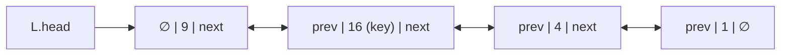

链表中的结点有三个基本元素：结点值（key）、前驱元素（prev）、后驱元素（next）。

prev和next实际上是指针，指向前后的结点，这样就形成了一个链条似的结点组。

prev和next 至少存在一个，根据存在的多少决定了链表的类型。

双向链表：prev和next都存在；

单向链表：prev不存在，next存在。

> prev和next是相对的，一般我们把prev为null的第一个元素称之为链表的头， next为null的称为链表的尾。
>

链表结点结构的定义：

```java
public class ListNode {
  int val;
  ListNode prev;
  ListNode next;
  ListNode(int x) { val = x; }
}
```

## 单向链表
```java
public class ListNode {
  int val;
  ListNode next;
  ListNode(int x) { val = x; }
}
```

### 添加操作
如果我们想在给定的结点prev之后添加新值，我们应该

1. 使用给定值初始化新结点cur；
2. 将cur的next指针连接到prev的下一个结点next；
3. 将prev的next指针连接到cur；

如果是数组，在中间插入一个值需要拷贝和移动，而链表则不用，可以在O(1)的时间复杂度中将新结点插入到链表中。

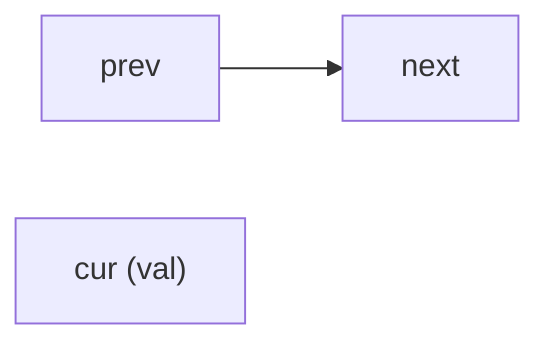

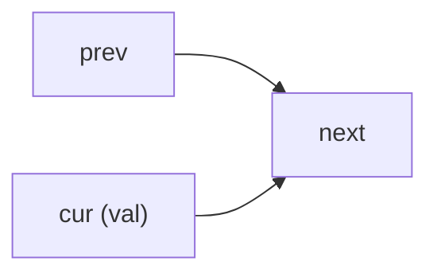

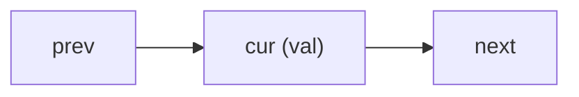

### 删除操作
如果我们想从单链表中删除现有结点cur，分两步完成：

1. 找到cur的上一个结点prev及其下一个结点next；
2. 接下来链接prev到cur到下一个结点next；

这个实际上就是把需要删除的结点移除链表了，因为删除结点需要先找到结点的位置，所以时间复杂度为O(N)，N为链表的长度，空间复杂度O(1)，因为我们只需要常量空间来存储指针。

## 双向链表

```java
public class ListNode {
    int val;
    ListNode prev;
    ListNode next;
    ListNode(int x) { val = x; }
}
```

### 添加操作
如果我们想在给定的结点prev之后添加新值，我们应该

### 删除操作

#### [141. 环形链表](https://leetcode.cn/problems/linked-list-cycle/)
快慢指针判圈，慢指针走一步的同时，快指针走两步，如果没有环，那么快指针一定会先遇到null，如果有环，慢指针和快指针一定会相遇

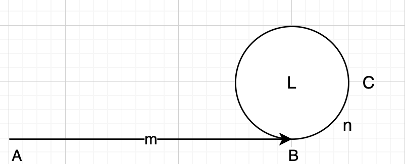

证明：

假设从A出发，B是环形链表的起点， AB=m，环形链表长度为L，在C点快慢指针第一次相遇。

第一次相遇时，慢指针走的路程：

$ m+aL+n\quad a = 0, 1, ... $

此时快指针走的路程是

$ m+bL+n \quad a = 0,1,... $

而快指针走的路程永远是慢指针的一倍，所以

$ 2(m+aL+n)=m+bL+n \\
m+n=(b-2a)L $

其中，m是已知的，可以通过遍历链表求出；a、b必然是整数，且m+n必然大于0.

$ m+n=L\\
m+n=2L \\
... \\
m+n=k*L $

所以n的位置取决于m和环的长度L，首先n肯定是有解的， n = k*L - m，只需要凑出一个k，保证n>=0且n<=L

$ 0<=k*L-m<=L\\
m/L<=k<=m/L+1 $

如果m<L的话，k=1;

如果m=L的话，k=1或2；

如果m>L的话，k=ceil(m/L)

所以快慢指针的相遇能检测出环。

另一种思考方式是，用「相对速度」来思考，慢指针不动，快指针相对慢指针每次只走一步，最终一定会与慢指针相遇。

```java
public class Solution {
  public boolean hasCycle(ListNode head) {
    if(head == null) {
      return false;
    }
    ListNode slow = head;
    ListNode fast = head;
    while(fast != null && fast.next != null) {
      slow = slow.next;
      fast = fast.next.next;
      if(slow == fast) {
        return true;
      }
    }
    return false;

  }
}
```

进一步探索：

1. 快慢指针什么时候第一次相遇呢？
2. 快慢指针差多少步能最快的进行检测呢？能走三步、四步吗
    1. [https://stackoverflow.com/questions/5130246/why-increase-pointer-by-two-while-finding-loop-in-linked-list-why-not-3-4-5](https://stackoverflow.com/questions/5130246/why-increase-pointer-by-two-while-finding-loop-in-linked-list-why-not-3-4-5)
3. [https://en.wikipedia.org/wiki/Cycle_detection#Tortoise_and_hare](https://en.wikipedia.org/wiki/Cycle_detection#Tortoise_and_hare)
4. [https://math.stackexchange.com/questions/913499/proof-of-floyd-cycle-chasing-tortoise-and-hare](https://math.stackexchange.com/questions/913499/proof-of-floyd-cycle-chasing-tortoise-and-hare)
5. [https://betterexplained.com/articles/fun-with-modular-arithmetic/#:~:text=The%20modulo%20operation%20(abbreviated%20%E2%80%9Cmod,you%20divide%205%20by%203.](https://betterexplained.com/articles/fun-with-modular-arithmetic/#:~:text=The%20modulo%20operation%20(abbreviated%20%E2%80%9Cmod,you%20divide%205%20by%203.)

#### [142. 环形链表 II](https://leetcode.cn/problems/linked-list-cycle-ii/)
用哈希存储结点，首次遇到走过的就是入口

```java
public class Solution {
  public ListNode detectCycle(ListNode head) {
    ListNode pos = head;
    Set<ListNode> visited = new HashSet<>();
    while(pos != null) {
      if(visited.contains(pos)) {
        return pos;
      }
      visited.add(pos);
      pos = pos.next;
    }
    return null;
  }
}
```

空间复杂度为O(N)。

如果要让空间复杂度降为O(1)：

[https://leetcode.cn/problems/linked-list-cycle-ii/solutions/1999271/mei-xiang-ming-bai-yi-ge-shi-pin-jiang-t-nvsq/](https://leetcode.cn/problems/linked-list-cycle-ii/solutions/1999271/mei-xiang-ming-bai-yi-ge-shi-pin-jiang-t-nvsq/)

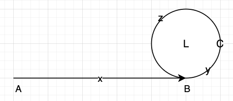

快慢双指针，slow进入环后，会在第一圈还没跑完的中途C处与fast指针相遇。

> 为什么slow指针会在第一圈就被快指针追上？
>
> 当慢指针刚进入环点B时，慢指针需要L步才能重新回到B点，此时快指针已经在环中，距离慢指针的最大距离为L-1，快指针永远比慢指针快上一步，当慢指针走上L步回到B点，快指针会在L-1步追上慢指针，此时慢指针还没有跑完一圈。
>

$ x+n(y+z)+y=2(x+y) \\
x+(n+1)y+nz=2x+2y\\
x = (n-1)y+nz\\
x = (n-1)(y+z)+z=(n-1)L+z
 $

从上式可以看出，x的距离是慢指针重新回到环的起点B的距离 加上 环的距离，也就是说当慢指针从C点出发，如果有一个指针同时从A点出发，两者一定会在B点相遇。

```java
public class Solution {
  public ListNode detectCycle(ListNode head) {
    if(null == head) {
      return null;
    }
    ListNode slow = head;
    ListNode fast = head;
    do {
      if(fast == null || fast.next == null) {
        return null;
      }
      slow = slow.next;
      fast = fast.next.next;
    } while(slow != fast);

    ListNode goWithSlow = head;
    while(goWithSlow != slow) {
      slow = slow.next;
      goWithSlow = goWithSlow.next;
    }
    return slow;
  }
}
```

#### [160. 相交链表](https://leetcode.cn/problems/intersection-of-two-linked-lists/)
```java
public class Solution {
  public ListNode getIntersectionNode(ListNode headA, ListNode headB) {

    Set<ListNode> sets = new HashSet<>();

    ListNode l1 = headA;
    ListNode l2 = headB;
    while(l1 != null) {
      sets.add(l1);
      l1 = l1.next;
    }

    while(l2 != null) {
      if(sets.contains(l2)) {
        return l2;
      }
      l2 = l2.next;
    }
    return null;
  }
}
```

时间复杂度O(m+n)，空间复杂度O(m+n)

利用双指针优化空间复杂度到O(1)。

[https://leetcode.cn/problems/3u1WK4/solutions/1052161/tu-jie-shuang-zhi-zhen-5xing-dai-ma-gao-owom2/](https://leetcode.cn/problems/3u1WK4/solutions/1052161/tu-jie-shuang-zhi-zhen-5xing-dai-ma-gao-owom2/)

```java
public class Solution {
  public ListNode getIntersectionNode(ListNode headA, ListNode headB) {
    if (headA == null || headB == null) {
      return null;
    }
    ListNode pA = headA;
    ListNode pB = headB;
    while(pA != pB) {
      if(pA == null) {
        pA = headB;
      } else {
        pA = pA.next;
      }

      if(pB == null) {
        pB = headA;
      } else {
        pB = pB.next;
      }
    }
    return pA;
  }
}
```

## 循环链表

## 链表的优劣
链表是一种线性表，但存储并不会按照线性的顺序存储数据，而是采用引用或者指针的方式链接下一个元素，由于不必按顺序存储，所以插入的复杂度是O(1)，但查找则需要遍历整个链表，所以查询的复杂度为O(N)。

使用链表结构可以克服数组链表需要预先知道数据大小的缺点，链表结构可以充分利用计算机内存空间，实现灵活的内存动态管理。但是链表失去了数组随机读取的优点，同时链表由于增加了结点的指针域，空间开销比较大。

链表最明显的好处就是，常规数组排列关联项目的方式可能不同于这些数据项目在记忆体或磁盘上顺序，数据的访问往往要在不同的排列顺序中转换。而链表是一种自我指示数据类型，因为它包含指向另一个相同类型的数据的指针（链接）。链表允许插入和移除表上任意位置上的节点，但是不允许随机存取。

## 移动和插入链表元素
+ 707. 设计链表
+ 203. 移除链表元素
+ 237. 删除链表中的节点
+ 19. 删除链表的倒数第 N 个结点
+ 83. 删除排序链表中的重复元素
+ 82. 删除排序链表中的重复元素 II

### [707. 设计链表](https://leetcode.cn/problems/design-linked-list/)
#### 单向链表
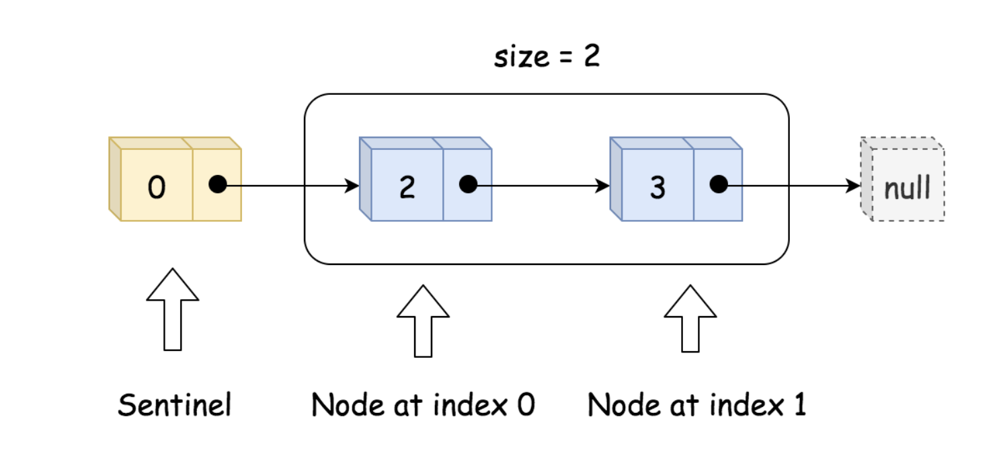

最核心的是需要有一个哨兵节点，指向真正的头节点。

```java
class MyLinkedList {
  ListNode dummyNode;
  int size;

  public MyLinkedList() {
    size = 0;
    dummyNode = new ListNode(-1);
  }

  public int get(int index) {
    if(index < 0 || index >= size) {
      return -1;
    }
    ListNode cur = dummyNode;
    for(int i = 0; i <= index; i++) {
      cur = cur.next;
    }
    return cur.val;
  }

  public void addAtHead(int val) {
    addAtIndex(0, val);
  }

  public void addAtTail(int val) {
    addAtIndex(size, val);
  }

  public void addAtIndex(int index, int val) {
    if(index < 0 || index > size) {
      return ;
    }
    ListNode preIndex = dummyNode;
    for(int i = 0; i < index; i++) {
      preIndex = preIndex.next;
    }
    ListNode toAdd = new ListNode(val);
    toAdd.next = preIndex.next;
    preIndex.next = toAdd;
    size++;
  }

  public void deleteAtIndex(int index) {
    if(size < 0 || index >= size) {
      return ;
    }
    ListNode preIndex = dummyNode;
    for(int i = 0; i < index; i++) {
      preIndex = preIndex.next;
    }
    ListNode temp = preIndex.next;
    preIndex.next = preIndex.next.next;
    temp.next = null;
    size--;
  }
}

class ListNode {
  int val;
  ListNode next;
  public ListNode(int val) {
    this.val = val;
  }
}
/**
* Your MyLinkedList object will be instantiated and called as such:
* MyLinkedList obj = new MyLinkedList();
* int param_1 = obj.get(index);
* obj.addAtHead(val);
* obj.addAtTail(val);
* obj.addAtIndex(index,val);
* obj.deleteAtIndex(index);
*/
```

#### 双向链表
```java
class MyLinkedList {

  ListNode dummy;
  ListNode tail;
  int size;

  public MyLinkedList() {
    size = 0;
    dummy = new ListNode(-1);
    tail = new ListNode(-1);
    dummy.next = tail;
    tail.prev = dummy;
  }

  public int get(int index) {
    if(index < 0 || index >= size) {
      return -1;
    }

    ListNode cur = dummy.next;
    if(index < size / 2) {
      for(int i = 0; i < index; i++) {
        cur = cur.next;
      }
      return cur.val;
    }

    cur = tail;
    for(int i = 0; i < size - index; i++) {
      cur = cur.prev;
    }
    return cur.val;

  }

  public void addAtHead(int val) {
    addAtIndex(0, val);
  }

  public void addAtTail(int val) {
    addAtIndex(size, val);
  }

  public void addAtIndex(int index, int val) {
    if(index < 0 || index > size) {
      return ;
    }
    ListNode slow = dummy;
    for(int i = 0; i < index; i++) {
      slow = slow.next;
    }
    ListNode fast = slow.next;

    ListNode node = new ListNode(val);
    node.next = fast;
    fast.prev = node;

    slow.next = node;
    node.prev = slow;
    size++;
  }

  public void deleteAtIndex(int index) {
    if(size < 0 || index >= size) {
      return ;
    }
    ListNode slow = dummy;
    for(int i = 0; i < index; i++) {
      slow = slow.next;
    }
    ListNode delete = slow.next;
    slow.next = delete.next;

    delete.next.prev = slow;
    delete = null;


    size--;
  }
}

class ListNode {
  int val;
  ListNode next;
  ListNode prev;
  public ListNode(int val) {
    this.val = val;
  }
}
/**
 * Your MyLinkedList object will be instantiated and called as such:
 * MyLinkedList obj = new MyLinkedList();
 * int param_1 = obj.get(index);
 * obj.addAtHead(val);
 * obj.addAtTail(val);
 * obj.addAtIndex(index,val);
 * obj.deleteAtIndex(index);
 */
```

### [203. 移除链表元素](https://leetcode.cn/problems/remove-linked-list-elements/)
```java
/**
* Definition for singly-linked list.
* public class ListNode {
*     int val;
*     ListNode next;
*     ListNode() {}
*     ListNode(int val) { this.val = val; }
*     ListNode(int val, ListNode next) { this.val = val; this.next = next; }
* }
*/
class Solution {
  public ListNode removeElements(ListNode head, int val) {
    if(head == null) {
      return null;
    }
    ListNode dummy = new ListNode(-1);
    dummy.next = head;

    ListNode slow = dummy;
    ListNode fast = dummy.next;
    while(fast != null) {
      if(fast.val == val) {
        slow.next = fast.next;
        fast = slow.next;
      } else {
        fast = fast.next;
        slow = slow.next;
      }
    }
    return dummy.next;

  }
}
```

### [237. 删除链表中的节点](https://leetcode.cn/problems/delete-node-in-a-linked-list/)
无法知道前一个节点，但我们可以对后面所有的节点进行复制。一个一个复制后面的节点

```java
/**
* Definition for singly-linked list.
* public class ListNode {
*     int val;
*     ListNode next;
*     ListNode(int x) { val = x; }
* }
*/
class Solution {
  public void deleteNode(ListNode node) {
    if(node.next == null) {
      node = null;
      return;
    }

    while(node.next != null) {
      node.val = node.next.val;
      if(node.next.next == null) {
        node.next = null;
      } else {
        node = node.next;
      }
    }
  }
}
```

时间复杂度为O(n)

一个一个复制，不如直接复制后一个，然后跳过后一个节点，时间复杂度为O(1)

```java
/**
 * Definition for singly-linked list.
 * public class ListNode {
 *     int val;
 *     ListNode next;
 *     ListNode(int x) { val = x; }
 * }
 */
class Solution {
    public void deleteNode(ListNode node) {
      node.val = node.next.val;
      node.next = node.next.next;
    }
}
```

### [19. 删除链表的倒数第 N 个结点](https://leetcode.cn/problems/remove-nth-node-from-end-of-list/)
使用双指针解决，先让快指针走N步，然后快慢指针同时走，直到快指针走到最后一个节点，此时慢指针就在要删除结点的前驱结点，slow.next = slow.next.next即可

```java
/**
* Definition for singly-linked list.
* public class ListNode {
*     int val;
*     ListNode next;
*     ListNode() {}
*     ListNode(int val) { this.val = val; }
*     ListNode(int val, ListNode next) { this.val = val; this.next = next; }
* }
*/
class Solution {
  public ListNode removeNthFromEnd(ListNode head, int n) {

    ListNode dummy = new ListNode(-1);
    dummy.next = head;
    ListNode fast = dummy;
    ListNode slow = dummy;
    for(int i = 0; i < n; i++) {
      fast = fast.next;
    }
    while(fast != null && fast.next != null) {
      slow = slow.next;
      fast = fast.next;
    }
    // this is important, rather than slow.next = fast;
    slow.next = slow.next.next;

    return dummy.next;
  }
}
```

### [83. 删除排序链表中的重复元素](https://leetcode.cn/problems/remove-duplicates-from-sorted-list/)

```java
/**
 * Definition for singly-linked list.
 * public class ListNode {
 *     int val;
 *     ListNode next;
 *     ListNode() {}
 *     ListNode(int val) { this.val = val; }
 *     ListNode(int val, ListNode next) { this.val = val; this.next = next; }
 * }
 */
class Solution {
  public ListNode deleteDuplicates(ListNode head) {
    if(head == null) {
      return null;
    }

    ListNode slow = head;
    ListNode fast = head.next;

    while(fast != null) {
      while(fast != null && slow.val == fast.val) {
        fast = fast.next;
      }
      slow.next = fast;
      slow = fast;
    }
    return head;
  }
}
```

### [82. 删除排序链表中的重复元素 II](https://leetcode.cn/problems/remove-duplicates-from-sorted-list-ii/)
这道题细节还是挺难写的，思路是用快慢指针去过滤掉重复的结点，快指针遇到重复的指针就继续往前走，慢指针负责在快指针确定当前结点不是重复结点的时候指向快指针，然后走到不重复结点处，周而复始。

如何判断重复节点，首先用`if(fast.val == fast.next.val)`来判断，如果为true则说明有重复节点，否则就没有。

```java
/**
* Definition for singly-linked list.
* public class ListNode {
*     int val;
*     ListNode next;
*     ListNode() {}
*     ListNode(int val) { this.val = val; }
*     ListNode(int val, ListNode next) { this.val = val; this.next = next; }
* }
*/
class Solution {
  public ListNode deleteDuplicates(ListNode head) {
    if(head == null) {
      return null;
    }

    ListNode dummy = new ListNode(-1);
    dummy.next = head;

    ListNode slow = dummy;
    ListNode fast = slow.next;
    // 0 -> 1 -> 1 -> 1 -> 2 -> 2
    // 0 -> 1 -> 2

    while(fast != null) {
      if(fast.next != null && fast.val == fast.next.val) {
        // 有重复节点
        while(fast.next != null && fast.val == fast.next.val) {
          fast = fast.next;
        } 
        fast = fast.next;
        slow.next = fast;
      } else {
        // 无重复节点
        slow = slow.next;
        fast = fast.next;
      }
    }
    return dummy.next;
  }
}
```

## 链表的遍历
### [430. 扁平化多级双向链表](https://leetcode.cn/problems/flatten-a-multilevel-doubly-linked-list/)
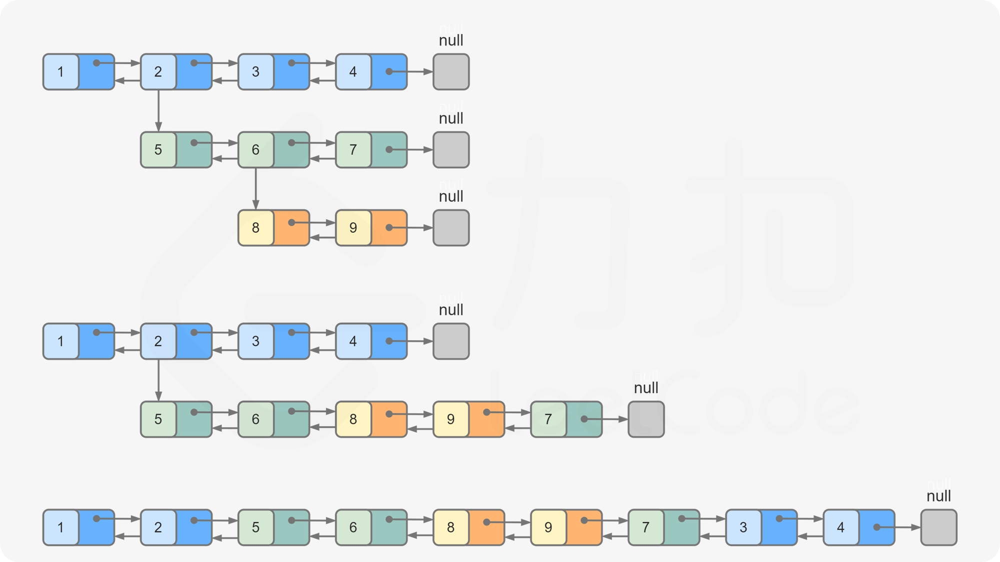

```java
class Solution {
  public Node flatten(Node head) {
    if(head == null) {
      return null;
    }
    dfs(head);
    return head;
  }

  // 返回head子树的最后一个扁平节点
  private Node dfs(Node node) {
    Node cur = node;
    Node lastNode = node;
    while(cur != null) {
      if(cur.child == null) {
        lastNode = cur;
        cur = cur.next;
      } else {
        Node next = cur.next;
        lastNode = dfs(cur.child);
        lastNode.next = next;
        if(next != null) {
          next.prev = lastNode;
        }        
        cur.next = cur.child;
        cur.next.prev = cur;
        cur.child = null;
      }
    }
    return lastNode;
  }
}
```

时间复杂度：O(N)

空间复杂度：O(N)

另一种写法：

```java
class Solution {
  public Node flatten(Node head) {
    Node dummy = new Node(0);
    dummy.next = head;
    while(head != null) {
      if(head.child == null) {
        head = head.next;
      } else {
        Node nextNode = head.next;
        Node childHead = flatten(head.child);

        head.next = childHead;
        childHead.prev = head;
        head.child = null;

        while(head.next != null) {
          head = head.next;
        }
        head.next = nextNode;
        if(nextNode != null) {
          nextNode.prev = head;
        }
        head = nextNode;
      }
    }
    return dummy.next;
  }
}
```

进阶：试着用桢 将递归转成迭代

### [114. 二叉树展开为链表](https://leetcode.cn/problems/flatten-binary-tree-to-linked-list/)
前序遍历为根左右

令当前结点递归后的返回参数为[当前结点，最右结点]，dfs(cur.left)返回的是[cur.left, cur.left的前序遍历后的最右结点]

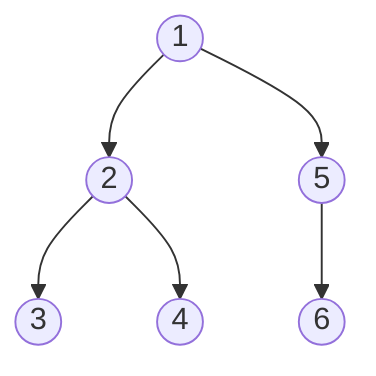

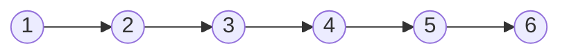

那就是

1. dfs(2) = 2,4;
2. dfs(3) = 3,3;
3. dfs(4) = 4,4;
4. dfs(5) = 5,6
5. dfs(6) = 6,6
6. dfs(1) = 1,6

然后作一个链接。

```java
class Solution {
  public void flatten(TreeNode root) {
    if(root == null) {
      return ;
    }
    dfs(root);
  }
  private TreeNode[] dfs(TreeNode root) {

    TreeNode[] left = null, right = null;
    if(root.left != null) {
      left = dfs(root.left);
    }
    if(root.right != null) {
      right = dfs(root.right);
    }

    TreeNode tail = root;
    if(left != null && right != null) {
      root.right = left[0];
      left[1].right = right[0];
      tail = right[1];
    } else if(left != null) {
      root.right = left[0];
      tail = left[1];
    } else if(right != null){
      tail = right[1];
    }
    root.left = null;

    return new TreeNode[]{root, tail};
  }

}
```

时间复杂度和空间复杂度都为O(N)

优化：右结点其实不需要进行递归。可寻找空间复杂度为O(1)的解法。

原地算法：原问题是将根节点的树转变成链表，那左子树和右子树其实也都是要转化为链表的，所以就是个子问题。

那可以递归下去。

```java
class Solution {
  public void flatten(TreeNode root) {
    if(root == null) {
      return;
    }

    flatten(root.left);
    flatten(root.right);

    TreeNode right = root.right;
    root.right = root.left;
    root.left = null;

    // 指向right的最右结点
    TreeNode node = root;
    while(node.right != null) {
      node = node.right;
    }
    node.right = right;
  }

}
```

## 链表的旋转和反转
25. K 个一组翻转链表

### [61. 旋转链表](https://leetcode.cn/problems/rotate-list/)
```java
/**
* Definition for singly-linked list.
* public class ListNode {
*     int val;
*     ListNode next;
*     ListNode() {}
*     ListNode(int val) { this.val = val; }
*     ListNode(int val, ListNode next) { this.val = val; this.next = next; }
* }
*/
class Solution {
  public ListNode rotateRight(ListNode head, int k) {
    // rotate 1 -> 4
    // rotate 2 -> 3
    // ...
    // rotate k -> len - k

    // slow 
    if(head == null) {
      return head;
    }
    ListNode slow = head;
    ListNode fast = head;
    int size = 0;
    while(fast != null){
      size++;
      fast = fast.next;
    }
    fast = head;
    for(int i = 0; i < k % size; i++) {
      fast = fast.next;
    }
    while(fast.next != null) {
      fast = fast.next;
      slow = slow.next;
    }
    if(slow.next == null) {
      return head;
    }

    fast.next = head;
    head = slow.next;
    slow.next = null;

    return head;
  }
}
```

### [24. 两两交换链表中的节点](https://leetcode.cn/problems/swap-nodes-in-pairs/)
使用三个结点 

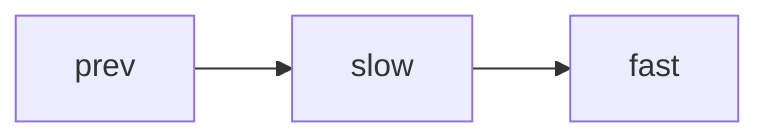

交换 

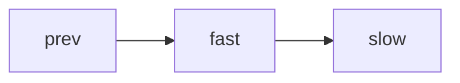

再重新回到相应的位置：


```java
/**
* Definition for singly-linked list.
* public class ListNode {
*     int val;
*     ListNode next;
*     ListNode() {}
*     ListNode(int val) { this.val = val; }
*     ListNode(int val, ListNode next) { this.val = val; this.next = next; }
* }
*/
class Solution {
  public ListNode swapPairs(ListNode head) {
    if(head == null) {
      return null;
    }
    ListNode dummyNode = new ListNode(-1);
    dummyNode.next = head;
    ListNode prev = dummyNode;
    ListNode slow = head;
    ListNode fast = head.next;

    while(fast != null) {
      // 交换
      prev.next = fast;
      slow.next = fast.next;
      fast.next = slow;

      // 置位
      slow = prev.next;
      fast = slow.next;

      // move
      if(fast.next == null) {
        break;
      }
      prev = prev.next.next;
      slow = slow.next.next;
      fast = fast.next.next;
    }

    return dummyNode.next;


  }
}
```

### [206. 反转链表](https://leetcode.cn/problems/reverse-linked-list/)
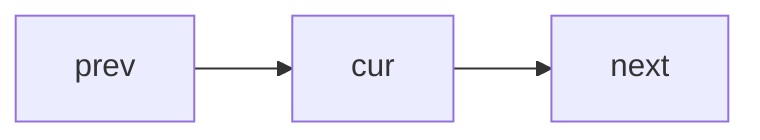

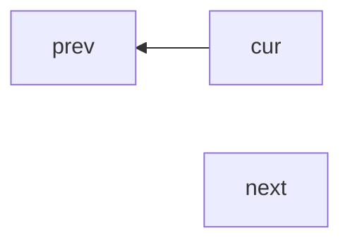

```java
class Solution {
    public ListNode reverseList(ListNode head) {
        if (head == null || head.next == null) {
            return head;
        }

        // prev -> cur -> next;
        // prev <- cur next
        ListNode prev = null;
        ListNode cur = head;
        while (cur != null) {
            // 记住下一个结点并交换
            ListNode next = cur.next;
            cur.next = prev;
            prev = cur;
            cur = next;
        }
        return prev;
    }
}
```

### [92. 反转链表 II](https://leetcode.cn/problems/reverse-linked-list-ii/)

在反转链表的基础上分段执行即可。

```java
class Solution {
    public ListNode reverseBetween(ListNode head, int left, int right) {
      if(head.next == null) {
        return head;
      }
      
      // prev -> cur -> next;
      // prev <- cur next
      ListNode dummy = new ListNode(-1);
      dummy.next = head;
      ListNode prev = null;
      ListNode cur = head;
      
      ListNode start = null;
      for(int i = 0; i < left; i++) {
        start  = prev;
        prev = cur;
        cur = cur.next;        
      }
      if(start == null) {
        start = dummy;
      }

      // System.out.println(prev.val);
      // System.out.println(cur.val);
       
      int expectedStep = right - left;
      // 反转
      ListNode next = null;
      for(int i = 0; i < expectedStep; i++) {
        // 记住下一个结点
        next = cur.next;
        // 交换
        cur.next = prev;
        // 置位
        prev = cur;
        cur = next;
      }

      // System.out.println(prev.val);
      // System.out.println(cur.val);
      // System.out.println(next.val);

      ListNode temp = start.next;
      start.next = prev;
      temp.next = cur;
      
      return dummy.next;
    }
}
```

## 链表高精度加法
2. 两数相加 // 445. 两数相加 II // 面试题 02.05. 链表求和

### [445. 两数相加 II](https://leetcode.cn/problems/add-two-numbers-ii/)
[https://leetcode.cn/problems/add-two-numbers-ii/solutions/2328330/fan-zhuan-lian-biao-liang-shu-xiang-jia-okw6q/](https://leetcode.cn/problems/add-two-numbers-ii/solutions/2328330/fan-zhuan-lian-biao-liang-shu-xiang-jia-okw6q/)

```java
class Solution {
  public ListNode addTwoNumbers(ListNode l1, ListNode l2) {
    ListNode r1 = reverseList(l1);
    ListNode r2 = reverseList(l2);
    ListNode l3 = addTwo(r1, r2);
    return reverseList(l3);
  }
  private ListNode reverseList(ListNode head) {
    ListNode cur = head;
    ListNode prev = null;
    while(cur != null) {
      ListNode next = cur.next;
      cur.next = prev;
      prev = cur;
      cur = next;
    }
    return prev;
  }
  private ListNode addTwo(ListNode l1, ListNode l2) {
    ListNode dummy = new ListNode(-1);
    ListNode cur = dummy;
    int carry = 0;
    while(l1 != null || l2 != null || carry != 0) {
      if(l1 != null) {
        carry += l1.val;
        l1 = l1.next;
      }
      if(l2 != null) {
        carry += l2.val;
        l2 = l2.next;
      }

      ListNode node = new ListNode(carry % 10);
      carry = carry / 10;
      cur.next = node;
      cur = node;
    }
    return dummy.next;
  }
}
```

## 链表的合并
### [21. Merge Two Sorted Lists](https://leetcode.cn/problems/merge-two-sorted-lists/)
```java
class Solution {
    public ListNode mergeTwoLists(ListNode list1, ListNode list2) {
      // mergeTwoLists(list1, list2)
      // list1[0] + merge(list[1:], list2[0:]) if(list1[0] > list2[0]) else list2[0] + merge(list1[0:], list2[1:])
      if(list1 == null) {
        return list2;
      }
      if(list2 == null) {
        return list1;
      }
      if(list1.val < list2.val) {
        list1.next = mergeTwoLists(list1.next, list2);
        return list1;
      } else {
        list2.next = mergeTwoLists(list1, list2.next);
        return list2;
      }
    }
}
```

### [23. 合并 K 个升序链表](https://leetcode.cn/problems/merge-k-sorted-lists/)
```java
class Solution {
  public ListNode mergeKLists(ListNode[] lists) {
    if(lists == null || lists.length == 0) {
      return null;
    }
    ListNode head = null;
    for(ListNode list : lists) {
      head = mergeTwoLists(list, head);
    }
    return head;

  }
  public ListNode mergeTwoLists(ListNode list1, ListNode list2) {
    if(list1 == null) {
      return list2;
    }
    if(list2 == null) {
      return list1;
    }
    if(list1.val < list2.val) {
      list1.next = mergeTwoLists(list1.next, list2);
      return list1;
    } else {
      list2.next = mergeTwoLists(list1, list2.next);
      return list2;
    }
  }
}
```

```java
class Solution {
  public ListNode mergeKLists(ListNode[] lists) {
    if(lists == null || lists.length == 0) {
      return null;
    }
    PriorityQueue<ListNode> pq = new PriorityQueue<>((a, b) -> a.val - b.val);

    for(ListNode list : lists) {
      if(list != null) {
        pq.offer(list);
        System.out.println(list.val);
      }
    }
    ListNode dummy = new ListNode(-1);
    ListNode head = dummy;
    while(!pq.isEmpty()) {
      ListNode node = pq.poll();
      head.next = node;
      head = head.next;
      if(node.next != null) {
        pq.offer(node.next);
      }
    }
    return dummy.next;
  }
}
```

## 链表中的双指针技巧
86. 分隔链表 // 19. 删除链表的倒数第 N 个结点 // 142. 环形链表 II // 876. 链表的中间结点 // 143. 重排链表 // 160. 相交链表

### [LCR 026. 重排链表](https://leetcode.cn/problems/LGjMqU/)
```java
class Solution {
  public void reorderList(ListNode head) {
    if (head == null) {
      return;
    }
    ListNode mid = middleNode(head);
    ListNode l1 = head;
    ListNode l2 = mid.next;
    mid.next = null;
    l2 = reverseList(l2);
    mergeList(l1, l2);
  }

  public ListNode middleNode(ListNode head) {
    ListNode slow = head;
    ListNode fast = head;
    while (fast.next != null && fast.next.next != null) {
      slow = slow.next;
      fast = fast.next.next;
    }
    return slow;
  }

  public ListNode reverseList(ListNode head) {
    ListNode prev = null;
    ListNode curr = head;
    while (curr != null) {
      ListNode nextTemp = curr.next;
      curr.next = prev;
      prev = curr;
      curr = nextTemp;
    }
    return prev;
  }

  public void mergeList(ListNode l1, ListNode l2) {
    ListNode nextOfL1;
    ListNode nextOfL2;
    while (l1 != null && l2 != null) {
      nextOfL1 = l1.next;
      nextOfL2 = l2.next;

      l1.next = l2;
      l2.next = nextOfL1;

      l1 = nextOfL1;
      l2 = nextOfL2;
    }
  }
}
```

[LCR 027. 回文链表](https://leetcode.cn/problems/aMhZSa/)
```java
/**
 * Definition for singly-linked list.
 * public class ListNode {
 *     int val;
 *     ListNode next;
 *     ListNode() {}
 *     ListNode(int val) { this.val = val; }
 *     ListNode(int val, ListNode next) { this.val = val; this.next = next; }
 * }
 */
class Solution {
    public boolean isPalindrome(ListNode head) {
      ListNode left = head;
      ListNode mid = middle(head);
      ListNode right = reverseList(mid.next);
      mid.next = null;
      
      ListNode temp = right;
      while(right != null) {
        if(left.val != right.val) {
          return false;
        }
        right = right.next;
        left = left.next;
      }
      // 恢复head，不能改变入参
      mid.next = reverseList(temp);
      return true;

    }
    private ListNode middle(ListNode head) {
      ListNode dummy = new ListNode(-1);
      dummy.next = head;
      ListNode left = dummy;
      ListNode right = dummy;
      while(right != null && right.next != null) {
        left = left.next;
        right = right.next.next;
      }
      return left;

    }
    private ListNode reverseList(ListNode head) {
      ListNode prev = null;
      ListNode cur = head;
      while(cur != null) {
        ListNode next = cur.next;
        cur.next = prev;

        prev = cur;
        cur = next;
      }
      return prev;
    }

}
```

### [LCR 029. 循环有序列表的插入](https://leetcode.cn/problems/4ueAj6/)
```java
class Solution {
  public Node insert(Node head, int insertVal) {
    Node node = new Node(insertVal);
    if(head == null) {
      node.next = node;
      return node;
    }
    if(head.next == head) {
      head.next = node;
      node.next = head;
      return head;
    }
    Node cur = head;  
    while(cur.next != head) {
      if(insertVal >= cur.val && insertVal <= cur.next.val) {
        break;
      }
      if(cur.val > cur.next.val && (insertVal >= cur.val || insertVal < cur.next.val)) {
        break;
      }
      cur = cur.next;
    }
    Node next = cur.next;
    cur.next = node;
    node.next = next;
    return head;
  }
}
```
