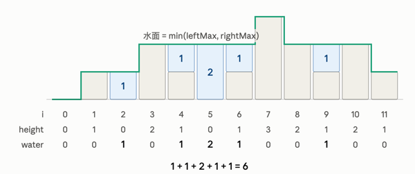

满足单调性的栈，插入元素时，在保证该元素插入到栈顶后整个栈满足单调性的前提下弹出最少的元素。

例如，栈中自顶向下的元素为 $ \{0,11,45,81\} $

<!-- 这是一张图片，ocr 内容为：45 81 -->


插入元素14时为了保证单调性需要依次弹出元素0、11，操作后栈变为 $ \{14,45,81\} $

<!-- 这是一张图片，ocr 内容为：PUSH -->


单调栈比朴素的栈更为严格，它要求每次入栈的元素必须要有序，如果新元素入栈不符合要求，则将栈顶元素不断出栈，直到最新的元素满足单调的要求，使之形成单调递增/单调递减的一个栈。

这个保证单调性的原则是通过不断遗弃老的元素达成的，在这个遗弃的过程中就可以做一些事情，比如计算他们的差值，如[739. 每日温度](https://leetcode.cn/problems/daily-temperatures/); 或是找出下一个更大的值，如496。

```java
public void insert(int x) {
    while(!stack.isEmpty() && stack.peek() < x) {
        stack.pop();
    }
    // do something
    stack.push(x);
}
```

为了方便描述，如果出栈的元素是单调递减的，那我们称这个栈为单调递减栈，也就是说，单调递减栈是从栈顶开始递减的；

如果出栈的元素是单调递增的，那我们称这个栈为单调递增栈，也就是说，单调递增栈是从栈顶开始递增的。

在刷题的过程中，实际上单调栈应该是为了避免重复遍历自然而言想出来的，而不是用单调栈去套，也就是在暴力求解的时候，你会遇到什么样的重复遍历，为了解决这个重复遍历，不得不用栈的遍历存储结构来降低时间复杂度，此时写出来的自然就是一个单调栈了。

## [496. Next Greater Element I](https://leetcode.cn/problems/next-greater-element-i/)
### 暴力法
直接hashmap暴力求解

```java
class Solution {
  public int[] nextGreaterElement(int[] nums1, int[] nums2) {
    int len1 = nums1.length;
    int len2 = nums2.length;
    int[] res = new int[len1];
    Map<Integer, Integer> numToIndexMap = new HashMap<>();
    for(int i = 0; i < len2; i++) {
      numToIndexMap.put(nums2[i], i);
    }
    for(int i = 0; i < len1; i++) {
      int num = nums1[i];
      int index = numToIndexMap.get(num);
      boolean flag = false;
      for(int j = index + 1; j < len2; j++) {
        if(nums2[j] > num) {
          flag = true;
          res[i] = nums2[j];
          break;
        }
      }
      if(!flag) {
        res[i] = -1;
      }
    }

    return res;

  }
}
```

时间复杂度O(m*n)。

### 单调栈
因为nums1是nums2的子集，所以这个问题可以认为是找出nums2中每个元素的下一个最大元素是什么？

> 定位nums1的数在nums2的位置可以用HashMap来快速定位
>

对于`[1, 2, 3, 4, 5]`暴力的话，时间复杂度实际上就是`O(N)`，但对于`[4, 3, 2, 1, 5]`暴力时，时间复杂度就是`O(N^2)`，实际上在找4的下一个更大元素时，就已经知道了`[3, 2, 1]`的下一个更大元素了，也就是说一次遍历到5的时候，前面4个数的答案就可以知道了。由于一次遍历到5的时候不可能什么都不记录就知道前面数的答案，所以需要一个数据结构来存储，在遇到5的时候能让前面的数得到一个释放，有先进先出的特性那就自然是栈比较合适。并且这个栈的特性是**从栈顶到栈底单调递增的栈。**

```java
class Solution {
  public int[] nextGreaterElement(int[] nums1, int[] nums2) {
    // 1. nums1 是 nums2的子集 => 求nums2中下一个更大的元素
    // 从前向后找时间复杂度是O(n^2)，从后向前找
    // [1, 2, 3, 4]
    Deque<Integer> stack = new ArrayDeque<>();
    Map<Integer, Integer> map = new HashMap<>();
    // [4, 3, 2, 1, 5, 6, 5, 4, 3]
    for(int i = 0; i < nums2.length; i++) {
      // 从栈顶到栈底单调递增的栈
      while(!stack.isEmpty() && stack.peek() < nums2[i]) {
        int num = stack.pop();
        map.put(num, nums2[i]);
      }
      stack.push(nums2[i]);
    }
    // 遍历完之后仍然在栈中的说明现在
    while(!stack.isEmpty()) {
      map.put(stack.pop(), -1);
    }

    int[] ans = new int[nums1.length];
    for(int i = 0; i < nums1.length; i++) {
      ans[i] = map.get(nums1[i]);
    }
    return ans;
  }
}
```

这种栈由于其单调性，也就是我们前面说到的单调栈，本质上还是为了解决重复遍历的问题。

事实上，我们还可以从后向前遍历，`[3, 6, 4, 2, 3, 5]`从后向前遍历，一次遍历到4时就知道`[4, 2, 1]`的下一个更大元素是5，但在这中间我们还知道2的下一个元素是3，也就是在向前遍历的过程中，比5小的元素`[3, 2]`也是要存储起来的，直到遇到了更大的元素`4`，`[3, 2]`的存储从元素才没有了价值，因为更前面的元素的下一个更大的元素必然是刚遇到的这个元素。所以还是一个**从栈顶到栈底单调递增的栈存储**。

我们如何知道2的下一个更大的元素是2呢，就是在将2弹入栈之前。

```java
class Solution {
  public int[] nextGreaterElement(int[] nums1, int[] nums2) {
    // 1. nums1 是 nums2的子集 => 求nums2中下一个更大的元素
    // 从前向后找时间复杂度是O(n^2)，从后向前找
    // [1, 2, 3, 4]
    Deque<Integer> stack = new ArrayDeque<>();
    Map<Integer, Integer> map = new HashMap<>();
    // [3, 6, 4, 2, 3, 5]
    for(int i = nums2.length - 1; i >= 0; i--) {
      // 从栈顶到栈底单调递增的栈
      // 遇到更小的元素就存储起来，遇到更大的元素就弹出来
      while(!stack.isEmpty() && stack.peek() < nums2[i]) {
        stack.pop();
      }
      if(stack.isEmpty()) {
        map.put(nums2[i], -1);
      } else {
        map.put(nums2[i], stack.peek());
      } 
      stack.push(nums2[i]);
    }

    int[] ans = new int[nums1.length];
    for(int i = 0; i < nums1.length; i++) {
      ans[i] = map.get(nums1[i]);
    }
    return ans;
  }
}
```

time complexity: O(nums1.length + nums2.length)

space complexity: O(nums2.length)

## [739. 每日温度](https://leetcode.cn/problems/daily-temperatures/)
> Input: temperatures = [73,74,75,71,69,72,76,73] 
>
> Output: [1,1,4,2,1,1,0,0]
>

其实跟496题是一样的题。

先从暴力求解开始，可以自然而然思考出单调栈的方法。

### 逆序遍历
逆序遍历，形成一个从栈顶到栈底单调递增的单调栈，意味着即将插入的元素的下一个更大的元素一定在栈顶。

```java
class Solution {
  public int[] dailyTemperatures(int[] temperatures) {

    Deque<Integer> stack = new ArrayDeque<>();
    int[] res = new int[temperatures.length];
    for(int i = temperatures.length - 1; i >= 0; i--) {
      while(!stack.isEmpty() && temperatures[stack.peek()] <= temperatures[i]) {
        stack.pop();
      }
      if(!stack.isEmpty()) {          
        res[i] = stack.peek() - i;
      } 
      stack.push(i);
    }
    return res;
  }
}
```

### 正序遍历
正序遍历，形成一个从栈顶到栈底单调递增的单调栈，意味着每次出栈的元素的下一个最大的元素就是即将插入的元素。

```java
class Solution {
    public int[] dailyTemperatures(int[] temperatures) {

      Deque<Integer> stack = new ArrayDeque<>();
      int[] res = new int[temperatures.length];
      for(int i = 0; i < temperatures.length; i++) {
        while(!stack.isEmpty() && temperatures[stack.peek()] < temperatures[i]) {
          int idx = stack.pop();
          res[idx] = i - idx;
        }
        stack.push(i);
      }
      return res;
    }
}
```

## [84. 柱状图中最大的矩形](https://leetcode.cn/problems/largest-rectangle-in-histogram/)
非常经典的题，需要多次刷。

For any bar <i> the maximum rectangle is of width **indexOfFirstSmallerElementOfRight- indexOfFirstSmallerElementOfLeft -1  **where **indexOfFirstSmallerElementOfRight** is the first coordinate of the bar to the right with height h[**indexOfFirstSmallerElementOfRight**] < h[i], and **indexOfFirstSmallerElementOfLeft** is the first coordinate of the bar to the left with height h[**indexOfFirstSmallerElementOfLeft**] < h[i].

#### 暴力破解法
so we need find r and l, the first solution is bruce force：

```java
class Solution {
  public int largestRectangleArea(int[] heights) {
    // bruce 
    int maxArea = 0;
    for(int i = 0; i < heights.length; i++) {
      if(heights[i] == 0) {
        continue;
      }
      // left
      int area = heights[i]; 
      for(int j = i - 1; j >= 0; j--) {
        if(heights[j] >= heights[i]) {
          area += heights[i];
        } else {
          break;
        }
      }

      // right
      for(int j = i + 1; j < heights.length; j++) {
        if(heights[j] >= heights[i]) {
          area += heights[i];
        } else {
          break;
        }
      }
      maxArea = Math.max(maxArea, area);
    } 
    return maxArea;
  }
}
```

the time complexity is O(N^2)

the senond solution is monotonic stack solution：

#### 两次单调栈
暴力法是向左向右找到第一个比自己小的位置，那这个位置其实就可以用单调栈来完成。

```java
class Solution {
  public int largestRectangleArea(int[] heights) {
    int maxArea = 0;
    int[] left = nextSmallerIndexOfLeft(heights);
    int[] right = nextSmallerIndexOfRight(heights);
    for(int i = 0; i < heights.length; i++) {
      maxArea = Math.max(maxArea, (right[i] - left[i] - 1) * heights[i]);
    } 
    return maxArea;
  }
  // 找到右侧第一个比当前数小的位置
  // heights = [2,1,5,6,2,3,3,3]
  private int[] nextSmallerIndexOfRight(int[] heights) {
    // 维护一个从栈顶到栈底 单调递减的单调栈
    Deque<Integer> stack = new ArrayDeque<>();
    int[] res = new int[heights.length];
    for(int i = heights.length - 1; i >= 0; i--) {
      while(!stack.isEmpty() && heights[stack.peek()] >= heights[i]) {
        stack.pop();
      }
      res[i] = !stack.isEmpty() ? stack.peek() : heights.length;
      stack.push(i);
    }
    return res;
  }

  // 找到左侧第一个比当前数小的位置
  // heights = [2,2,2,1,5,6,2,3]
  private int[] nextSmallerIndexOfLeft(int[] heights) {
    // 维护一个从栈顶到栈底 单调递减的单调栈
    Deque<Integer> stack = new ArrayDeque<>();
    int[] res = new int[heights.length];
    for(int i = 0; i < heights.length; i++) {
      while(!stack.isEmpty() && heights[stack.peek()] >= heights[i]) {
        stack.pop();
      }
      res[i] = !stack.isEmpty() ? stack.peek() : -1;
      stack.push(i);
    }
    return res;
  }
}
```

we can continue to optimize it: 

#### 一次单调栈
一次单调栈时，其面积的思想略微有些不同，两次单调栈每次柱形的最大矩形面积是严格意义上的最大，一次单调栈时，每次柱形上的最大矩形面积不一定是最大的，在右侧元素有相同元素时如[1,1,1]，第一个柱形的面积为1，第二个柱形的面积为2，第三个柱形的面积才为三，在两次单调栈中，三个柱形的矩形面积都为3。

我们用公式来推导：

左侧的位置：

$ left(i) = j \quad when \quad \{min_{j=-1}^{i-1}{(i-j)} \quad 
\&\& \quad 
height[j] < height[i]\} $

右侧的位置：

$ right(i) = j \quad when \quad \{min_{j=i+1}^{len}{(j-i)} \quad 
\&\& \quad 
height[i] >= height[j]\} $

圆柱的可能最大矩形面积，之所以是可能，是因为可能有[1,1,1]这种情况，只有到最后一个相等的元素1后才会是最大值：

$ f(i)= height[i]*(right(i)-(-1)-1) \quad i= 0
\\f(i)=height[i]*(right(i)-left(i)-1) \quad 0 < i < len - 1\\
f(i)=height[i]*(len - left(i) - 1) \quad i = len - 1
 $

对于整个数组来说：

$ max_{i=0}^{len-1}(f(i)) $

```java
class Solution {
  public int largestRectangleArea(int[] heights) {
    Deque<Integer> stack = new ArrayDeque<>();
    int maxArea = 0;
    int len = heights.length;
    // 从左向右遍历，算出每一个遍历元素的左侧最大矩形面积
    // 因为我们要在左侧找出比当前遍历元素小的最近的一个数的位置，所以用自顶向下单调递减的单调栈
    // 自顶向下单调递减，意味着能保证始终记录着比当前元素小的最近一个数的位置
    for(int i = 0; i <= len; i++){
      int currentHeight = i == len ? 0 : heights[i];
      // 自顶向下单调递减，当栈顶元素大于等于当前遍历元素时，就出栈
      // 之所以出栈，是因为栈顶元素遇到了<小于等于>它的元素，同时这个元素也就是出栈元素在左侧遇到的一个最近且小于等于它的元素
      // 另外，在出栈元素的右侧，出栈元素在栈中紧挨着的元素就是其右侧的最近且小于它的元素
      // 所以对于出栈元素来说，每次出栈时的最左侧就是出栈后的栈顶元素，最右侧就是当前遍历元素，其(宽度-1)*高度就是出栈元素的最大矩形面积之一。
      while(!stack.isEmpty() && heights[stack.peek()] >= currentHeight){
        // 出栈元素的高度
        int height = heights[stack.pop()];
        // 左边第一个比出栈元素小的位置
        int left = stack.isEmpty() ? -1 : stack.peek();
        // 右边第一个比出栈元素小的位置
        int right = i;
        int area = height * (right - left - 1);
        maxArea = Math.max(maxArea, area);
      }
      stack.push(i);
    }

    return maxArea;
  }
}
```

[https://muyuuuu.github.io/2022/05/20/monotonic-stack/](https://muyuuuu.github.io/2022/05/20/monotonic-stack/)

## [901. 股票价格跨度](https://leetcode.cn/problems/online-stock-span/)
暴力破解法的时间复杂度O(N^2)：用链表存储下来，然后每次向前遍历判断连续小于当前数的最大连续日数。比如`[6, 3, 2, 1, 4, 5]`，插入4时向前遍历，发现`3, 2, 1`都是小于4，插入5时，发现`[3, 2, 1, 4]`小于5。这部分其实就重复遍历了，我们其实可以将`[3, 2, 1]`的个数信息存储在4中，4后面的数如果小于4，那这部分信息没什么用，如果大于4，这部分信息可以直接加上。

所以优化的数据结构可以利用上单调栈，不过要额外存储一下个数信息，可以用两个栈，也可以用一个栈实现。

时间复杂度O(N)。

```java
class StockSpanner {
  // 从栈顶到栈底递增的单调栈
  // [price, 插入时导致出栈的元素个数 + 1(自身的数量)]
  private Deque<int[]> stack;
  public StockSpanner() {
    stack = new ArrayDeque<>();
  }

  public int next(int price) {
    int cnt = 1;
    while(!stack.isEmpty() && stack.peek()[0] <= price) {
      cnt += stack.pop()[1];
    }
    stack.push(new int[] {price, cnt});
    return cnt;
  }
}
```

## [42. 接雨水](https://leetcode.cn/problems/trapping-rain-water/)
### 暴力

<!-- 这是一张图片，ocr 内容为：3 输入:HEIGHT 三 [0,1,0,2,1,0,1,3,2,1,2,1] 输出:6 解释:上面是由数组 (0,1,8,2.1,3,2,1,2,1] 表示的高度图.在这种情况下,可以接6个单位的雨水). -->
我们可以把每个柱子看成一个木桶，木桶的有效高度是`min(左侧最高的木板，右侧最高的木板) - heights[i]`。

因此总积水面积等于`sum(min(左侧最高的木板，右侧最高的木板) - heights[i])`


```java
class Solution {
  public int trap(int[] height) {
    int n = height.length; 
    int ans = 0;
    for(int i = 0; i < n; i++) {
      int leftHeight = 0;
      for(int j = i - 1; j >= 0; j--) {
        leftHeight = Math.max(leftHeight, height[j]);
      }

      int rightHegiht = 0;
      for(int j = i + 1; j < n; j++) {
        rightHegiht = Math.max(rightHegiht, height[j]);
      }
      int validHeight = Math.max(Math.min(leftHeight, rightHegiht) - height[i], 0);
      ans += validHeight;
    }
    return ans;
  }
}
```

这其中部分重复的计算，在于每次向右向左找最高的柱子，比如[5, 3, 2, 1, 2, 4]，3找到大于3最高的柱子4，说明中间的都是小于4的，说明`[2, 1, 2]`的右侧最高柱子为4。也就是`[2, 1, 2]`是没有必要存储的，这个我们用一个变量来存储就可以，找到每个值的右侧最大的值的高度。

```java
class Solution {
  public int trap(int[] height) {
    Map<Integer, Integer> indexToleftHeightMaxMap = findLeftMaxHeight(height);
    Map<Integer, Integer> indexToRightHeightMaxMap = findRightMaxHeight(height);
    int len = height.length;
    int sum = 0;
    findLeftMaxHeight(height);
    for (int i = 0; i < len; i++) {
      int leftMax = indexToleftHeightMaxMap.get(i);
      int rightMax = indexToRightHeightMaxMap.get(i);
      sum += Math.max(Math.min(leftMax, rightMax) - height[i], 0);
    }
    return sum;
  }

  private Map<Integer, Integer> findLeftMaxHeight(int[] height) {

    Map<Integer, Integer> map = new HashMap<>();
    int len = height.length;
    // max[i] = max(height[0:i-1]) if max(height[0:i-1]) > height[i] otherwise -1
    int max = height[0];
    map.put(0, -1);
    for(int i = 1; i < len; i++) {
      if(max > height[i]) {
        map.put(i, max);
      }  else {
        map.put(i, -1);
        max = height[i];
      }
    }
    return map;
  }

  private Map<Integer, Integer> findRightMaxHeight(int[] height) {
    Map<Integer, Integer> map = new HashMap<>();
    int len = height.length;
    int max = height[len - 1];
    // max[i] = max(height[i+1:len-1]) if max(height[i+1:len-1]) > height[i] else -1
    map.put(len - 1, -1);
    for(int i = len - 2; i >= 0; i--) {
      if(max > height[i]) {
        map.put(i, max);
      } else {
        map.put(i, -1);
        max = height[i];
      }
    }
    return map;
  }
}
```

上面的方法都不算单调栈。

### 单调栈
上面是竖着拆分，我们还可以横着切。

这个没精力搞清楚，后续再看吧。

横着切。

官方题解讲的很好。以下是一些总结，使用单调栈的数据结构。

积水只能在低洼处形成，当后面的柱子比前面低时，是接不住雨水的，接水需要底盘，只有当后面的柱子的高度大于等于前面的柱子时，后面的柱子和前面的柱子之间才能作为接水的底盘，而能接多少高度的水，则看前面的前面的柱子和后面的柱子围成的封闭空间是多大。

<!-- 这是一张图片，ocr 内容为：HEIGHT [4,2,0,3,2,5] -->


如果只要后面的柱子的高度依然大于等于前面的柱子，则说明可以继续积水，直到后面的柱子的高度小于前面的柱子。同时后面的柱子进入栈中，可以与下一轮后面的柱子积水。

```java
class Solution {
  public int trap(int[] height) {
    int res = 0;
    Deque<Integer> stack = new ArrayDeque<>();
    int len = height.length;
    for(int i = 0; i < len; i++) {
      while(!stack.isEmpty() && height[i] >= height[stack.peek()]) {
        int top = stack.pop();
        if(stack.isEmpty()) {
          break;
        }
        int indexBeforeTop = stack.peek();
        int width = i - indexBeforeTop - 1;
        int currHeight = Math.min(height[indexBeforeTop], height[i]) - height[top];
        res += width * currHeight;
      }
      stack.push(i);
    }

    return res;
  }
}
```

## [316. Remove Duplicate Letters](https://leetcode.cn/problems/remove-duplicate-letters/)
> 有思维难度
>

这道题核心点：

1. 移除字符串中重复的字符，意味着只能做移除，不能交换顺序
2. 选取字典序最小的字符串，比如abc < acb

举例：

s = "bcabc"，

在遍历到a之前的操作：保存b、保存c、丢弃c、丢弃b；

符合「后进先出」的规律，因此使用栈的数据结构。

要保持字典序，说明我们要用到单调栈，为了尽可能让字典序小的字符在前面，那就要保证单调栈是单调递减的。

也就是说，单调栈里面始终要维持一个目前字典序最小的字符串。

插入新字符到栈中，有两个问题：

1. 栈中元素是否需要出栈；
2. 新字符是否可以入栈；

对于第一个问题，栈中元素是否需要出栈：

1. 插入新字符到栈中时，如果新字符比栈顶的字符的字典序靠前：
    1. 只要栈顶的字符还会在后续继续出现，那栈顶字符就**需要出栈**，因为新字符的字典顺序更靠前，反正栈顶的字符后续还会出现，肯定让位新字符整体的字典序更靠前；
    2. 如果栈顶的字符后续不会继续出现，那栈顶字符不需要出栈，因为很可能栈顶字符就出现一次，出栈后就没了，这不符合题意要求的保留
2. 插入新字符到栈中时，如果新字符比栈顶的字符的字典序靠后：
    1. 栈顶元素不需要出栈
3. 插入新字符到栈中时，如果新字符比栈顶的字符的字典序一样：
    1. 栈顶元素可以出栈，也可以不出栈，无所谓，我们这里选择不出栈，直接丢弃新字符

对于第二个问题，新字符是否可以入栈：

上面我们已经考虑到栈顶元素与新字符相同的情况下不用入栈。

对于栈顶元素与新字符不相同的情况，此时在栈中的，一定已经是一个从栈底分段单调递增的栈，如果有与新字符相同的字符在栈中已经存在，这个字符必然不是某一段单调递增的最后一个字符，既然不是，去掉栈中字符，新字符入栈必然会破坏掉已有的最小字典序，但同时又不能保证后续的字典序一定比现在的字典序靠前。

> 可能还会有疑问，就是如果不移除栈中字符，万一后面真的有更小的字典序字符串呢？
>
> 答：如果真的有，那后续的字符会继续与栈顶元素进行比较，如果真的有更靠前的，那一定会在后续被谨慎的处理掉。
>

"abacb" -> "abc"

"afacf" -> "acf"

"afacbf" -> "acbf"

```java
class Solution {
  public String removeDuplicateLetters(String s) {
    int len = s.length();
    char[] charArray = s.toCharArray();
    int[] lastIndex = new int[26];

    for(int i = 0; i < len; i++) {
      lastIndex[charArray[i] - 'a'] = i;
    }

    Deque<Character> stack = new ArrayDeque<>();
    boolean[] visited = new boolean[26];
    for(int i = 0; i < len; i++) {
      // 在栈中已经出现过的字符直接丢弃
      if(visited[charArray[i] - 'a']) {
        continue;
      }
      // 1.a 栈顶的字符在后续还会出现
      while(!stack.isEmpty() && stack.peek() > charArray[i] && lastIndex[stack.peek() - 'a'] > i) {
        char top = stack.pop();
        visited[top - 'a'] = false;
      }

      stack.push(charArray[i]);
      visited[charArray[i] - 'a'] = true;
    }
    StringBuilder stringBuilder = new StringBuilder();
    while(!stack.isEmpty()) {
      stringBuilder.append(stack.removeLast());
    }

    return stringBuilder.toString();
  }
}
```

## [2866. 美丽塔 II](https://leetcode.cn/problems/beautiful-towers-ii/)
暴力法：

```java
class Solution {
  public long maximumSumOfHeights(List<Integer> maxHeights) {
    int n = maxHeights.size();
    long maxSum = 0;
    for(int i = 0; i < n; i++) {
      // left
      int cur = maxHeights.get(i);
      long sum = cur;
      for(int j = i - 1; j >= 0; j--) {
        cur = Math.min(maxHeights.get(j), cur);
        sum += cur;
      }

      // right
      cur = maxHeights.get(i);
      for(int j = i + 1; j < n; j++) {
        cur = Math.min(maxHeights.get(j), cur);
        sum += cur;
      }
      // System.out.println(sum);
      maxSum = Math.max(sum, maxSum);
    }
    return maxSum;

  }
}
```

单调栈：
